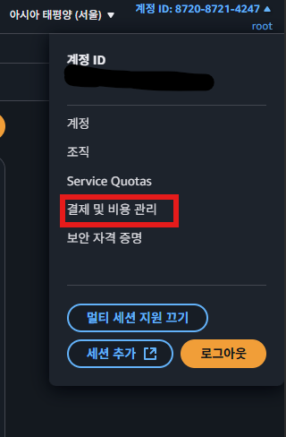
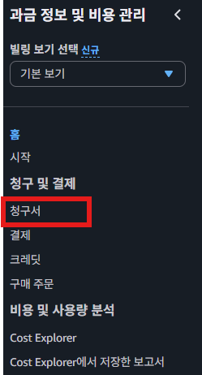
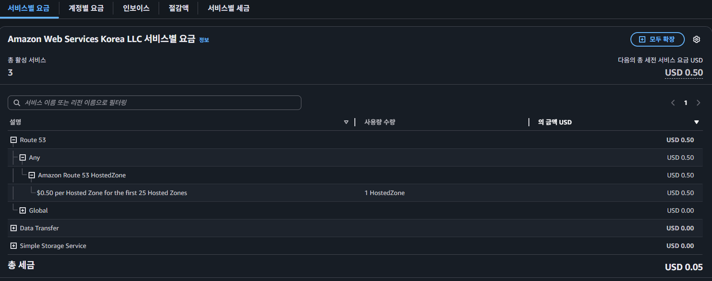
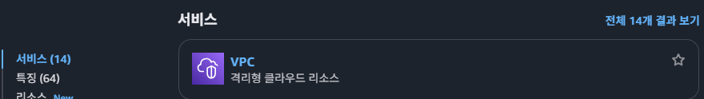
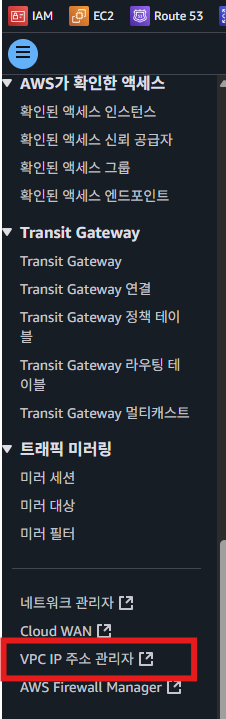
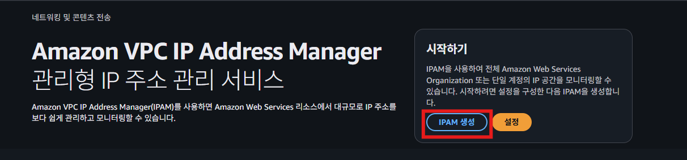
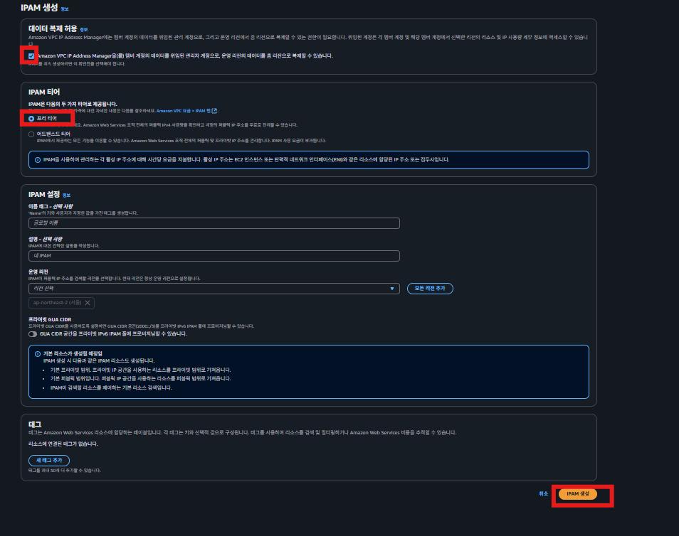
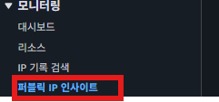

## 비용확인
  
  
  

`Virtual Private Cloud`  
AWS에서는 24년 2월부터 Public IPv4 주소 1개당 요금을 부과(시간당 0.005USD)하겠다고 합니다.

위 Virtual Private Cloud에서 나온 비용은 Public IPv4 주소를 사용함에 따라 부과된 비용을 뜻합니다.

하지만 위의 비용 청구서의 항목을 봤을 때는 정확히 어떤 AWS 서비스에서

Public IPv4에 대한 비용이 나가고 있는 지 확인하기가 어렵습니다.   

이 때문에 AWS에서는 Public IPv4를 사용하고 있는 곳을 빠르게 확인할 수 있는 기능을 추가했습니다.  
  
## 사용 중인 Public IPv4 확인하는 방법  
### 1. VPC 접속
  
    
이때 리전을 확인해서 알맞은 리전을 선택한다.  
### 2. IPM 생성
  
  
  
### 3. 모니터링
