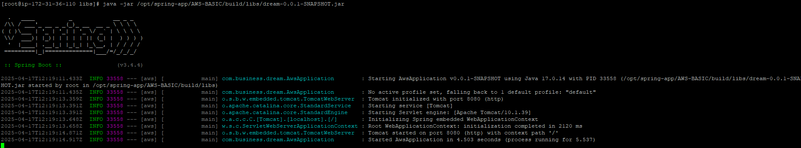

## 간단하게 배포 해보기
### 시스템 업데이트

```bash

sudo su
# 시스템 패키지 업데이트
yum update -y

```

EC2 인스턴스의 Amazon Linux 버전을 확인해보겠습니다:

```bash

# 리눅스 버전 확인
cat /etc/os-release

```

Amazon Linux 2023을 사용하고 계신 경우 다음과 같이 Java를 설치할 수 있습니다:

```bash

# root 권한으로 전환
sudo su

# 패키지 업데이트
dnf update -y

# 또는 Java 17 개발 도구까지 포함하여 설치
dnf install java-17-amazon-corretto-devel -y

# Java 버전 확인
java -version
javac -version  

```

Amazon Linux 2를 사용하고 계시는데 `amazon-linux-extras` 명령이 없는 경우라면 다음 명령으로 설치할 수 있습니다:

```bash

# root 권한으로 전환
sudo su

# amazon-linux-extras 설치
yum install -y amazon-linux-extras

# 설치 확인
amazon-linux-extras

```

만약 다른 리눅스 배포판(Ubuntu 등)을 사용 중이라면:

```bash
# Ubuntu/Debian 계열인 경우
sudo apt update
sudo apt install -y openjdk-17-jdk

# CentOS/RHEL/Fedora 계열인 경우
sudo dnf install -y java-17-openjdk-devel

```

```bash
# 설치위치 확인
which java
# 출력: /usr/lib/jvm/java-17-amazon-corretto.x86_64/bin/java

# JAVA_HOME 설정
# Java 실행 파일 경로에서 '/bin/java' 부분을 제외한 경로를 JAVA_HOME으로 설정
export JAVA_HOME=/usr/lib/jvm/java-17-amazon-corretto.x86_64
echo "export JAVA_HOME=/usr/lib/jvm/java-17-amazon-corretto.x86_64" > /etc/profile.d/java.sh
# PATH 환경변수에 JAVA_HOME/bin 경로 추가 (Java 명령어 실행을 위해)
echo "export PATH=\$JAVA_HOME/bin:\$PATH" >> /etc/profile.d/java.sh
# 환경변수 설정 즉시 적용
source /etc/profile.d/java.sh

# JAVA_HOME 설정 확인
echo $JAVA_HOME
java -version
# 출력 예상: /usr/lib/jvm/java-17-amazon-corretto.x86_64
```  

정확한 배포판을 확인 후 그에 맞는 명령어를 사용하시는 것이 좋습니다.

애플리케이션 배포 디렉토리 설정

```bash

# 애플리케이션 디렉토리 생성
mkdir -p /opt/spring-app

# 디렉토리 권한 설정
chmod 755 /opt/spring-app

```

Git을 통한 소스 코드 배포

```bash

# Git 설치
dnf install git -y

# 배포 디렉토리로 이동
cd /opt/spring-app

# 프로젝트 클론
git clone https://github.com/your-username/your-spring-project.git .

# Gradle 설치 (필요한 경우)
dnf install wget unzip -y
wget https://services.gradle.org/distributions/gradle-8.6-bin.zip
unzip gradle-8.6-bin.zip -d /opt/
ln -s /opt/gradle-8.6/bin/gradle /usr/bin/gradle

# 프로젝트 빌드
gradle build

# 또는 Gradle Wrapper 사용
cd spring-app/프로젝트

chmod +x ./gradlew
./gradlew clean  build

### 절대 경로 활용
# gradlew clean build 명령어를 절대 경로의 Java로 실행
/usr/lib/jvm/java-17-amazon-corretto.x86_64/bin/java -Dorg.gradle.java.home=/usr/lib/jvm/java-17-amazon-corretto.x86_64 -jar ./gradlew clean build

# 실행
java -jar 파일이름.jar

# JAR 파일을 절대 경로의 Java로 실행
/usr/lib/jvm/java-17-amazon-corretto.x86_64/bin/java -jar your-application.jar
```

빌드가 완료되면 일반적으로 다음 위치에 JAR 파일이 생성됩니다:

- Gradle: `build/libs/your-spring-app.jar`

  



### 프로세스 확인

```bash
# 실행 중인 프로세스 확인
ps -ef | grep java

# 프로세스 종료 (PID는 실제 프로세스 ID로 변경)
kill <PID>
```

### 서비스 파일 만들기
서비스 파일은 systemd가 애플리케이션을 관리하기 위해 사용하는 설정 파일입니다. systemd는 리눅스 시스템의 초기화 시스템으로, 서비스의 시작, 중지, 상태 확인 등을 관리합니다. 서비스 파일은 .service 확장자를 가지며, 애플리케이션의 실행 방법, 의존성, 재시작 정책 등을 정의합니다.

### 1.vim 설치
```bash
dnf install vim -y
```
## 서비스 파일 생성 및 편집

```bash

# 서비스 파일을 생성하고 편집하기
vim /etc/systemd/system/spring-app.service

```

vim이 열리면 `i` 키를 눌러 입력 모드로 전환하고 다음 내용을 입력합니다:

```

[Unit]
Description=Spring Boot Application              # 서비스에 대한 설명
After=network.target                            # 네트워크가 활성화된 후에 이 서비스를 시작

[Service]
Type=simple                                     # 서비스 타입 (simple: 기본적인 서비스 타입)
User=root                                       # 서비스를 실행할 사용자 (root 또는 다른 사용자로 변경 가능)
WorkingDirectory=/opt/spring-app                # 서비스가 실행될 작업 디렉토리
ExecStart=/usr/bin/java -jar /opt/spring-app/build/libs/자신의앱이름.jar    # 서비스 시작 명령
SuccessExitStatus=143                          # 정상 종료로 간주할 종료 코드 (143은 SIGTERM에 의한 종료)
TimeoutStopSec=10                              # 서비스 중지 시도 후 강제 종료까지의 대기 시간(초)
Restart=on-failure                             # 실패 시 재시작 정책 (on-failure: 비정상 종료 시에만 재시작)
RestartSec=5                                   # 재시작 전 대기 시간(초)

[Install]
WantedBy=multi-user.target                     # 이 서비스가 속할 타겟 (멀티유저 모드에서 활성화)

```

## 서비스 등록 및 실행

```bash

# systemd에 변경사항 반영
systemctl daemon-reload

# 서비스 시작
systemctl start spring-app.service

# 부팅 시 자동 실행 설정
systemctl enable spring-app.service

# 서비스 상태 확인
systemctl status spring-app.service

# 서비스 파일 편집
vim /etc/systemd/system/spring-app.service

# 수정 후 systemd에 변경사항 반영
systemctl daemon-reload

# 서비스 재시작
systemctl restart spring-app.service

```
  
### sh파일로 실행
```shell
#!/bin/bash

# 변수 설정
BASE_DIR="/opt/spring-app"
APP_DIR="$BASE_DIR/dream"
GIT_REPO="https://github.com/yourRepository.git"
JAVA_PATH="/usr/lib/jvm/java-17-amazon-corretto.x86_64/bin/java"
JAR_NAME="app.jar"  # 원하는 JAR 파일 이름 지정
SERVER_PORT=3000

# 로그 함수
log() {
  echo "[$(date +'%Y-%m-%d %H:%M:%S')] $1"
}

# 1. 기존 디렉토리 정리
if [ -d "$APP_DIR" ]; then
  log "기존 애플리케이션 디렉토리 삭제 중..."
  rm -rf "$APP_DIR"
  log "삭제 완료"
fi

# 2. 애플리케이션 디렉토리 생성
log "애플리케이션 디렉토리 생성 중..."
mkdir -p "$APP_DIR"
cd "$APP_DIR"

# 3. Git 프로젝트 클론
log "Git 저장소 클론 중: $GIT_REPO"
git clone "$GIT_REPO" .

# 4. (삭제) build.gradle 자동 수정 부분 제거

# 5. Gradle 빌드 실행
log "애플리케이션 빌드 중..."
if [ -f "./gradlew" ]; then
  log "Gradle Wrapper 사용"
  chmod +x ./gradlew
  # 직접 스크립트를 실행하도록 변경
  export JAVA_HOME=$(dirname $(dirname "$JAVA_PATH"))
  ./gradlew clean build
else
  log "시스템 Gradle 사용"
  gradle clean build
fi

# 6. JAR 파일 경로 설정
if [ -f "build/libs/$JAR_NAME" ]; then
  JAR_FILE="build/libs/$JAR_NAME"
else
  log "지정한 이름의 JAR 파일을 찾을 수 없어 기본 검색을 시도합니다..."
  JAR_FILE=$(find . -name "*.jar" | grep -v "sources\|javadoc\|original" | head -n 1)
fi

if [ -z "$JAR_FILE" ]; then
  log "오류: JAR 파일을 찾을 수 없습니다."
  exit 1
fi

log "JAR 파일 발견: $JAR_FILE"

# 7. 애플리케이션 실행
log "애플리케이션 실행 중..."
$JAVA_PATH -jar -Dserver.port=$SERVER_PORT "$JAR_FILE" > app.log 2>&1 &

# 8. 프로세스 ID 저장
PID=$!
echo $PID > app.pid
log "애플리케이션이 PID $PID로 시작되었습니다."
log "로그 확인: tail -f $APP_DIR/app.log"

log "배포 완료!"
```