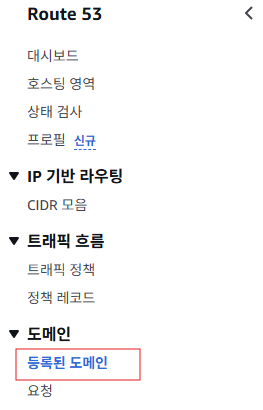
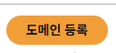
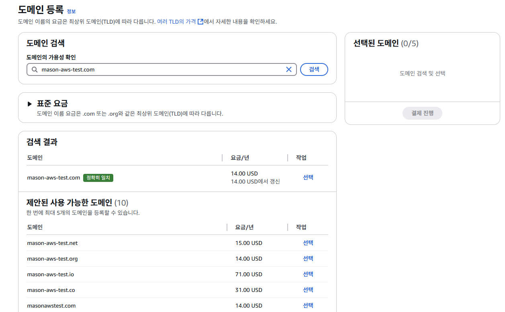
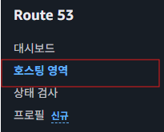
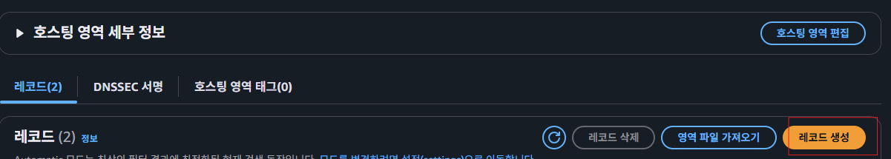
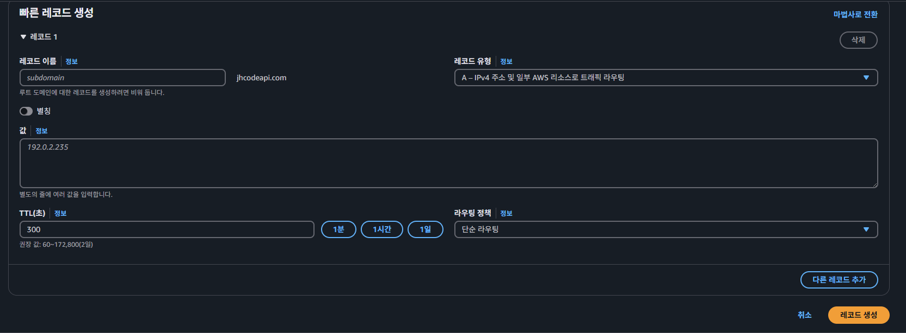
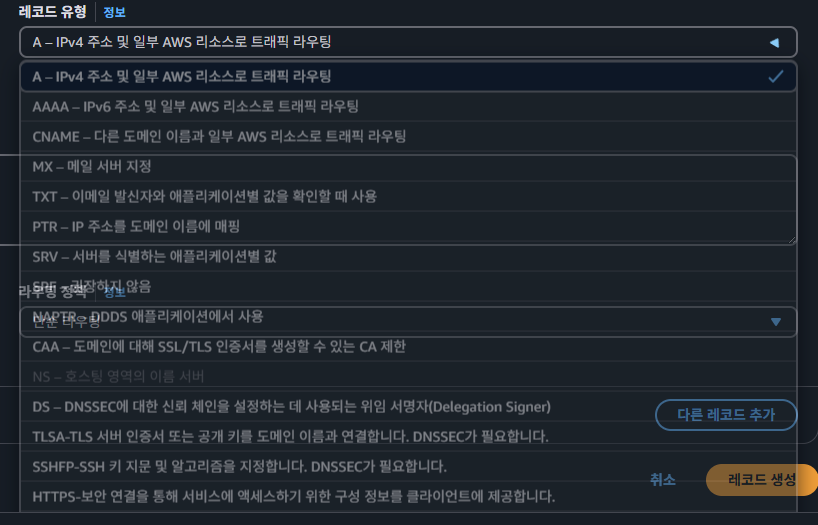
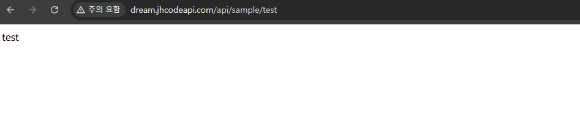

## Rout3 53 이란?
도메인을 발급하고 관리해주는 서비스이다. `Route 54`을 조금 전문적인 용어로 표현하면 `DNS(Domain Name System)`서비스 이다.

### DNS(Domain Name System)란?

도메인(Domain)이 없던 시절에는 특정 컴퓨터와 통신하기 위해서 IP 주소(ex. `12.134.122.11`)를 사용했다. 이 **IP**는 **특정 컴퓨터를 가리키는 주소의 역할**을 한다.

하지만 IP 주소는 많은 숫자들로 이루어져 있어서 일일이 외우기가 너무 불편했다. 이 때문에 사람들이 기억하기 쉬운 문자로 컴퓨터의 주소를 나타낼 수는 없을까에 대해 고민하게 됐다. 숫자로 이루어져 있는 IP 주소를 문자로 구성하기에는 한계가 있었다. 왜냐하면 컴퓨터가 처리하기 쉬운 값의 형태는 문자가 아니라 숫자이기 때문이다.

이를 해결하기 위해 문자를 IP 주소로 변환해주는 하나의 시스템(서버)을 만들게 됐다. 이게 바로 **DNS(Domain Name System)**이다. DNS가 생기고나서부터 사람들은 특정 컴퓨터와 통신하기 위해 복잡한 IP 주소를 일일이 외울 필요가 없게 됐다.  

### 현업에서의 Route53 활용 여부

프론트 웹 페이지든 백엔드 서버든 일반적으로 IP를 기반으로 통신하지 않고 **도메인을 기반으로 통신**한다. 이유는 여러가지지만 그 이유 중 하나는 HTTPS 적용 때문이다. `IP 주소에는 HTTPS 적용을 할 수가 없다.` 도메인 주소가 있어야만 HTTPS 적용을 할 수 있다. 이 때문에 특정 서비스를 운영할 때 도메인은 필수적으로 사용하게된다.

하지만 DNS의 역할을 하는 서비스는 AWS Route 53 뿐만 아니라 다양하게 존재한다. 가비아(gabia), 후이즈(whois) 등에서도 도메인을 구매하고 관리할 수 있다. 즉, DNS의 역할을 서비스를 하고 있다는 뜻이다.

현업에서는 무조건적으로 AWS Route 53을 고집하진 않는다. 왜냐면 각 서비스마다 구매할 수 있는 도메인의 종류가 다르기 때문이다. 쉽게 예를 들어, 가비아(gabia)에는 내가 원하는 형태의 도메인이 있는데 AWS Route 53에는 없을 수도 있다. 따라서 내가 원하는 도메인이 존재하는 곳의 DNS 서비스를 활용하자.
  

---

### 도메인 등록
  
  
  
도메인 등록시 필요한 도메인 명을 검색해서 사용여부를 확인할 수 있다.  
  
결제 완료 후 승인까지 10분에서 20분 정도 시간이 소요된다.
  
---

### 도메인 매핑
도메인이 정상적으로 생성되었나느 이메일을 확인 후 에 해당 메뉴에 들어가면 우리가 등록한 도메인 정보가 나온다.
  
  
  
레코드 생성 버튼을 누르면 레코드 유형을 선택 후 레코드를 생성하면된다.

  
여기서는 IP 주소와 매핑 시키기 떄문에 A 레코드를 사용한다.  
값 정보에는 우리가 생성한 EC2 퍼블릭 IP 주소를 입력해준다. 이때 레코드명에 test를 추가하게되면 test.등록도메인명.com 이런식의 도메인 매핑을 할 수 도 있다.
  

---  

## 레코드 상세 설명
## A 레코드

- **기능**: IPv4 주소 및 일부 AWS 리소스로 트래픽 라우팅
- **용도**: 도메인 이름을 IPv4 주소(예: 192.168.1.1)로 연결
- **사용 예**: 웹 서버의 IP 주소 설정

## AAAA 레코드

- **기능**: IPv6 주소 및 일부 AWS 리소스로 트래픽 라우팅
- **용도**: 도메인 이름을 IPv6 주소(예: 2001:0db8:85a3:0000:0000:8a2e:0370:7334)로 연결
- **사용 예**: IPv6를 지원하는 서버 설정

## CNAME 레코드

- **기능**: 다른 도메인 이름과 일부 AWS 리소스로 트래픽 라우팅
- **용도**: 도메인 이름을 다른 도메인 이름으로 연결(별칭)
- **사용 예**: [www.example.com을](http://www.example.xn--com-of0o/) example.com으로 연결

## MX 레코드

- **기능**: 메일 서버 지정
- **용도**: 이메일을 수신할 메일 서버와 우선순위 지정
- **사용 예**: example.com 도메인의 이메일 서버 설정

## TXT 레코드

- **기능**: 이메일 발신자와 애플리케이션별 값을 확인할 때 사용
- **용도**: 도메인 소유권 확인, SPF, DKIM 설정 등
- **사용 예**: Google Workspace 확인, SPF 기록 설정

## PTR 레코드

- **기능**: IP 주소를 도메인 이름에 매핑
- **용도**: 역방향 DNS 조회(IP 주소로 도메인 이름 찾기)
- **사용 예**: 이메일 서버의 신뢰성 향상

## SRV 레코드

- **기능**: 서비스를 실행하는 애플리케이션별 값
- **용도**: 특정 서비스를 제공하는 서버 정보 지정
- **사용 예**: VoIP, XMPP, SIP 서비스 구성

## NAPTR 레코드

- **기능**: DDOS 애플리케이션에서 사용
- **용도**: Dynamic Delegation Discovery System(DDDS) 애플리케이션에서 사용
- **사용 예**: 전화번호를 URI로 변환하는 ENUM 서비스

## CAA 레코드

- **기능**: 도메인에 대해 SSL/TLS 인증서를 생성할 수 있는 CA 제한
- **용도**: 승인된 인증 기관만 도메인에 대한 인증서 발급 가능하도록 제한
- **사용 예**: SSL 인증서 발급 보안 강화

## NS 레코드

- **기능**: 호스팅 영역의 이름 서버
- **용도**: 도메인의 DNS 레코드를 관리하는 이름 서버 지정
- **사용 예**: 도메인의 DNS 관리 위임

## DS 레코드

- **기능**: DNSSEC에 대한 신뢰 체인을 설정하는 데 사용되는 위임 서명자(Delegation Signer)
- **용도**: DNSSEC 보안 확장을 위한 설정
- **사용 예**: DNS 보안 강화

## TLSA-TLS 서버 인증서

- **기능**: 인증서 또는 공개 키를 도메인 이름과 연결
- **용도**: DNSSEC가 필요한 TLS 인증서 검증
- **사용 예**: 추가적인 TLS 보안 계층 제공

## SSHFP-SSH 키

- **기능**: SSH 키 지문 및 알고리즘을 지정
- **용도**: DNSSEC가 필요한 SSH 인증 보안 강화
- **사용 예**: SSH 서버 인증 검증

## HTTPS
  
- **기능**: 보안 연결을 통해 서비스에 액세스하기 위한 구성 정보를 클라이언트에 제공
- **용도**: HTTPS 연결에 대한 보안 정책, 인증서 등의 정보 제공
- **사용 예**: HTTPS 연결의 세부 설정 제공

각 레코드 유형은 특정 네트워킹 요구 사항에 맞게 선택하여 사용할 수 있으며, AWS 서비스와 통합하거나 일반적인 DNS 구성에 활용할 수 있습니다.