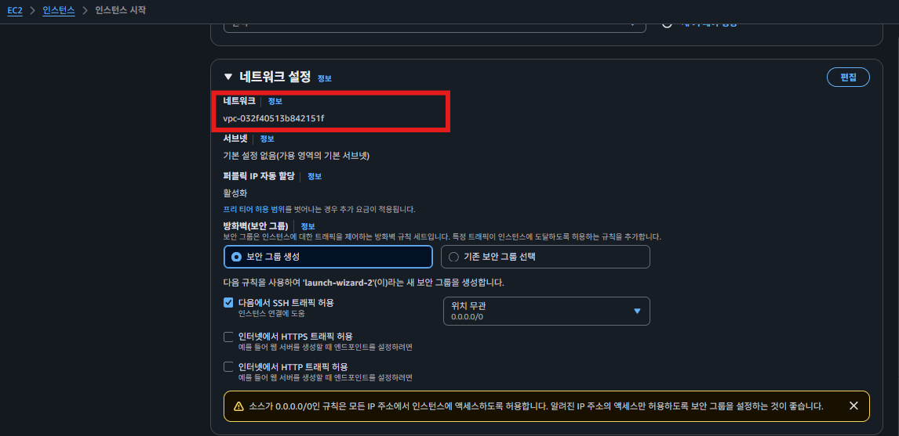
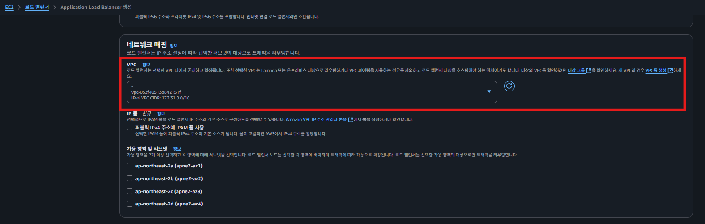
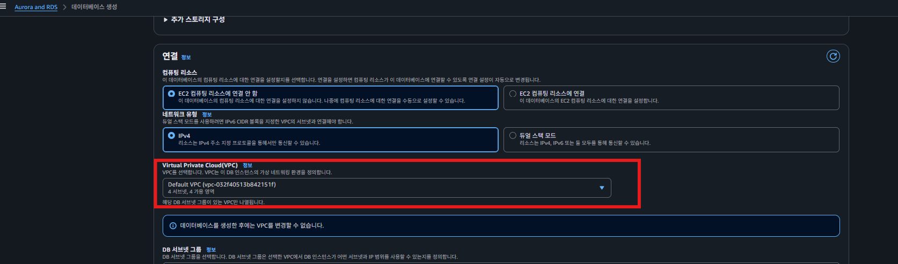
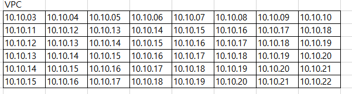
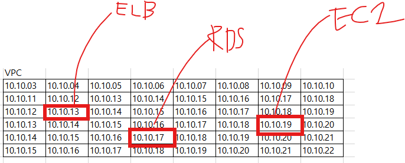

## VPC(Virtual Private Cloud)

---

### VPC는 어떤 장점을 가지고 있길래 많이 쓰는 걸까 ?

VPC를 쓰는 데는 여러가지 이유가 있지만, 그 중에서 핵심 이유 딱 1가지만 기억하자.

> **보안**이 핵심적인 이유다.
>

VPC를 활용하면 **외부에서 직접 접근할 수 없는 독립적인 네트워크 환경**을 구성할 수 있어서, 보안적으로 안전하게 리소스(EC2, RDS 등)를
사용할 수 있다.

예를 들어, EC2 인스턴스 2대가 있다고 가정하자. 그런데 1대의 인스턴스는 인터넷에 자유롭게 접근하면서 사용하고 싶고, 나머지 1대는 좀 더
안전하고 비공개로 사용하고 싶을 수 있다. 이럴 때 VPC를 활용하면 된다.

---

## VPC 란?

VPC란 **가상의 네트워크 공간(컴퓨터들끼리 서로 통신하는 공간)을** 의미한다.

EC2, RDS과 같은 서비스도 다른 컴퓨터와 통신을 해야 하기 때문에 반드시 VPC 위에 셋팅을 해야 한다. VPC에 대해 공부를 하지 않고
AWS를 사용했던 사람들은, 기본 VPC로 저절로 셋팅되어 있어서 VPC에 대한 존재를 모를 수도 있다. 하지만 EC2를 생성하든, RDS를 생성
하든, ELB를 생성하든 VPC를 선택하는 옵션이 항상 존재했었다.  
  

  
ec2생성
  
ELB 생성
  
RDS 생성

---

## VPC 의 이해

위에서 VPC란 ‘가상의 네트워크 공간(컴퓨터들끼리 소통하는 공간)’이라고 표현을 했었다. 이런 개념들이 어렵게 와닿는 이유는 눈에 보이지
않아서 머릿속에서 상상이 안 되기 때문이다.

VPC는 ‘모눈 종이처럼 생긴 땅덩이’라고 생각하면 쉽게 이해할 수 있다.  

- 땅덩이에서 각각의 칸은 IP 주소를 가지고 있다. 즉, VPC는 할당할 수 있는 여러 개의 IP를 가지고 있다.
- AWS에서 EC2, RDS, ELB의 리소스를 생성하는 순간 VPC 안에 배치한다. 그럼과 동시에 각각의 자원에 IP 주소를 할당한다.

- VPC의 크기를 정할 때는 IP 주소의 범위로 정한다.
    - ex) 10.10.0.0 ~ 10.10.0.31
  
  
---

## VPC를 생성하려면 알아야하는 개

위에서 설명하기를 VPC는 ‘모눈종이처럼 생긴 땅덩이’라고 표현을 했었다. 그리고 VPC는 여러 IP 주소로 이루어져있는 공간이라고 볼 수도
있다. 이 공간의 크기는 VPC를 생성할 때 직접 정할 수 있다.  

  
위 그림과 같은 크기로 VPC를 구성하려면, VPC의 IP 범위를 `10.10.0.0 ~ 10.10.0.31` 라고 설정하면 된다. 하지만 컴퓨터한테 `‘10.10.0.0 ~ 10.10.0.31` 의
범위로 VPC를 만들어줘'라고 얘기하면 못 알아듣는다. 컴퓨터한테는 `‘ 10.10.0.0/27` 의 범위로 VPC를 만들어줘’라고 얘기해야 한다.

여기서 `10.10.0.0/27` 과 같은 표기를 보고 `CIDR 표기` 방식이라고 얘기한다. 실제 AWS에서 VPC를 만들 때 보면 `CIDR 표기` 방식을 활용해 입력
해야 한다.  
  
따라서 여러분들이 스스로 원하는 크기의 VPC를 생성하려면, CIDR이라는 표기 방식을 이해하고 있어야 한다