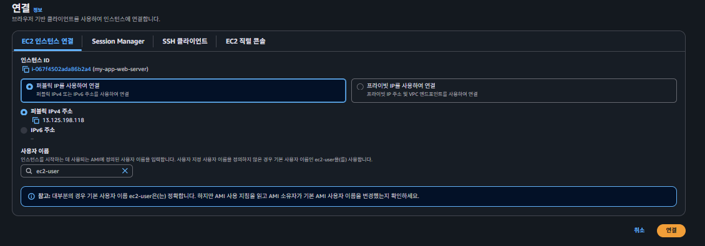
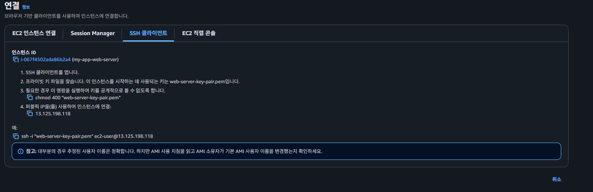

## 프라이빗 서브넷의 EC2에 접속

### 프라이빗 서브넷에 접근하는 방법

프라이빗 서브넷(Private Subnet)은 외부에서 접근이 불가능하다고 얘기했다. 하지만 **같은 VPC 내부에서는 퍼블릭 서브넷의 리소스와 프라이빗 서브넷의 리소스가 자유자재로 통신이 가능**하다는 점을 활용해서 프라이빗 서브넷에 있는 EC2 인스턴스에 접근해보자.  

  
  

  
### 키 페어를 활용한 EC2 접근

  
기존에는 AWS에서 제공하는 기능을 활용해 키 페어 없이 쉽게 EC2 인스턴스에 접근할 수 있었다. 하지만 이번는 AWS에서 제공하는 기능을 활용하지 않고, 터미널(terminal)과 키 페어를 활용해 EC2 인스턴스에 접속해보자.  
  
### 라이빗 서브넷의 EC2에 접속하는 방법

### 1. **로컬 컴퓨터에서 퍼블릭 서브넷에 존재하는 EC2 인스턴스에 접속하기**  
  
```sh
$ cd [키 페어 파일이 존재하는 경로]
$ chmod 400 "my-app-server-key-pair.pem" # 키 페어 파일 보안을 위한 권한 설정
$ ssh -i "my-app-server-key-pair.pem" ubuntu@[EC2 인스턴스의 Public IP]

```

### 2. **‘퍼블릭 서브넷에 위치한 EC2 인스턴스(web-server)’로 ‘my-app-server의 키 페어 파일’ 보내기**

퍼블릭 서브넷에 위치한 EC2 인스턴스(my-app-web-server)에서 프라이빗 서브넷에 위치한 EC2 인스턴스(my-app-server)로 접속할 것이다. my-app-web-server 인스턴스에서 my-app-server 인스턴스로 접속하는 게 가능한 이유는 같은 VPC에 존재하기 때문이다.

my-app-web-server 인스턴스에 접속할 때 my-app-web-server의 키 페어가 필요했던 것처럼, my-app-server 인스턴스에 접속할 때는 my-app-server의 키 페어가 필요하다. 따라서 my-app-server의 키 페어를 my-app-web-server 인스턴스로 전송해야 한다.  

``` sh
$ cd [키 페어 파일이 존재하는 경로]

# scp -i [EC2 접근을 위한 키 페어 파일] [전송할 파일명] [서버 username]@[EC2 인스턴스의 Public IP]:[전송 받을 파일 위치]
$ scp -i web-server.pem instagram-server.pem ubuntu@[EC2 인스턴스의 Public IP]:~/
```
  
### 3. 접속하기
``` sh
$ cd [키 페어 파일이 존재하는 경로]
$ chmod 400 "my-app-server-key-pair.pem" # 키 페어 파일 보안을 위한 권한 설정
$ ssh -i "my-app-server-key-pair.pem" ubuntu@[EC2 인스턴스의 프라이빗 IP]

```