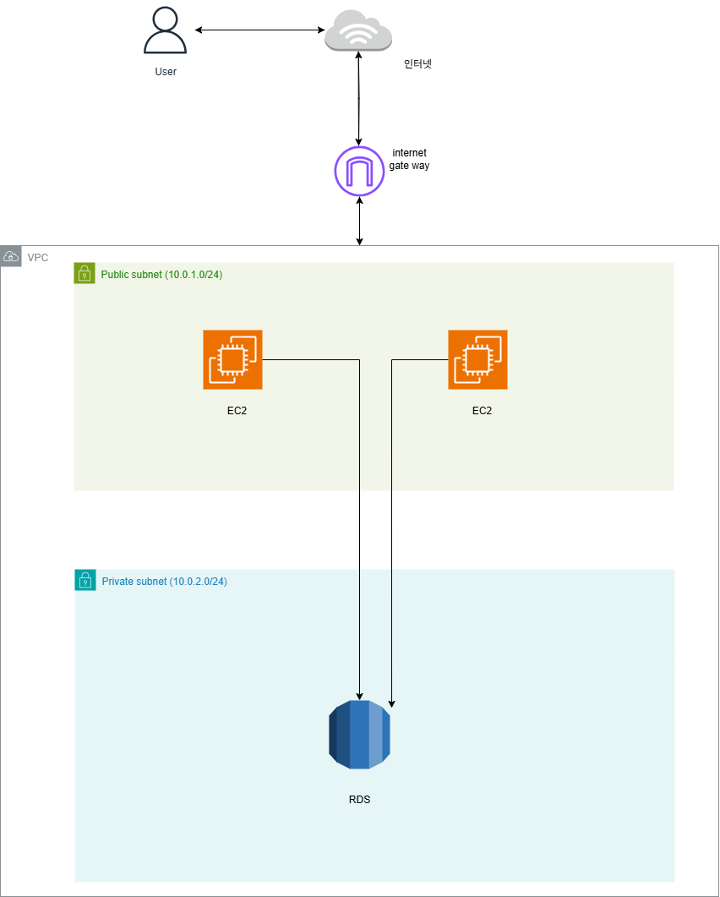
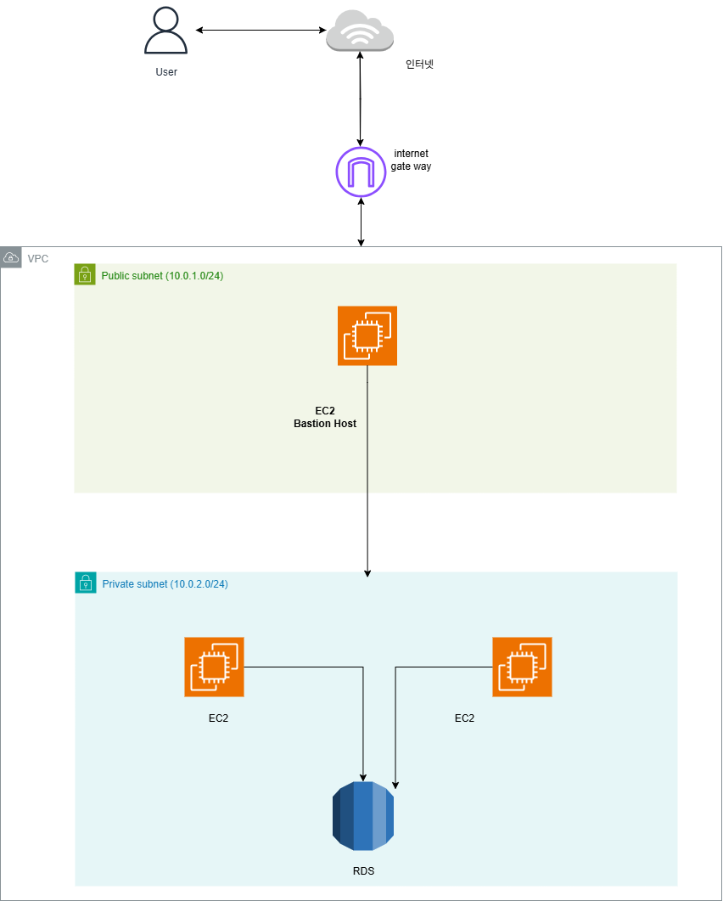
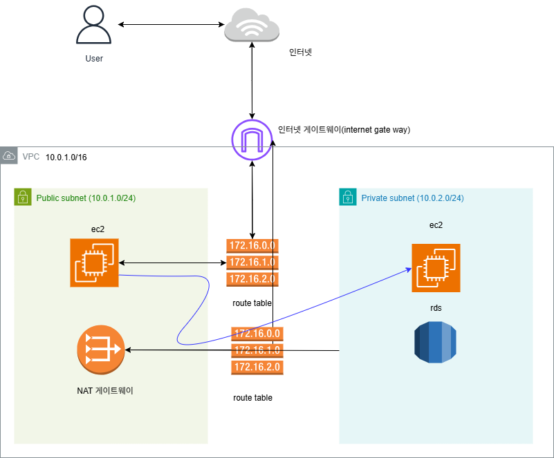
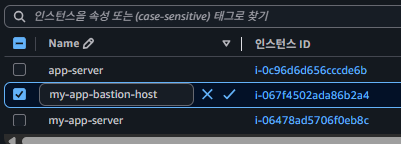
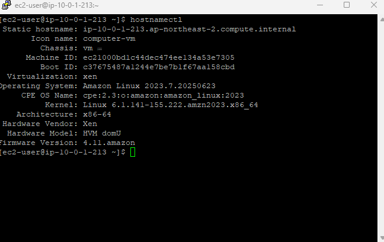
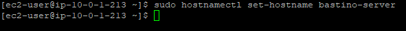
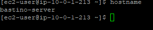
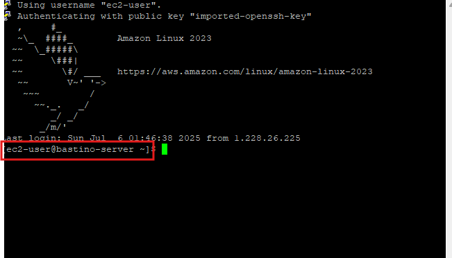

## Bastion Host란?
**Bastion**의 의미는 **성을 보호하기 위해 돌출된 부분**을 의미한다. Bastion Host도 이와 비슷한 역할을 한다. **Bastion Host**는 **외부 인터넷에서 내부 네트워크(ex. VPC)에 있는 리소스에 접근할 때 보안을 위해 가장 먼저 거치는 컴퓨터**를 뜻한다.  

### Bastion Host가 왜 필요할까?

쉽게 이해하기 위해 Basiton Host가 없는 아키텍처와 Bastion Host가 있는 아키텍처를 비교  

**Bastion Host가 없는 아키텍처**  
  

위 아키텍처를 보면 퍼블릭 서브넷에 있는 EC2 인스턴스(백엔드 서버)가 외부 인터넷에 노출된다. 즉, 외부 공격에 쉽게 노출될 수 있다. 해커 입장에서는 퍼블릭 서브넷에 있는 모든 리소스에 접근할 수 있기 때문에, 공격할 수 있는 포인트가 굉장히 많아진다. 서비스를 운영하는 입장에서는 공격이 들어올 수 있는 포인트가 많기 때문에 보안적으로 대비하는 것도 힘들어진다.  

**Bastion Host가 있는 아키텍처**  

위에서 언급한 보안적인 위험성 때문에 프라이빗 서브넷을 활용해 외부에서 접근할 수 없도록 AWS 리소스들을 배치해서 공격 포인트를 차단했다. 그리고 Bastion Host를 활용해 외부에서 접근할 수 있는 경로는 딱 하나만 만들었다. 외부에서 접근할 수 있는 경로는 단 하나이기 때문에 보안적인 조치를 하기도 쉽고 관리도 쉬워진다.
  
## 퍼블릭 서브넷에 Bastion Host 배치하기
  
위 아키텍처까지는 이미 구성을 해두었다. 저기 구성에서 보면 web-server의 인스턴스가 이미 Bastion Host 역할을 하고 있다.   
따라서 추가로 인프라를 수정해야 하는 부분은 없다. 다만, EC2 인스턴스의 역할을 직관적으로 구분하기 위해 EC2 인스턴스의 이름을 Bastion Host로 변경해보자.  
  
### EC2 인스턴스 이름 변경하기

  
  
### EC2 인스턴스의 hostname 수정하기
1. 현재 호스트네임 확인
```sh
hostnamectl
```
or
```sh
hostname
```

  
###  호스트네임 변경

```sh
sudo hostnamectl set-hostname 새호스트이름
```


  
### 재시작
즉시 재부팅
```sh
sudo reboot
```

