## 사설 IP와 공인 IP

### 공인 IP

**공인 IP**란 **외부 인터넷을 통해 접근할 수 있는 공식적인 주소**이다. **퍼블릭 IP**라고도 얘기한다.
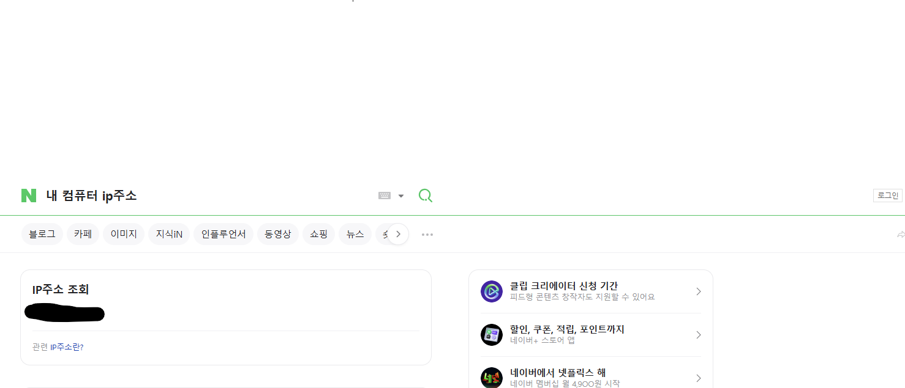  
내 컴퓨터의 공인 IP를 알고 싶다면 위와 같이 검색해보면 바로 알 수 있다. `14.47.150.187`이라는 공인 IP는 전세계에서 딱 하나뿐인 주소이다.  

  
AWS EC2의 인스턴스를 생성하더라도 퍼블릭 IPv4주소라는 걸 받는다. 이게 바로 공인 IP 주소이다. 외부 인터넷을 통해 접근할 수 있는 주소이기도 하다. 

## **공인 IP (Public IP)**

- **정의:**
    - 인터넷에서 고유하게 식별되는 IP 주소입니다.
    - 전 세계적으로 유일하며, 인터넷 상에서 직접 접근이 가능합니다.
- **할당 주체:**
    - 인터넷 서비스 제공업체(ISP) 또는 인터넷 등록 기관이 할당합니다.
- **특징:**
    - 인터넷 통신, 서버 호스팅, 원격 접속 등 외부와의 모든 통신에 필수적입니다.
    - 공개되어 있으므로 보안에 더 신경 써야 합니다.
- **사용 목적:**
    - 웹 서버, 이메일 서버, 원격 접속 등 인터넷과 직접 연결이 필요한 모든 서비스

---

### 사설 IP 란?

**사설 IP**란 **외부 인터넷과 직접 연결되지 않고, 내부 네트워크에서만 사용되는 주소**이다. 다른 말로 **프라이빗 IP**라고도 얘기한다.

**사설 IP의 특징**

1. 사설 IP는 ‘**동일한 네트워크 환경**’에서만 서로 통신할 수 있다.

   여기서 얘기하는 ‘**동일한 네트워크 환경**’이라 함은 크게 2가지 의미로 이해하면 충분하다.

    - 같은 공유기(와이파이)를 사용하고 있는 경우
    - 같은 VPC인 경우

2. **사설 IP는 네트워크 환경마다 중복해서 가질 수 있다.**

   공인 IP는 2개의 컴퓨터가 중복해서 사용할 수가 없다. 예를 들어, `13.15.262.16`이라는 공인 IP는 전세계에서 딱 1대의 컴퓨터만 사용할 수 있다.

   반면, 사설 IP는 네트워크 환경마다 독립적으로 사설 IP를 사용할 수 있다. 한 마디로 **사설 IP는 각자의 네트워크 환경에서만 사용하는 IP**이다. 예를 들어, A라는 네트워크 환경에서 `10.0.0.0`이라는 사설 IP를 쓰고 있다고 하더라도, B라는 네트워크 환경 에서도 `10.0.0.0`을 별개로 사용할 수 있다.


### 사설 IP 범위

IETF라는 국제 인터넷 표준화 기구에서 **사설 IP의 범위**를 정해놨다.

- **주요 대역:**

| RFC1918 이름 | IP주소 범위 | 호스트 ID 크기 |
| --- | --- | --- |
| 24비트 블록 | 10.0.0.0 ~ 10.255.255.255 (10.0.0.0/8) | 24비트 |
| 20비트 블록 | 172.16.0.0 ~ 172.31.255.255 (172.16.0.0/12) | 20비트 |
| 16비트 블록 | 192.168.0.0 ~ 192.168.255.255 (192.168.0.0/16) | 16비트 |

사설 IP 범위에 있는 IP 주소로 통신하면 무조건 사설 IP로 인식한다. 즉, 사설 IP 범위에 있는 IP를 공인 IP처럼 못 쓴다는 뜻이다. 그래서 AWS 인스턴스의 프라이빗 IPv4 주소를 보면 사설 IP 범위에 포함된 IP 값이다.  
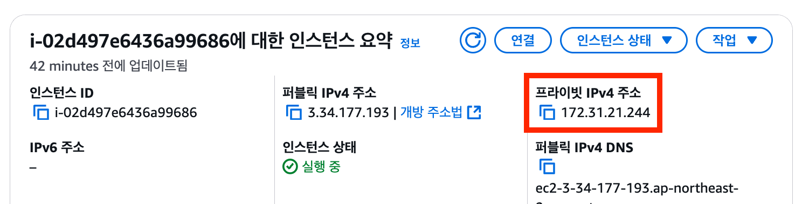  
  

---
## 사설 IP와 통신해보기
### 1. EC2 생성
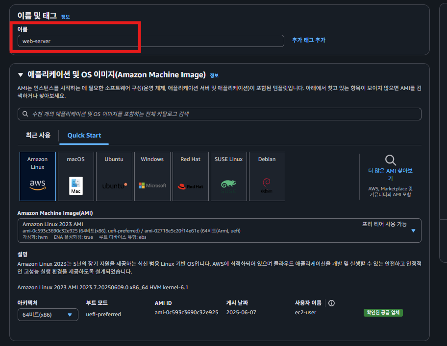
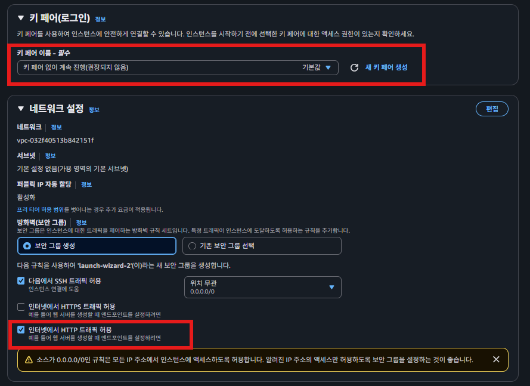
  
###  2. EC2 연결
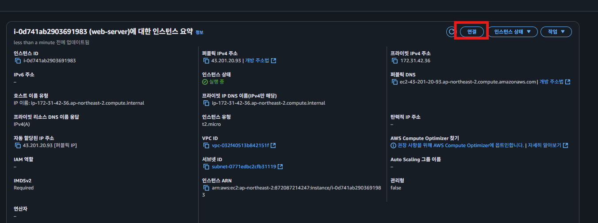
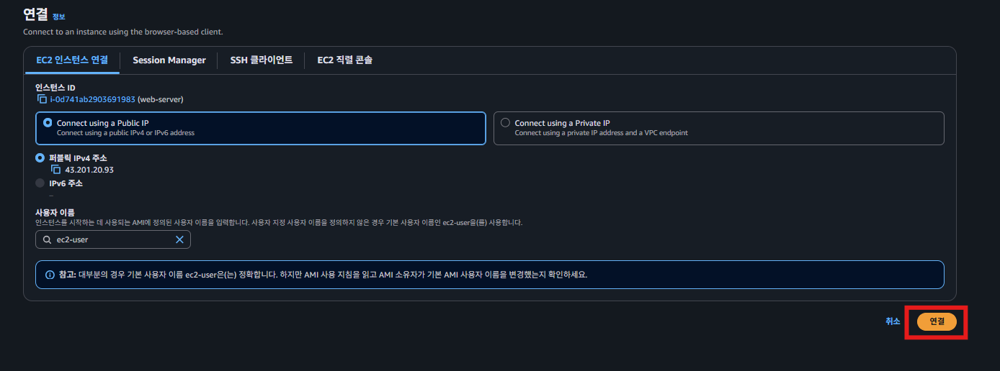  

### 3. Nginx 설치
엔진엑스 설치  
Nginx 설치:
```shell
dnf update -y
```
```shell
sudo dnf install nginx -y
```
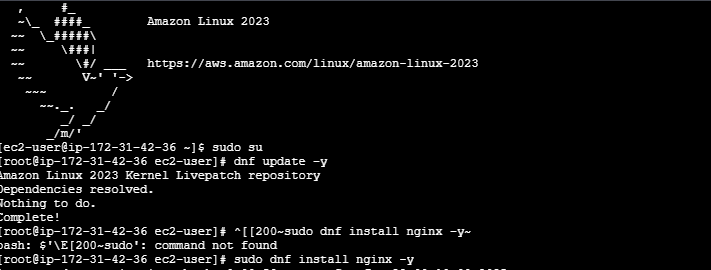

Nginx 서비스 시작 및 활성화:
```shell
sudo systemctl start nginx
sudo systemctl enable nginx
```
실행확인:
```shell
service nginx status
```
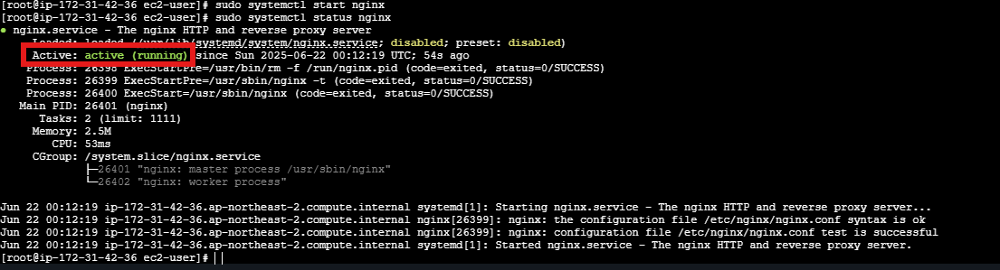  
### Public IP 주소로 접속
1.http 파일
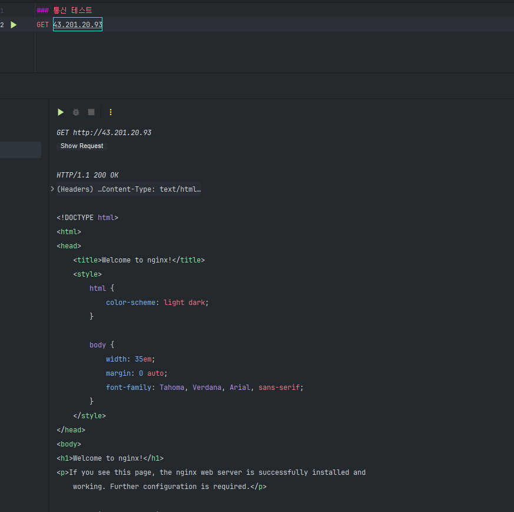  
  
2.curl 명령어
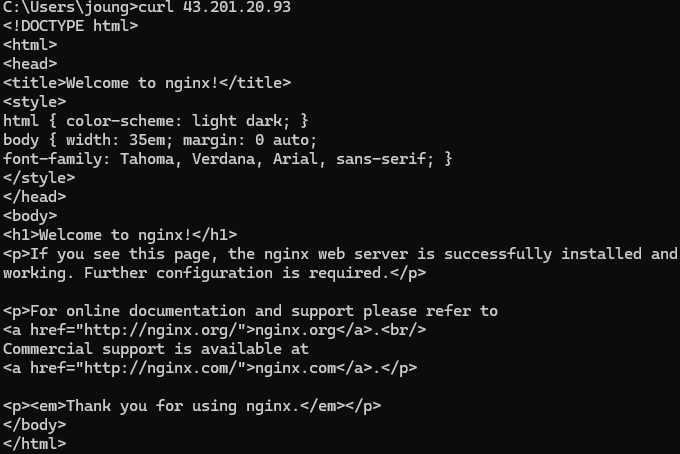
### Private IP 주소로 접속
  
요청에 대한 정상적인 응답이 오지 않는다.

이전 강의에서 **Private IP(사설 IP)는 동일한 네트워크 환경에서만 통신할 수 있는 주소**라고 얘기했다. 하지만 노트북에서 접속하는 네트워크 환경(KT 공유기)과 EC2 인스턴스의 네트워크 환경(AWS의 VPC)이 서로 다르기 때문에 접속이 안 된 것이다.  
  
## 4. 동일한 네트워크 환경에 EC2 인스턴스 생성하기
### 4.1. **기존 EC2 인스턴스의 VPC 확인**

   동일한 네트워크 환경에 EC2 인스턴스를 추가하기 위해, Nginx가 설치된 EC2 인스턴스의 VPC를 확인하자.
   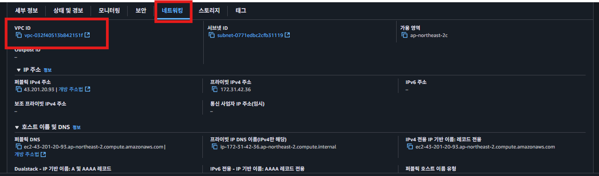
   
### 4.2 새로운 EC2 생성
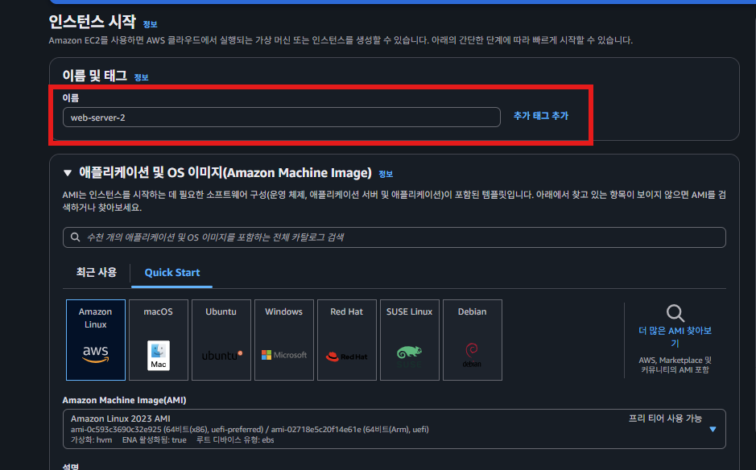
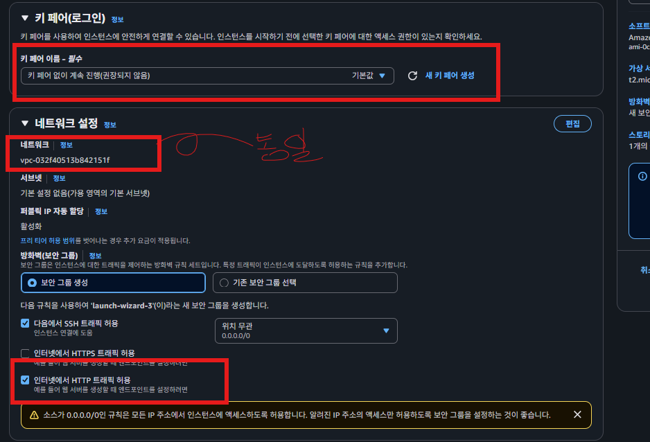
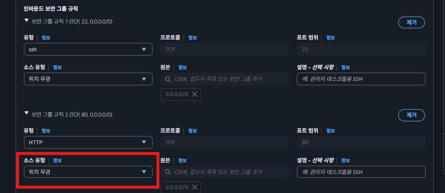  

### 4.3새로운 EC2 인스턴스에 접속해서 기존 인스턴스에 요청 보내보기
**공인 IP로 통신**
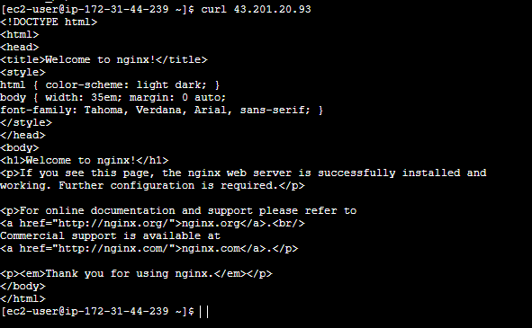  
  
**사설 IP로 통신**
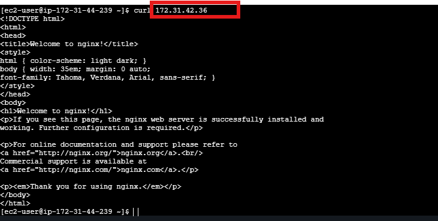  

Private IP로 요청을 보냈음에도 불구하고 정상적으로 응답이 잘 왔다. 즉, 성공적으로 통신을 한 것이다. 성공적으로 통신을 할 수 있었던 이유는 2개의 EC2 인스턴스가 동일한 네트워크 환경에 놓여있었기 때문이다. 
  
  
## 정리 사설 IP란?
**사설 IP**란 **외부 인터넷과 직접 연결되지 않고, 내부 네트워크에서만 사용되는 주소**이다. 다른 말로 **프라이빗 IP**라고도 얘기한다.

그리고 사설 IP는 ‘**동일한 네트워크 환경**’에서만 서로 통신할 수 있다. 여기서 얘기하는 ‘**동일한 네트워크 환경**’이라 함은 크게 2가지 의미로 이해하면 충분하다.

- 같은 공유기(와이파이)를 사용하고 있는 경우
- 같은 VPC인 경우
  
