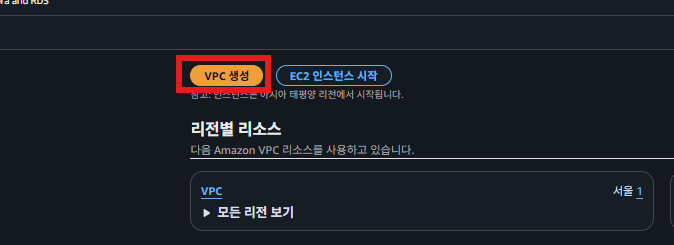
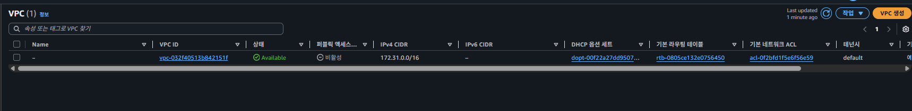
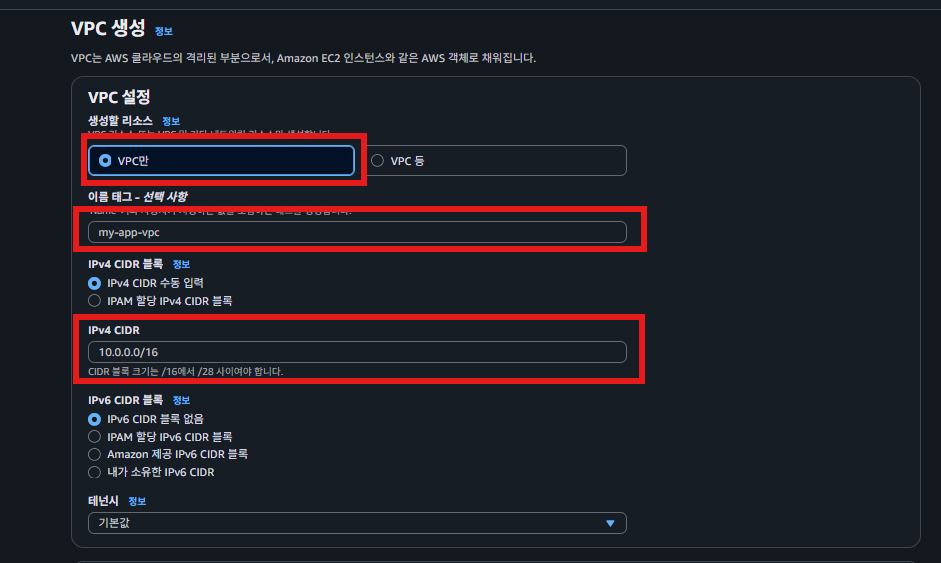
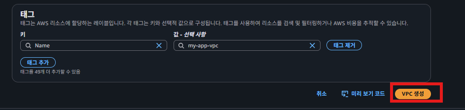
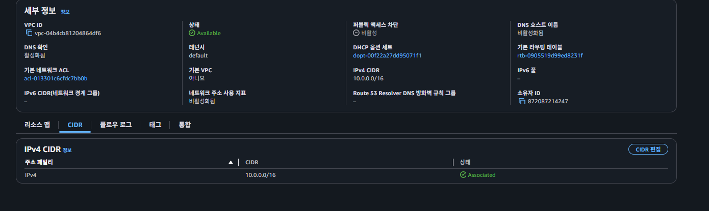

## VPC 생성
  
  
  
### VPC 생성하기
새로운 VPC 생성하기 전에 기본 VPC 확인하기
  

  
  첫 VPC를 생성할 때 주로 10.0.0.0/16(10.0.0.0 ~ 10.0.255.255 범위)으로 설정을 많이 한다. 이렇게 설정하는 이유를 짚고 넘어가자.  
  
  

  
  
### EC2에 우리가 생성한 VPC 연결하기

---

### ✅VPC를 `10.0.0.0/16`으로 설정한 이유

우선 `10.0.0.0/16`가 어떤 IP 범위를 뜻하는 지 해석해보자.

1. 10진수를 2진수로 바꾼다.

   `00001010.00000000.00000000.00000000`

2. CIDR 슬래시 뒤에 있는 숫자를 활용해 2진수를 자른다.

   `00001010.00000000` / `00000000.00000000`

3. 잘린 2진수의 왼쪽 값은 그대로 고정시키고, 잘린 2진수의 오른쪽 값에서 표현할 수 있는 최솟값과 최대값을 구한다.
    - 최소값 : `00001010.00000000` / `00000000.00000000`
    - 최대값 : `00001010.00000000` / `11111111.11111111`

4. 2진수로 표현된 최솟값과 최대값을 10진수로 변환한다.
    - 최소값 : `10.0.0.0`
    - 최대값 : `10.0.255.255`

즉, `10.0.0.0/16`은 `10.0.0.0 ~ 10.0.255.255`의 IP 범위를 의미한다. IP 범위에 포함된 IP의 총 개수는 65,536개이다.  

그럼 다시 돌아와서 VPC를 `10.0.0.0/16`으로 설정한 이유
### 1. **사설 IP 범위에 포함되어야 한다.**  

| RFC1918 이름 | IP주소 범위 | 호스트 ID 크기 |
| --- | --- | --- |
| 24비트 블록 | 10.0.0.0 ~ 10.255.255.255 (10.0.0.0/8) | 24비트 |
| 20비트 블록 | 172.16.0.0 ~ 172.31.255.255 (172.16.0.0/12) | 20비트 |
| 16비트 블록 | 192.168.0.0 ~ 192.168.255.255 (192.168.0.0/16) | 16비트 |

## 2. **충분한 IP 개수를 가지고 있어야 한다.**

   하나의 VPC에서 다양한 AWS 리소스를 사용하게 된다. 그러려면 충분한 IP 개수가 필요하다.

   따라서 넉넉한 개수를 가지고 있는 `10.0.0.0/16`(총 65,536개의 IP)을 VPC 범위로 사용한다.

**(3. Private IP 주소의 범위를 깔끔하게 사용하기 위해 Private IP 주소 범위의 첫 시작점부터 활용했다.)**

VPC를 생성할 때마다 랜덤으로 `10.102.0.0/16`, `10.58.0.0/16`, `10.23.0.0/16`와 같이 사용해도 된다. 하지만 `10.0.0.0/16`, `10.1.0.0/16`, `10.2.0.0/16`의 순서로 차례차례 깔끔하게 쓰는 경우가 많다.