# 서브넷

### 서브넷(Subnet)이란?

**서브넷**이란 **하나의 큰 네트워크(VPC, 회사 네트워크 등)를 작은 네트워크 단위로 나눈 것**을 의미한다.

하나의 **글**은 여러 개의 **단락**으로 나뉘어진다.

하나의 **아파트**는 여러 개의 **동**으로 나뉘어진다.

하나의 **영화**는 여러개의 **씬**으로 나뉘어진다.

이와 비슷하게, 하나의 **VPC**는 여러 개의 **서브넷**으로 나뉘어진다.  
  
### VPC
이 VPC 라는 범위에는 여러 주소를 가진 땅들이 존재하고 있다.
  
  
이 큰 VPC를 작은 서브넷으로 나눌수 있고 **큰 네트워크의 일부분**을 뜻한다.  
```
10.10.0.0 ~ 10.10.0.7    서브넷( 10.10.0/29)

10.10.0.8 ~ 10.10.0.15   서브넷( 10.10.8/29)

10.10.0.16 ~ 10.10.0.23  서브넷( 10.10.8/29)
```

### 서브넷을 사용하는 이유

서브넷을 사용하는 이유는 **용도에 따라 네트워크를 분리해서 사용하고 싶기 때문**이다.

예를 들어, 하나의 VPC에서 **데이터베이스끼리만 모아놓은 네트워크**와 **백엔드 서버끼리만 모아놓은 네트워크**를 분리해서 관리하고 싶을 수 있다. 이럴 때 **서브넷을 활용**한다.  


### 퍼블릭 서브넷(Public Subnet) / 프라이빗 서브넷(Private Subnet)

VPC를 여러개의 서브넷으로 나눌 때 가장 많이 활용하는 방식이 **외부에서 접근이 가능한 네트워크**와 **외부에서 접근이 불가능한 네트워크로 나누는 방식**이다.   
  
여기서 외부에서 접근이 가능한 서브넷을 보고 `퍼블릭 서브넷`(Public Subnet)이라고 부르고, 외부에서 접근이 불가능한 서브넷을 보고 `프라이빗 서브넷`(Private Subnet)이라고 부른다.  
  
# 서브넷 생성하기
  
## 서브넷 생성 페이지 들어가기
  
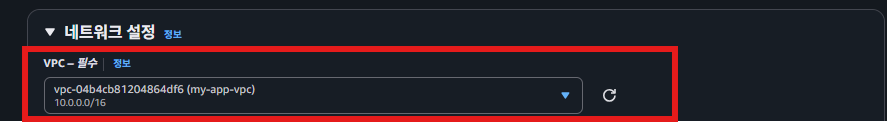  
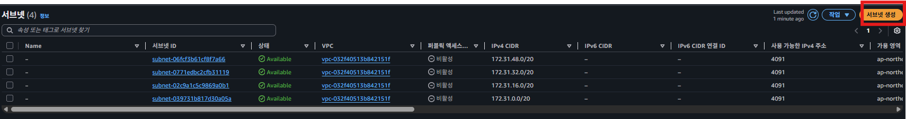  
이때 이미 생성되어 있는 서브넷은 기본적으로 AWS에서 생성하는 서브넷 이다.  
  
## 서브넷 생성
  
### public 서브넷 과 private 서브넷 생성
   
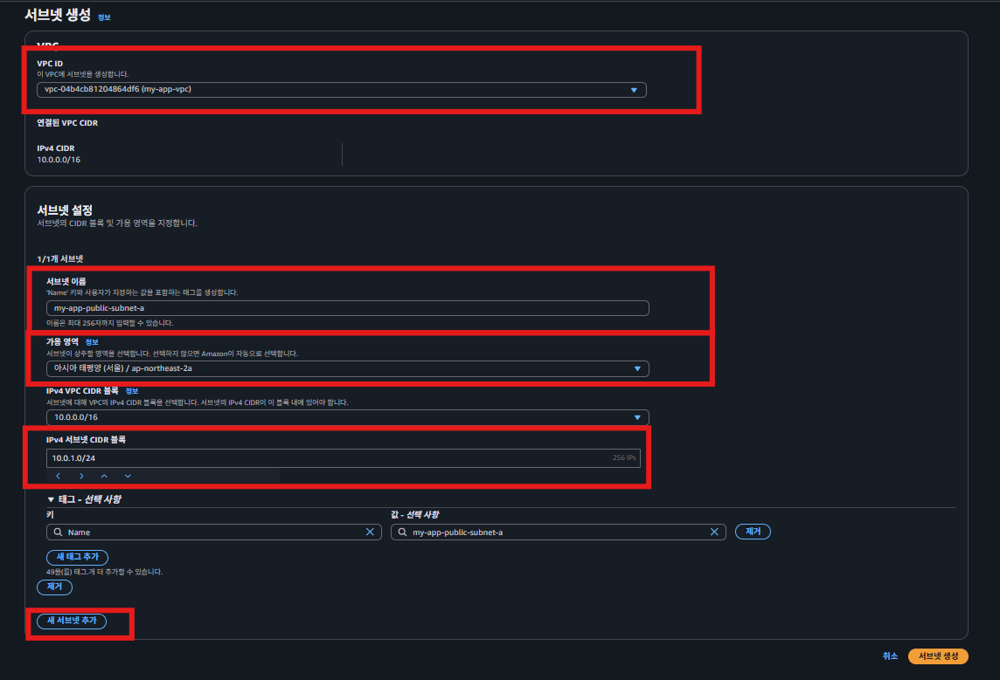  
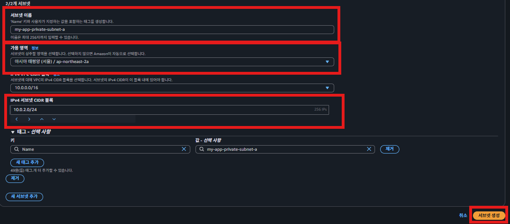  

- 서브넷 이름은 다른 서브넷과 쉽게 구별할 수 있으면서 어떤 용도의 서브넷인지 바로 알 수 있게 작성하기
    - ex) `[서비스명]-[public 또는 private]-subnet-[가용영역 알파벳]`
- IPv4 서브넷 CIDR 블록은 AWS 리소스를 배치할 때 부족하지 않을 정도의 크기로 설정하기
    - 서비스의 확장성도 어느 정도 고려해서 설정하면 좋음
    - 위 예시에서는 각 서브넷당 256개의 IP면 충분하다고 판단
    - 10.0.0.1 ~ 10.0.0.255 범위
  
### 서브넷 생성확인
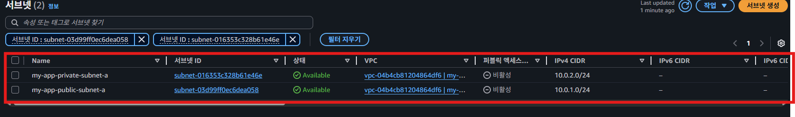  
  
  
## public 서브넷에 EC2 생성하기  
### EC2 인스턴스 옵션 설정
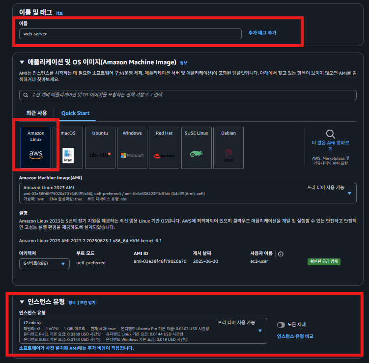  
  
### 키 페어 생성
  
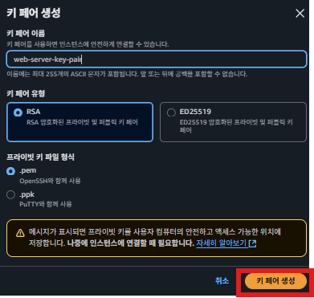  
  

### 네트워크 설정
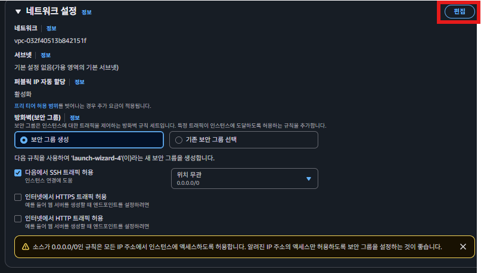  
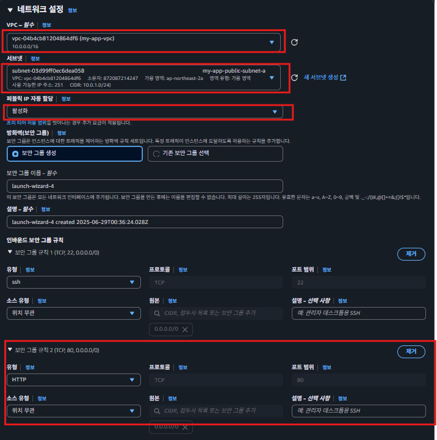  
외부에서 접근할 수 있어야하기 때문에 서브넷설정시 public 서브넷과 퍼블릭 ip 할당을 설정 후 **인스턴스 생성** 
  
  
### 접속하기  
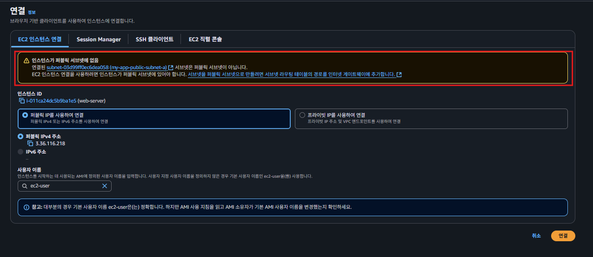  
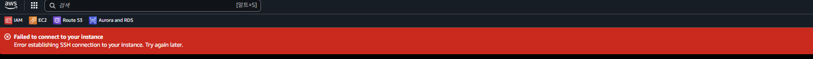
C2 인스턴스에 접속해보면 접속이 안 되는 걸 확인할 수 있다.  

접속을 하지 못한 이유는 **VPC에 외부 인터넷과 소통할 수 있는 출입구**를 셋팅하지 않았기 때문이다. 여기서 얘기하는 ‘**외부 인터넷과 소통할 수 있는 출입구**’를 보고 정확하게는 **인터넷 게이트웨이**라고 부른다.