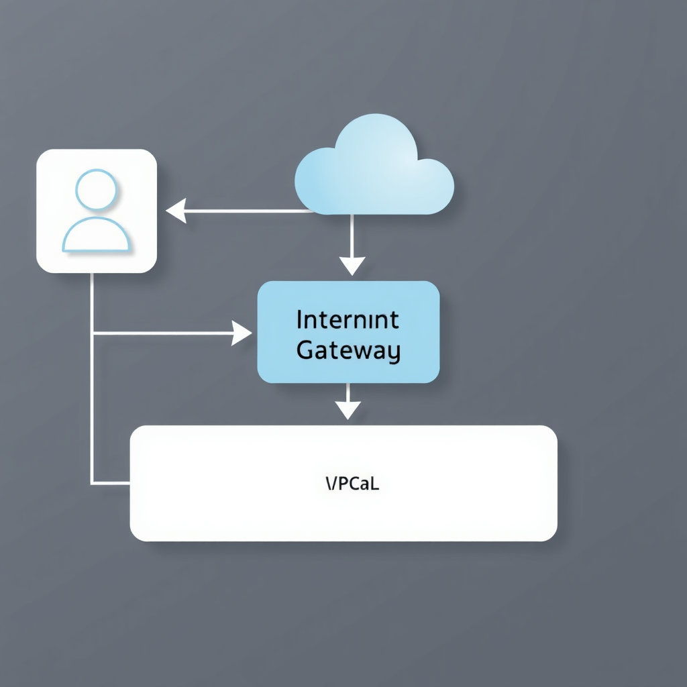
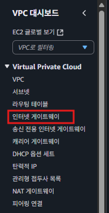
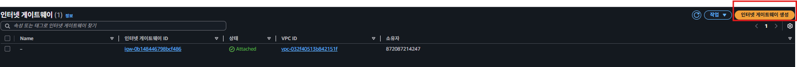
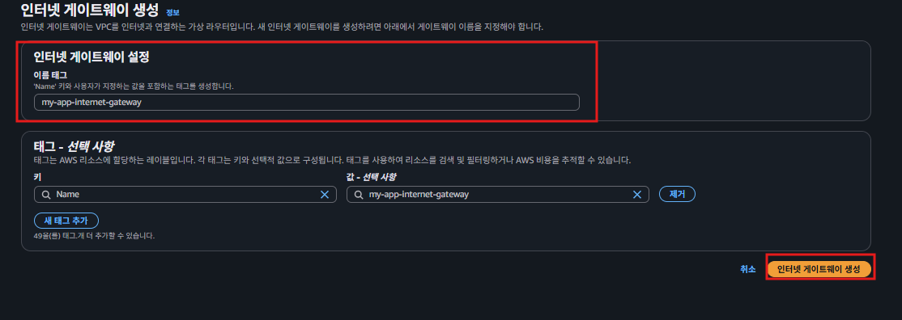
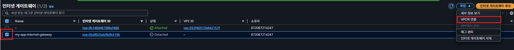
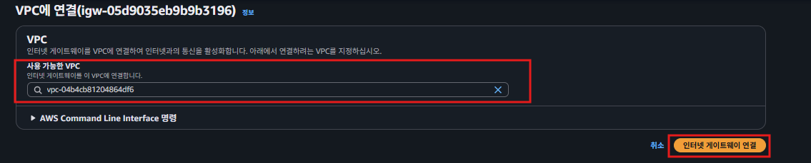

# 인터넷 게이트웨이
### 인터넷 게이트웨이**(Internet Gateway)**란?

`인터넷 게이트웨이`(Internet Gateway)란 **VPC와 외부 인터넷 간에 통신할 수 있게 해주는 장치**이다.

VPC의 서브넷을 만든 뒤에, 서브넷에 EC2 인스턴스를 생성했는데 접속이 안 되는 걸 확인했**다. VPC에 인터넷 간에 통신할 수 있게 해주는 장치**를 셋팅하지 않았기 때문이다.

### 인터넷 게이트웨이의 이해

**인터넷 게이트웨이**는 아래 그림과 같이 **외부 인터넷과 소통할 수 있는 출입구**라고 생각하면 이해하기가 편하다.  
  
사람들도 집에 문이 있어야 들락날락 할 수 있듯이, VPC에도 **인터넷 게이트웨이**가 있어야 들락날락 할 수 있다.

(**Gateway**를 우리나라 말로 직독직해하면 **출입구**라는 의미를 가진다.)  
  

## 인터넷 게이트웨이 생성하기  
### 인터넷 게이트웨이 생성페이지 접근
  
  
  
  
### 인터넷 게이트웨이 생성
  
   
### 인터넷 게이트웨이 연결하기
  
  
  
