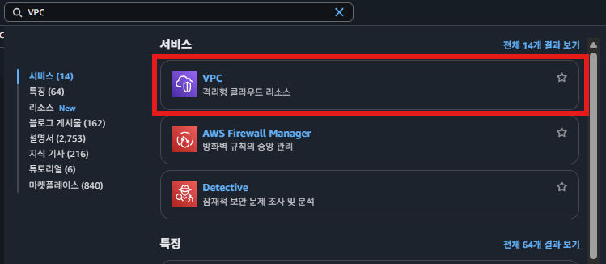
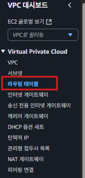
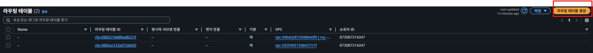
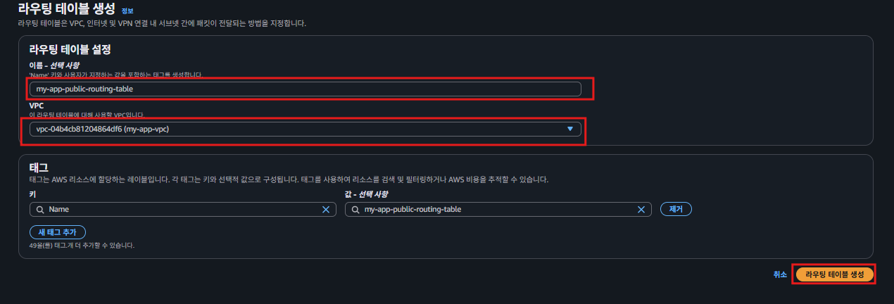
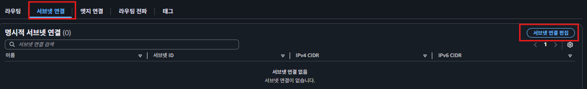
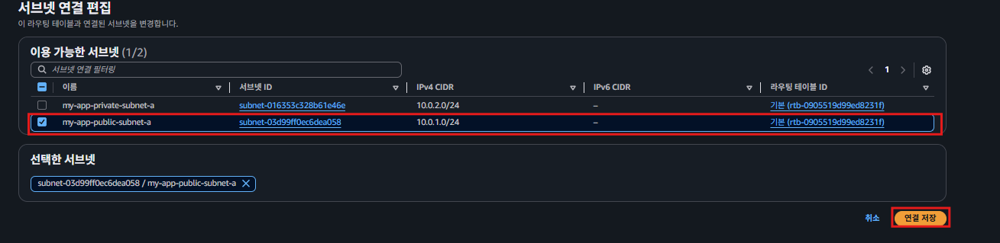
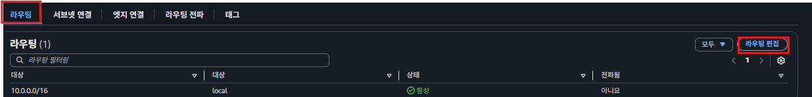
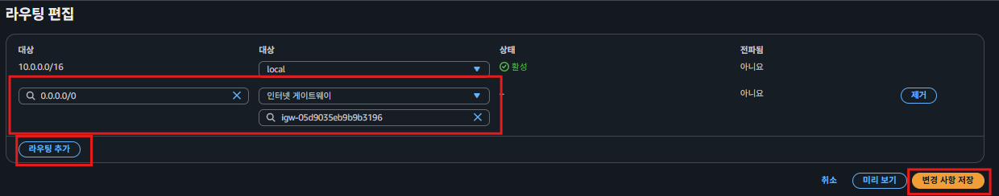
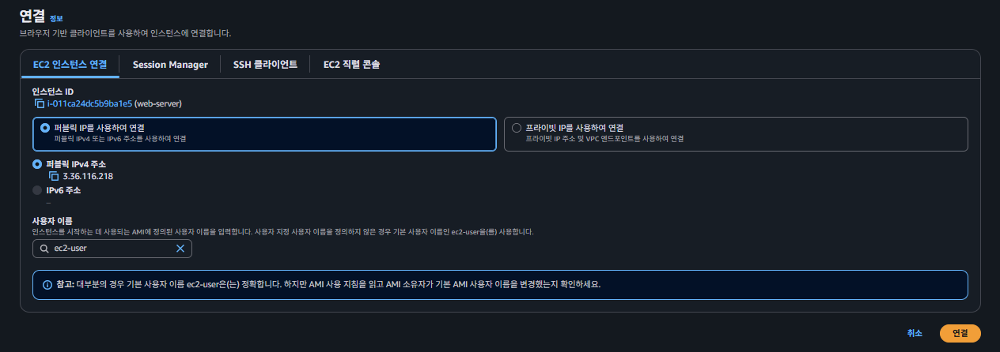
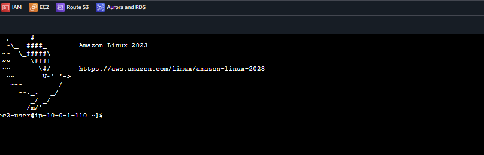

# 라우팅 테이블
### 라우팅 테이블(Routing Table)이란?

`라우팅 테이블`(Routing Table)은 **트래픽을 어디로 전송해야 하는 지 경로를 알려주는 테이블**이다.  
  
**Routing Table**에서 Routing이 ‘길을 정하다’라는 의미를 내포하고 있는 걸 보면, 이름에서도 그 의미를 유추할 수 있다.

### 라우팅 테이블은 왜 필요할까 ?

**VPC**는 **인터넷 게이트웨이** 뿐만 아니라 **라우팅 테이블**도 있어야만 외부 인터넷과 통신을 할 수 있는 걸까?  

VPC 내부에 EC2 인스턴스가 있고, 이 인스턴스가 VPC 외부에 있는 특정 컴퓨터와 통신을 하고 싶다고 가정하자.   
  
그럼 EC2 인스턴스 입장에서는 외부 인터넷에 있는 컴퓨터와 통신을 해야 하기 때문에 인터넷 게이트웨이를 거쳐가야 한다. 하지만 생각보다 컴퓨터는 똑똑하지 않아서 **인터넷 게이트웨이로 가는 방법조차 모른다.**   
  
즉, EC2 인스턴스가 특정 컴퓨터로 통신을 보내려고 해도 **어떤 방향으로 트래픽을 보내야 하는 지 모른다**는 뜻이다. 이 때, EC2 인스턴스가 **어떤 경로로 트래픽을 전송해야 되는 지 알려주는 장치**가 바로 `라우팅 테이블`(Routing Table)이다.  
  
## 라우팅 테이블 생성하기  
  
### 생성페이지 접근하기
  
  
  

### 라우팅 테이블 생성하기
  
  
### 서브넷 연결하기  
  
  
  
  
### 라우팅 설정
  
  

어떤 경로로 트래픽을 전송해야 하는 지’를 직접 정의해야 하는 페이지다. 하나씩 해석해보자.

1. `‘VPC 내부에서 10.0.0.0/16로 보내는 트래픽은 local로 보내라!’`라는 뜻이다. local로 보낸다는 건` Prviate IP를 활용해 내부에서 통신`을 하겠다는 의미이다.
2. 0.0.0.0/0은 “모든 IPv4 주소”를 의미한다. 따라서 ‘**VPC 내부에서 `IPv4 주소로 보내는 모든 트래픽은 인터넷 게이트웨이로 보내라!`**’라는 뜻이다.

이 2가지 조건을 보면 모순적인 부분이 있다. 1번 조건은 10.0.0.0/16으로 보내는 트래픽을 local로 보내라고 하지만, 2번 조건은 모든 IPv4 주소의 모든 트래픽을 인터넷 게이트웨이로 보내라고 한다.  
  
그런데 1번과 2번 조건을 둘 다 만족하는 IP 주소일 경우(ex. 10.0.0.5)에는 트래픽을 local 보내야 할까? 인터넷 게이트웨이로 보내야 할까?

AWS 공식 문서를 읽어보면 `‘IP 주소 범위가 더 구체적인 조건을 우선 적용한다’`고 되어 있다.   
  
즉, 0.0.0.0/0의 주소보다 10.0.0.0/16의 주소가 더 구체적이기 때문에, 10.0.0.5로 트래픽을 보내는 경우에는 local로 보내게 된다.
  
  
## EC2 다시 접속하기
  
  