## NAT 게이트웨이란 ?

### 프라이빗 서브넷을 사용하기 위해 필요한 셋팅

**퍼블릭 서브넷**으로 사용하기 위해 **인터넷 게이트웨이**랑 **라우팅 테이블**을 추가로 셋팅했어야 했다.

하지만 **프라이빗 서브넷**에서는 퍼블릭 서브넷과 달리 **인터넷 게이트웨이**를 셋팅하면 안 된다. 왜냐하면 인터넷 게이트웨이는 **VPC와 외부 인터넷 간에 통신**할 수 있게 해주는 장치이기 때문이다. 프라이빗 서브넷은 보안을 위해 외부에서 접근이 불가능하게 만들어야 한다.

따라서 프라이빗 서브넷은 인터넷 게이트웨이 대신에 **NAT 게이트웨이**를 셋팅해야 한다. 그럼 지금부터 **NAT 게이트웨이**가 뭔지 알아보자.

### NAT 게이트웨이의 직관적인 이해

**NAT 게이트웨이**는 **내부에서 외부로만 나갈 수 있는 출입구**라고 생각하면 이해하기 편하다.
  
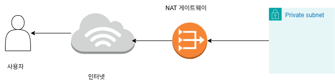  

NAT 게이트웨이가 한 방향(내부 → 외부)로만 트래픽을 보낼 수 있다보니 외부의 해커 침입으로부터 안전하게 보호할 수 있다는 장점이 있다. 즉, 보안적으로 훨씬 안전하다. 

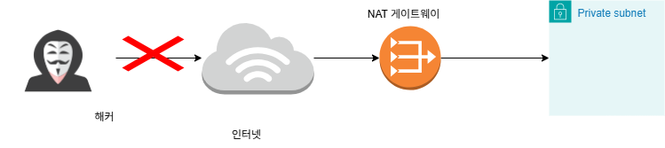  

### NAT 게이트웨이를 추가한 AWS 아키텍처 그림

NAT 게이트웨이를 어떻게 추가해야 하는 지 그림으로 살펴보자. 특이하게도 NAT 게이트웨이는 VPC에 연결하는 것도 아니고, 프라이빗 서브넷에 연결하는 것도 아니다. **NAT 게이트웨이는 퍼블릭 서브넷에 연결을 한다.**

프라이빗 서브넷을 외부 인터넷에 직접적으로 노출시키지 않으면서도, 인터넷에 접근은 할 수 있게 만들어야 해서 나온 구조로 예상된다.  
  
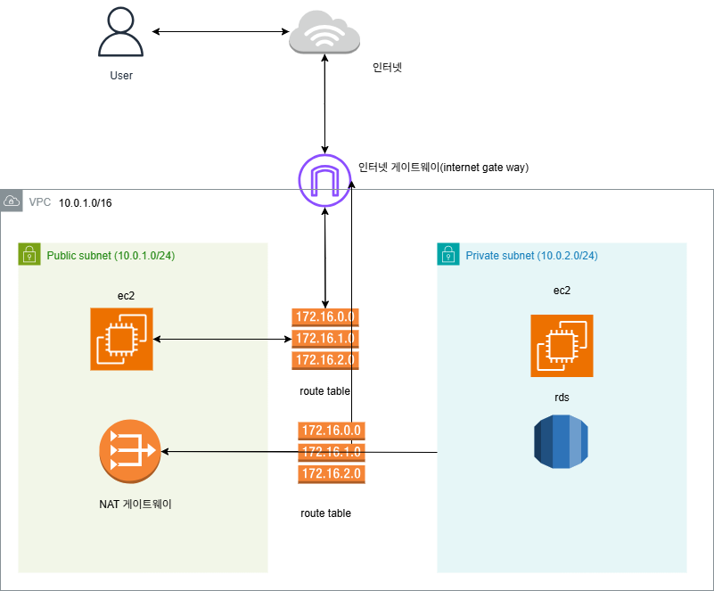  
  
  
## NAT 게이트웨이 생성
  
### 1.NAT 게이트웨이 생성 패이지
  
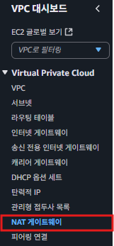  
  

### 2.생성
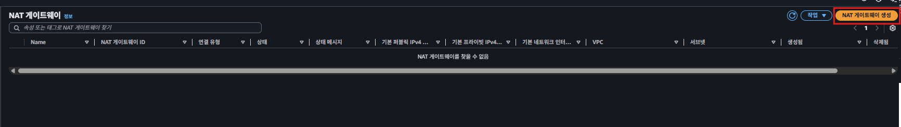  
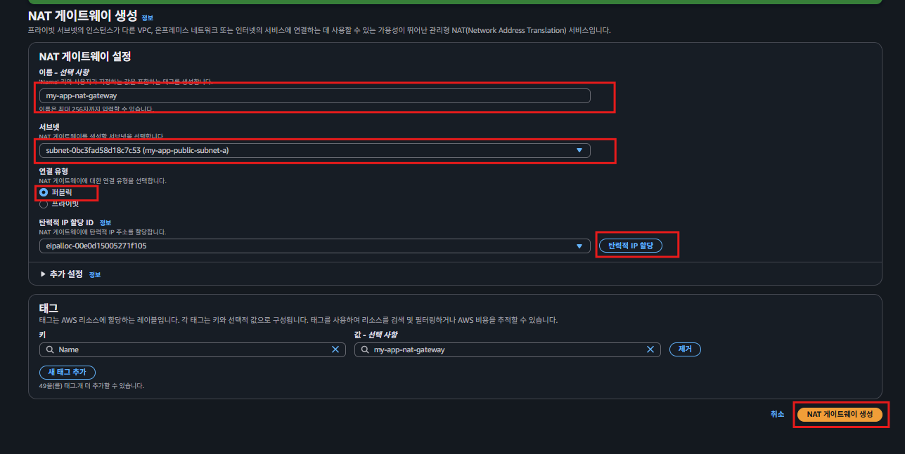  

- 연결 유형 : 외부 인터넷과 통신할 수 있게 만들기 위해 퍼블릭을 선택  
- NAT 게이트 웨이는 public subnet 과 연결한다.
  
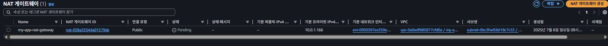  
NAT 게이트웨이는 생성되는 데 1~2분 정도의 시간이 걸린다.  
  
### 3.라우팅 테이블 생성하기
라우팅 테이블을 만들어서 트래픽이 ‘프라이빗 서브넷 → NAT 게이트웨이’의 방향으로 이동할 수 있게 경로를 설정해주자.   

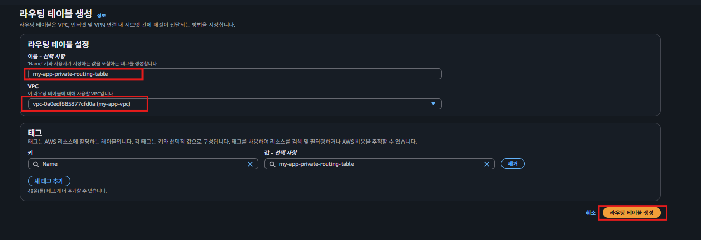  
  
### 4. 라우팅 테이블 서브넷 연결
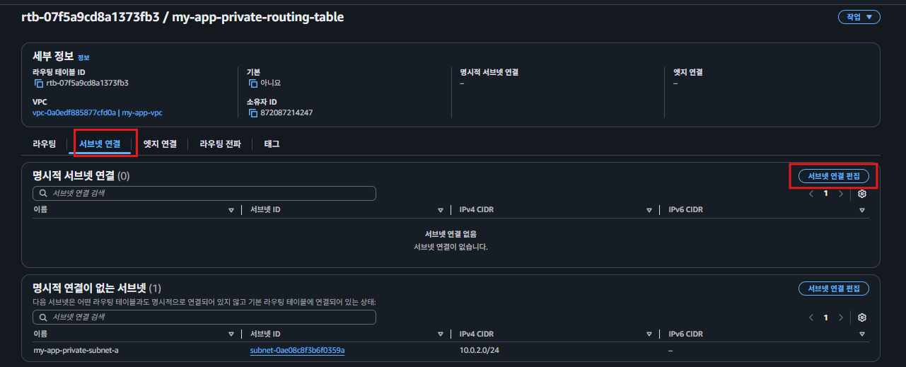  
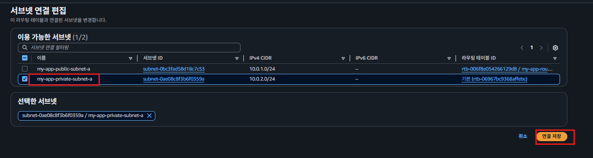  
  
### 5.라우팅 편집
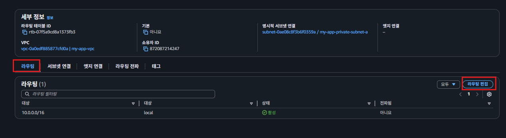  
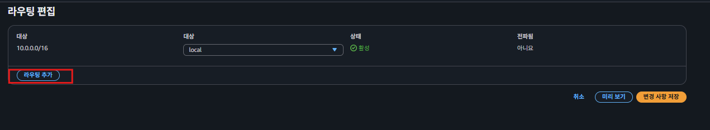
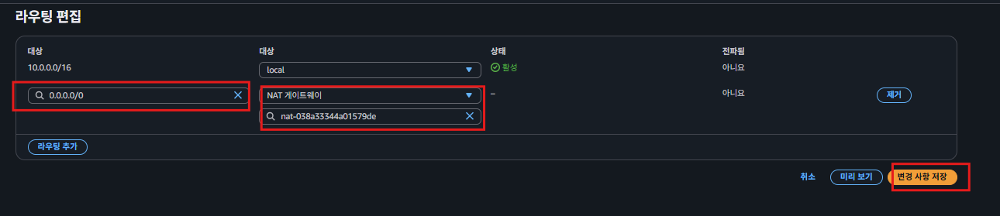  
이 페이지가 ‘어떤 경로로 트래픽을 전송해야 하는 지’를 직접 정의해야 하는 페이지다. 하나씩 해석해보자.

1. `‘VPC 내부에서 10.0.0.0/16로 보내는 트래픽은 local로 보내라!’`라는 뜻이다. local로 보낸다는 건 **Prviate IP**를 활용해 내부에서 통신을 하겠다는 의미이다.
2. 0.0.0.0/0은 “모든 IPv4 주소”를 의미한다. 따라서 ‘**VPC 내부에서 IPv4 주소로 보내는 모든 트래픽은 NAT 게이트웨이로 보내라!**’라는 뜻이다.

그리고 AWS 공식 문서에 따르면 ‘IP 주소 범위가 더 구체적인 조건을 우선 적용한다’고 했다.   
  
즉, 0.0.0.0/0의 주소보다 10.0.0.0/16의 주소가 더 구체적이기 때문에, 10.0.0.5로 트래픽을 보내는 경우에는 local로 보내게 된다. 그리고 10.0.0.0/16에 해당하지 않는 IP 주소로 요청을 보내면 NAT 게이트웨이로 트래픽을 보낸다.  

NAT 게이트웨이를 활용해 외부 인터넷에서 접근할 수 없는 프라이빗 서브넷을 만드는 과정이다. 다음 강의에서 프라이빗 서브넷에 EC2 인스턴스를 생성해, 실제로 외부 인터넷에서는 접근할 수 없는 지 확인해보자. 그리고 EC2 인스턴스에서는 외부 인터넷으로 요청을 보낼 수 있는 지도 확인해보자.
  
  
## private subnet ec2 연결
### EC2 인스턴스 옵션 설정
  

### 키 페어 생성
  
  
  
키페어 이름은 my-app-key-pair로 변경해서 생성한다.  

### 네트워크 설정  
  
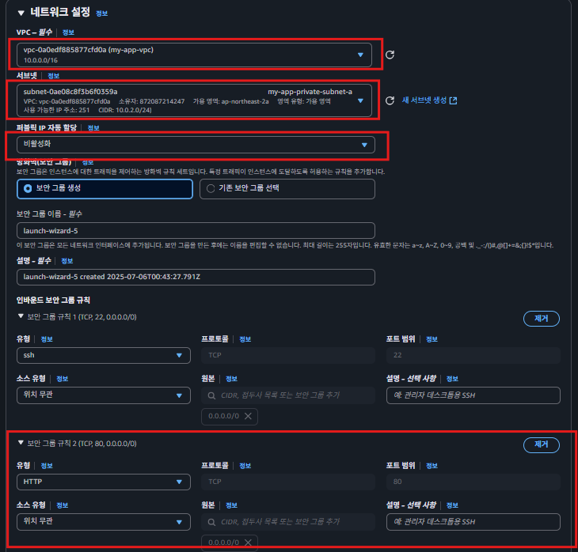  
  
### EC2 인스턴스에 접속하기
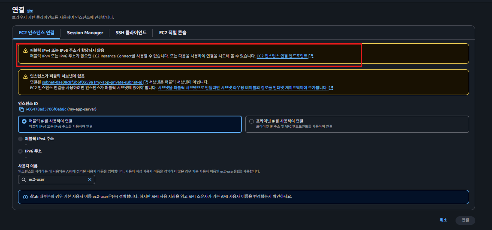  

EC2 인스턴스에 접속하려고 봤더니 퍼블릭 IPv4가 할당되지 않았고, 인스턴스가 퍼블릭 서브넷에 없어서 접속이 안 된다고 한다.   
  
집에 있는 컴퓨터로 EC2 인스턴스에 접속하는 것도 ‘외부 인터넷 → 서브넷’ 방향의 요청이기 때문에 접속이 안 된다. **즉, 프라이빗 서브넷이 제 역할을 하고 있다는 뜻**이기도 하다.  

  
현재 구성에서 인터넷에서 프라이빗 서브넷에 있는 EC2 인스턴스로 접근할 수 있는 경로 자체가 없다. 이 때문에 외부에서 접속할 수가 없다. 
   
> 그러면 프라이빗 서브넷에 EC2 인스턴스를 생성하는 것까진 좋았는데, EC2 인스턴스 내부로 접속은 어떻게 해야 할까?
  
  
### putty 접속하기
### 1.public ip로 접속
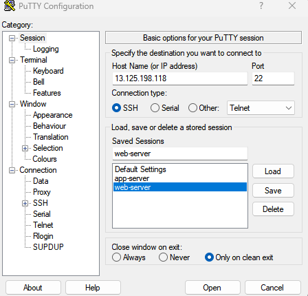  
### 2.접속 계정 설정
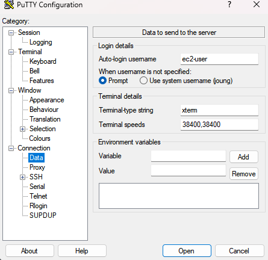  
### 3. ppk 설정 (pem 키를 puttygen을 이용해서 ppk 생성)
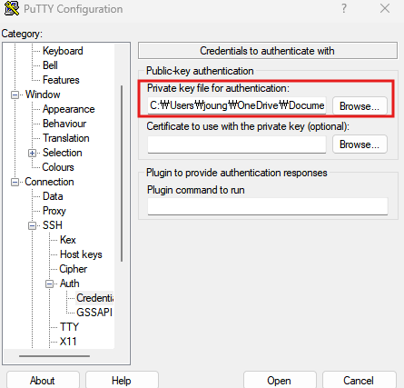  
  
### 4. private ip 터널링 설정
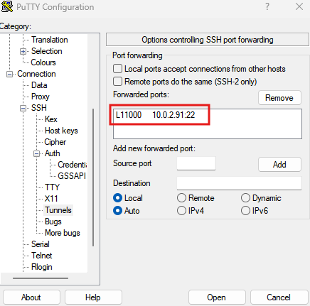  
  
  
### 5. 목적지 ip 접속하기 
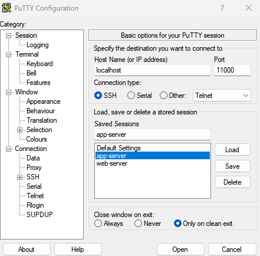  
  
### 6. 목적지 ppk 키 설정(host키 설정이 아님)
    
  
### 7.접속하기
