## 가용성 과 시스템 이중화
### 가용성(Availability)

가용성(Availability)이란 **시스템이 서비스를 정상적으로 제공할 수 있는 가능성**을 의미한다. 서비스에 장애가 발생할 가능성이 극히 작은 시스템을 가용성이 높은(**고가용성**) 시스템이라고 말할 수 있다. 반대로 서비스가 다운되는 시간이 긴 시스템을 가용성이 낮은 시스템이라고 한다.

가용성이 높고 낮음은 서비스의 정상 가동률(%)로 표시된다. 가용성 99.99%라는 경우 99.99% 시간을 정상적으로 이용 가능한 시스템을 말한다. 이를 바꿔 말하면 1년에 53분 정도는 서비스가 다운된다고 말할 수 있다.

**[고가용성을 가진 시스템 설계 방법]**

가용성을 높이기 위해서는 서비스 사용 불가능 시간을 최대한 발생시키지 않게 하고 설령 발생하더라도 그 시간을 짧게 만들어야 한다. 다운 타임을 줄이는 데 가장 중요한 설계 방법 중 하나가 **시스템 이중화**이다.

### ✅시스템 이중화

**시스템 이중화**라는 건 시스템의 일부분을 사용할 수 없게 되어도 다른 시스템을 이용하여 서비스를 계속 이용할 수 있게 만드는 걸 의미한다.

예를 들어, 도시를 연결하는 도로가 하나가 아닌 두 개가 있다면 둘 중 하나의 도로에서 사고가 발생하더라도 다른 도로를 이용하여 수송할 수 있다. 또한, 두 개의 도로가 존재함으로써 도로 공사 중에도 정상적으로 수송을 할 수 있다.  

시스템에서 이중화는 아래와 같이 설계할 수 있다. 이와 같이 이중화 설계를 하면 다운 타임을 줄일 수 있게 된다. 즉, 서비스의 가용성을 높일 수 있게 된다.   
  
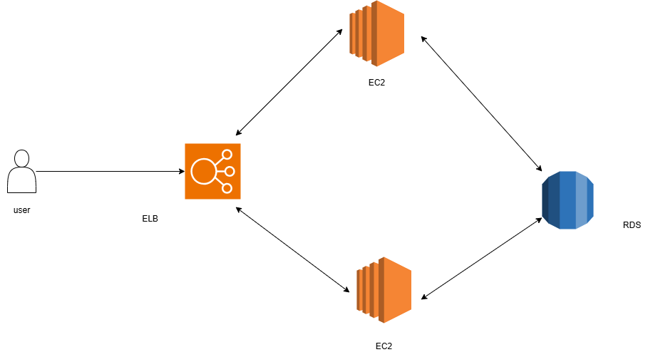  

가용성을 높이기 위해 시스템 이중화 뿐만 아니라 가용 영역(Availability zone)을 신경 써서 서버를 배치한다. 

## 가용 영역이란?
AWS는 자연 재해로 인해 데이터 센터가 파괴될 가능성을 고려해, 물리적으로 분리된 데이터 센터를 구축한다. 이와 같이 물리적으로 분리된 데이터 센터를 보고 가용 영역(Availability zone)이라고 부른다.  
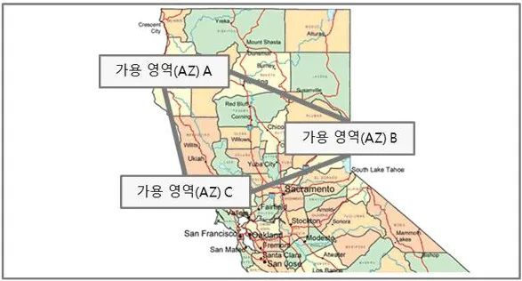  
출처 : https://velog.io/@eeapbh/AWS-구조2가용영역-AZ  

### 가용 영역을 활용한 아키텍처 개선
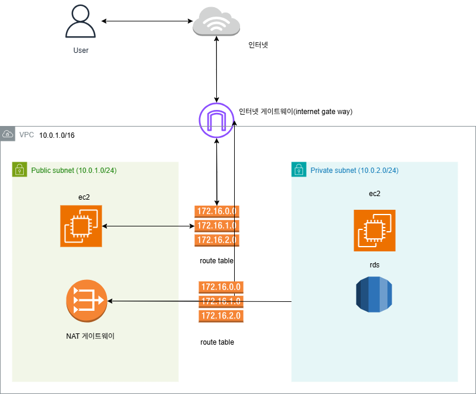  

우리는 지금까지 하나의 가용 영역(ap-northeast-2a)에 모든 인프라를 구성했다. 하나의 가용 영역에 모든 인프라를 구성하게 되면, 자연 재해에 비교적 취약한 구조가 될 수 있다. 만약에 ap-northeast-2a의 가용 영역에 화재가 나서 데이터 센터가 소실되면, 해당 가용 영역에 셋팅해둔 모든 인프라와 데이터는 소실된다. 복구할 수 있는 방법이 없다.

당연히 자연 재해가 일어날 확률이 높진 않다. 하지만 내가 운영하는 서비스가 100억의 가치가 있다고 가정해보자. 그런데 자연 재해로 인해 내 서비스의 모든 것이 손실되거나, 서비스가 중단된다고 가정해보자. 회사 입장에서는 아주 치명적일 수 있다. 이 때문에 안정성이 중요한 회사에서는 아래와 같이 2개 이상의 가용 영역을 활용해 인프라를 구성한다. 아래와 같이 가용 영역 2개를 활용해 구성하면 하나의 가용 영역이 아예 손실이 된다고 하더라도 서비스가 중단되는 일이 없어진다.

(Bastion Host는 중단이 된다고 하더라도 서비스가 작동되는 데는 문제가 없다. 단순히 EC2 인스턴스와 같은 리소스에 관리자가 직접 접근하기 위한 용도이다.)  
  
  
  
## 가용 영역 2개를 활용해 VPC 구성하기
  
### 1. **VPC 추가하기**

    (VPC는 이미 만들어두었다.)
  
### 2. 서브넷 추가하기
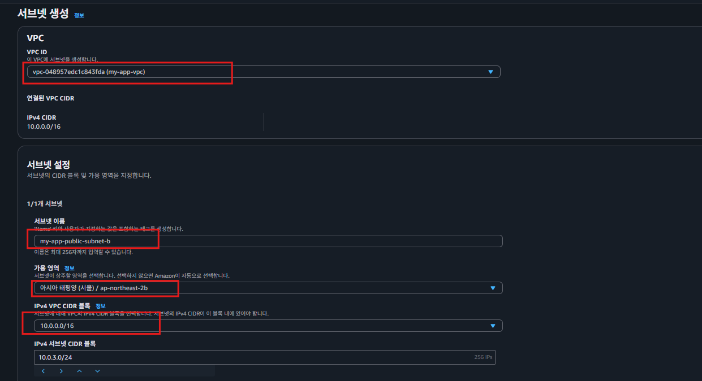  
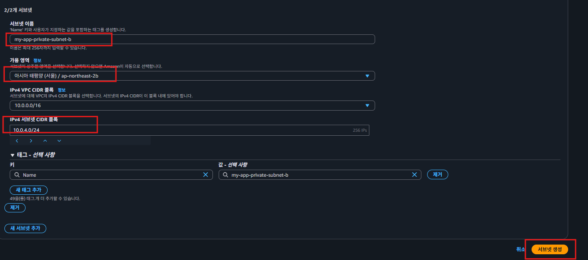  
  
### 3. **인터넷 게이트웨이 추가하기**

인터넷 게이트웨이는 VPC 단위로 동작한다. 따라서 가용 영역이 몇 개든 **하나의 VPC**당 **하나의 인터넷 게이트웨이**만 생성하면 된다. 즉, 추가로 생성해줄 인터넷 게이트웨이는 없다.  
  
### 4. **NAT 게이트웨이 추가하기**

NAT 게이트웨이는 서브넷 단위로 동작한다. 따라서 가용 영역의 개수에 맞춰서 NAT 게이트웨이를 생성해야 한다. 즉, 새로운 가용 영역(ap-northeast-2b)에 대한 NAT 게이트웨이가 필요하다.  

### 5. **퍼블릭 라우팅 테이블 추가하기**

기존에 생성된 퍼블릭 라우팅 테이블의 라우팅 정책을 별도로 수정할 게 없기 때문에, 새로 생성한 퍼블릭 서브넷은 기존 퍼블릭 라우팅 테이블을 같이 사용해도 된다.  
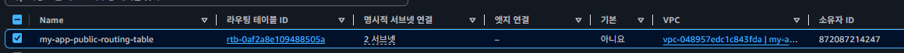    
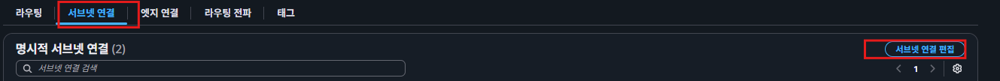  
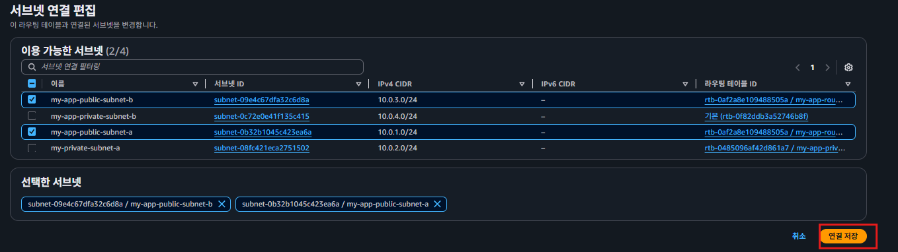  
  
### 6.프라이빗 라우팅 테이블 추가하기  
기존 라우팅 테이블은 ap-northeast-2a의 가용 영역에 있는 NAT 게이트웨이로 라우팅을 하고 있다. 하지만 새로 만든 프라이빗 서브넷은 ap-northeast-2b의 가용 영역에 있는 NAT 게이트웨이로 라우팅을 해야하기 때문에 새로운 라우팅 테이블을 만들어야 한다.   
  
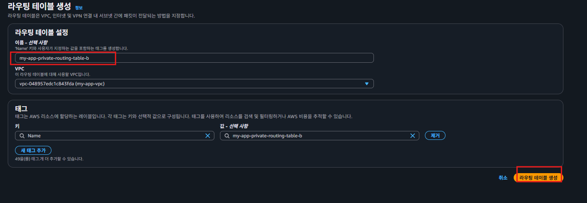  
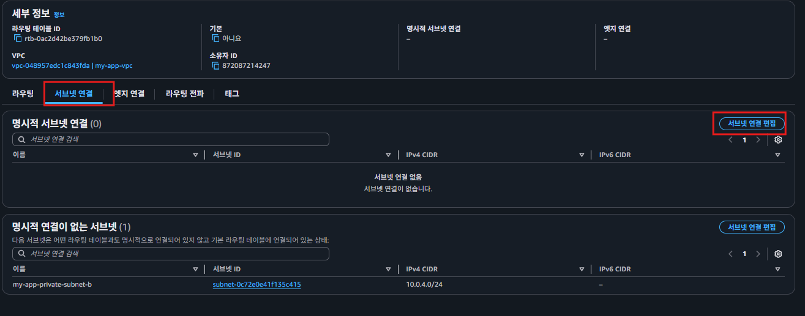  
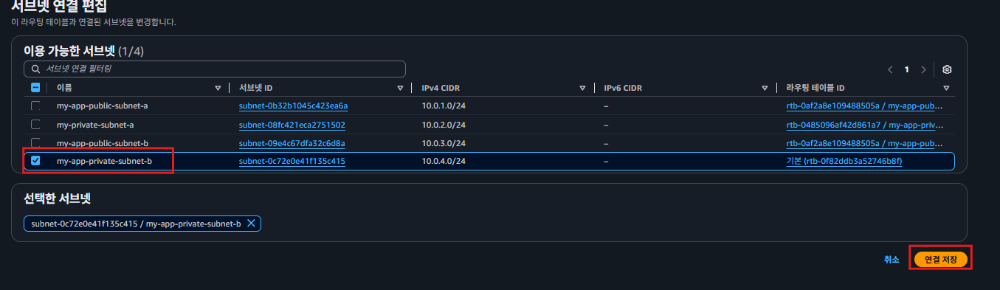  
  
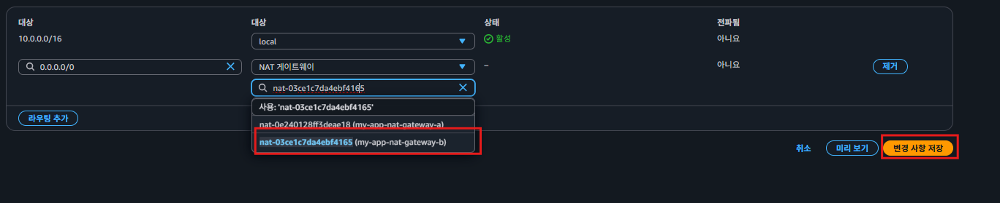

