# 프라이빗 서브넷에 RDS 인스턴스 추가하기  
  
### 아키텍처 미리 보기
 
  
  
### 프라이빗 서브넷에 RDS 인스턴스 추가하기
  
### 1. 서브넷 그룹 생성하기
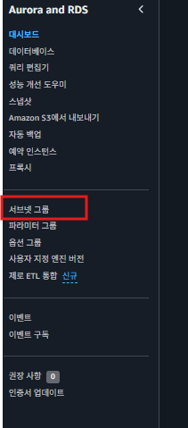  
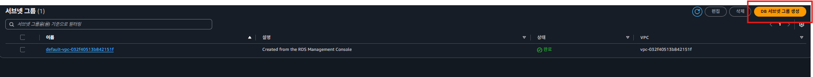  
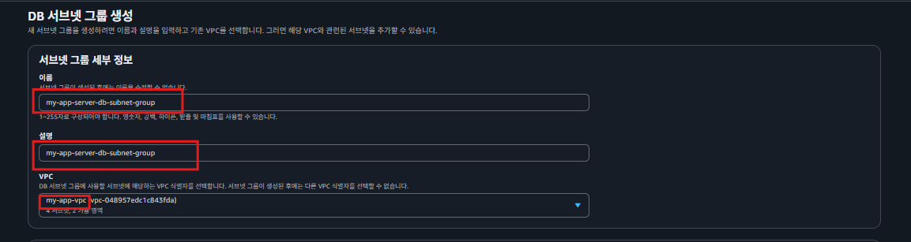  
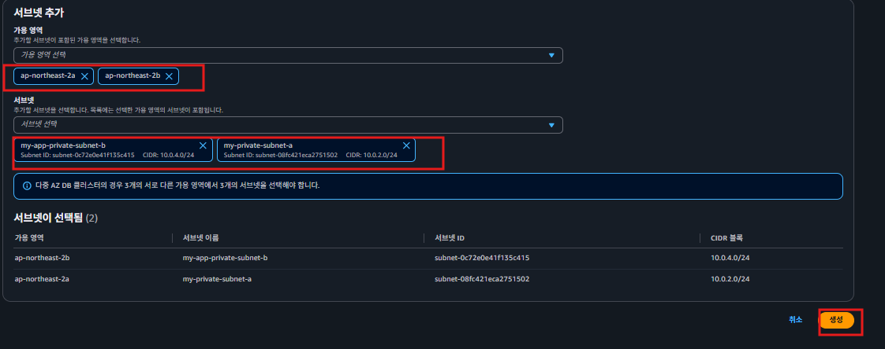  
RDS가 가지고 있는 기능(다중 AZ, Multi AZ) 때문에 가용 영역은 필수로 2개 이상 선택해야 한다.   
  
### 2.RDS 인스턴스를 위한 보안그룹 생성하기
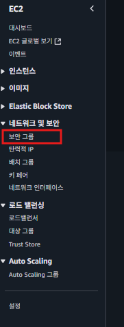  
보안 그룹 생성 클릭  
  
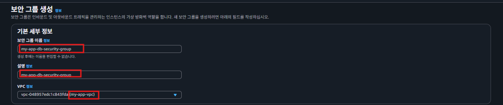  
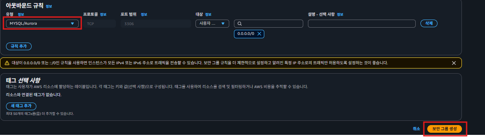  
  
### 3.RDS 인스턴스 생성하기  
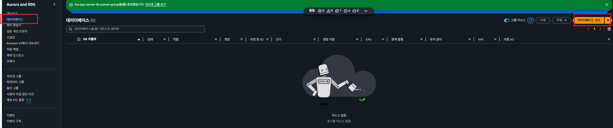  
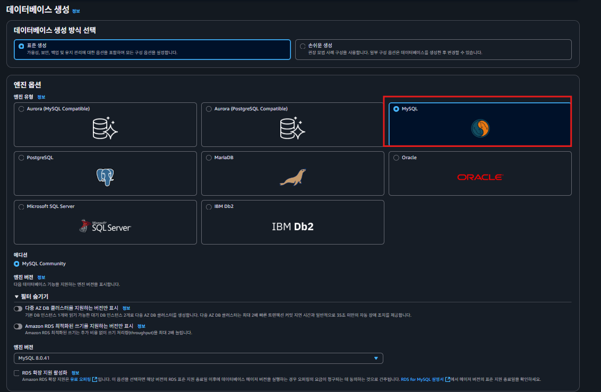  
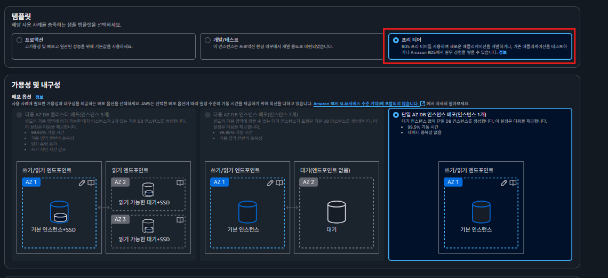  
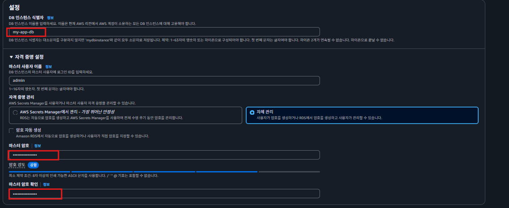  
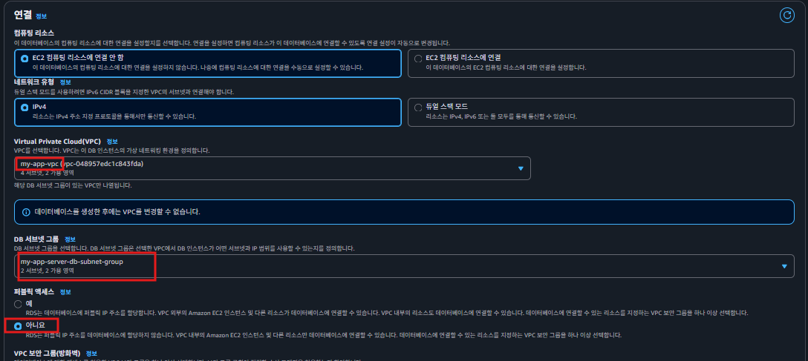  
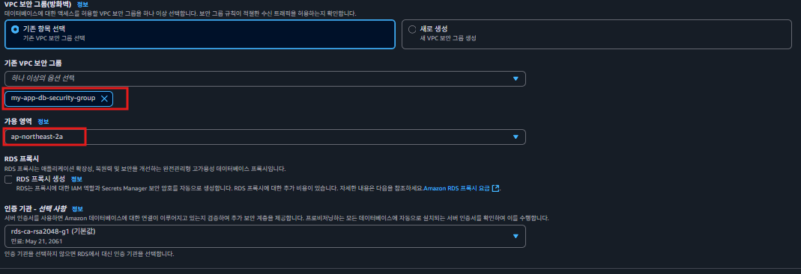  
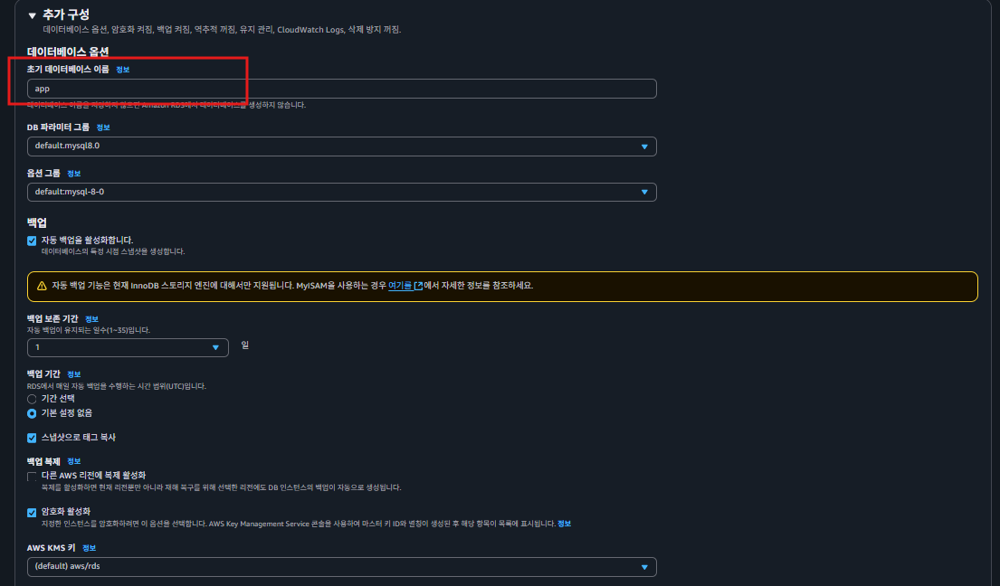