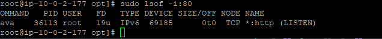
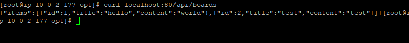

# 스프링 서비스 배포
  
## 배포하기

### jdk 및 git 설치
```bash 
# root 권한으로 전환
sudo su

# 패키지 업데이트
dnf update -y

# Git 설치
dnf install git -y

# 또는 Java 17 개발 도구까지 포함하여 설치
dnf install java-17-amazon-corretto-devel -y

# Java 버전 확인
java -version
javac -version  

```

### 스프링 서비스 배포

```sh 
#!/bin/bash
# 변수 설정
BASE_DIR="/opt/spring-app"
APP_DIR="$BASE_DIR/dream"
GIT_REPO="https://github.com/joung1010/AWS-BASIC.git"
GIT_BRANCH="development"  # 브랜치 변수 추가
JAVA_PATH="/usr/lib/jvm/java-17-amazon-corretto.x86_64/bin/java"
JAR_NAME="app.jar"
SERVER_PORT=

# 로그 함수
log() {
  echo "[$(date +'%Y-%m-%d %H:%M:%S')] $1"
}

# 1. 기존 디렉토리 정리
if [ -d "$APP_DIR" ]; then
  log "기존 애플리케이션 디렉토리 삭제 중..."
  rm -rf "$APP_DIR"
  log "삭제 완료"
fi

# 2. 애플리케이션 디렉토리 생성
log "애플리케이션 디렉토리 생성 중..."
mkdir -p "$APP_DIR"
cd "$APP_DIR"

# 3. Git 프로젝트 클론 (브랜치 지정)
log "Git 저장소 클론 중: $GIT_REPO ($GIT_BRANCH 브랜치)"
git clone -b "$GIT_BRANCH" "$GIT_REPO" .

# 4. (삭제) build.gradle 자동 수정 부분 제거

# 5. Gradle 빌드 실행
log "애플리케이션 빌드 중..."
if [ -f "./gradlew" ]; then
  log "Gradle Wrapper 사용"
  chmod +x ./gradlew
  # 직접 스크립트를 실행하도록 변경
  export JAVA_HOME=$(dirname $(dirname "$JAVA_PATH"))
  ./gradlew clean build
else
  log "시스템 Gradle 사용"
  gradle clean build -x test
fi

# 6. JAR 파일 경로 설정
if [ -f "build/libs/$JAR_NAME" ]; then
  JAR_FILE="build/libs/$JAR_NAME"
else
  log "지정한 이름의 JAR 파일을 찾을 수 없어 기본 검색을 시도합니다..."
  JAR_FILE=$(find . -name "*.jar" | grep -v "sources\|javadoc\|original" | head -n 1)
fi

if [ -z "$JAR_FILE" ]; then
  log "오류: JAR 파일을 찾을 수 없습니다."
  exit 1
fi

log "JAR 파일 발견: $JAR_FILE"

# 7. 애플리케이션 실행
log "애플리케이션 실행 중..."
nohup $JAVA_PATH -jar -Dserver.port=$SERVER_PORT "$JAR_FILE" > app.log 2>&1 &

# 8. 프로세스 ID 저장
PID=$!
echo $PID > app.pid
log "애플리케이션이 PID $PID로 시작되었습니다."
log "로그 확인: tail -f $APP_DIR/app.log"

log "배포 완료!"

```
  
### 권한 추가
```bash 
chmod +x deploy.sh
```

### 확인하기
`sudo lsof -i`는 현재 시스템에서 네트워크 연결을 사용 중인 모든 프로세스를 보여주는 명령어
```sh 
sudo lsof -i:80

```
  
  
### 요청 보내기
```sh 
curl localhost:80/health
```


```sh 
curl localhost:80/api/boards
```
  
  
### 동일한 방법으로 다른 가용성 ec2에도 배포하기