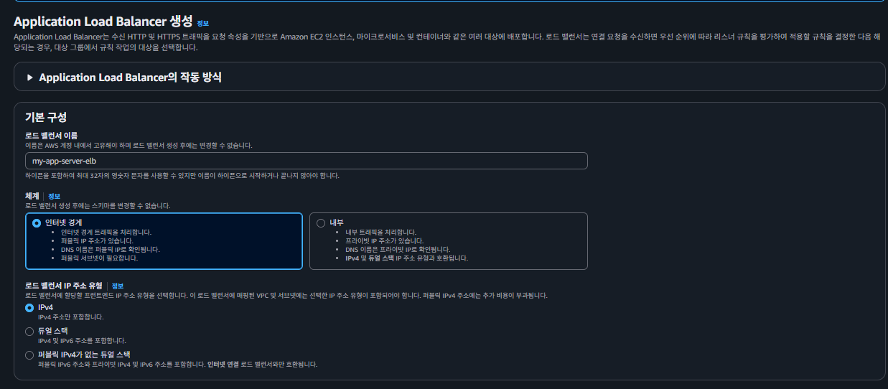
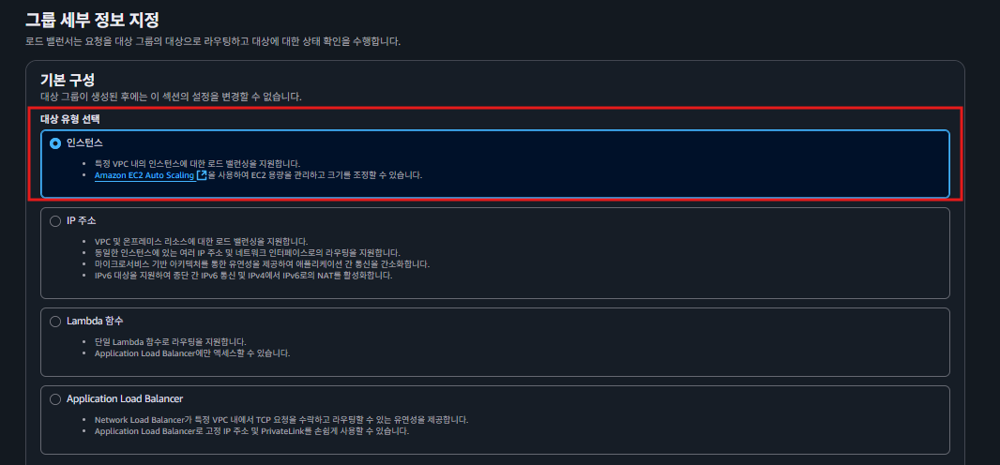
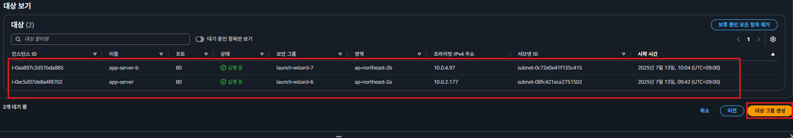

#  ELB 추가하기

### 아키텍처 미리보기

  
### ELB 추가하기
  
### 1.로드 밸런서에서 사용할 보안 그룹 생성하기
  
  
  
### 2. 로드 밸런서 생성
  
  
  
- 인터넷 경계가 외부 인터넷에서 traffic을 받을때 사용하는 옵션  
  
  
- public subnet 선택
  
  
  
### 3.대상 그룹 생성하고 셋팅
  
  
  
  
  
  
### 4.ELB 생성  
  
### 5. 로드 밸런서로 요청을 보냈을 때 정상적으로 응답하는 지 확인
  

### 마무리

ELB 덕분에 2대의 EC2 인스턴스에 트래픽을 분산시킬 수 있었고, 외부 인터넷(로컬 컴퓨터)에서 프라이빗 서브넷에 있는 EC2 인스턴스로 요청을 보낼 수 있었다. 하지만 아쉬운 포인트가 하나 있다. 아래 아키텍처에서 만약 ap-northeast-2a의 가용 영역이 자연 재해로 인해 고장난다면, RDS 인스턴스가 작동하지 않으면서 서비스의 중단이 일어난다.  

  
이를 방지하기 위해 EC2 인스턴스(백엔드 서버)를 서로 다른 가용 영역에 배치한 것처럼, RDS 인스턴스(데이터베이스 서버)를 서로 다른 가용 영역에 배치할 수 있다. 이 기능을 보고 ‘다중 AZ 배포’라고 한다. 다음 강의에서 ‘다중 AZ 배포’에 대해 알아보자.  
  
