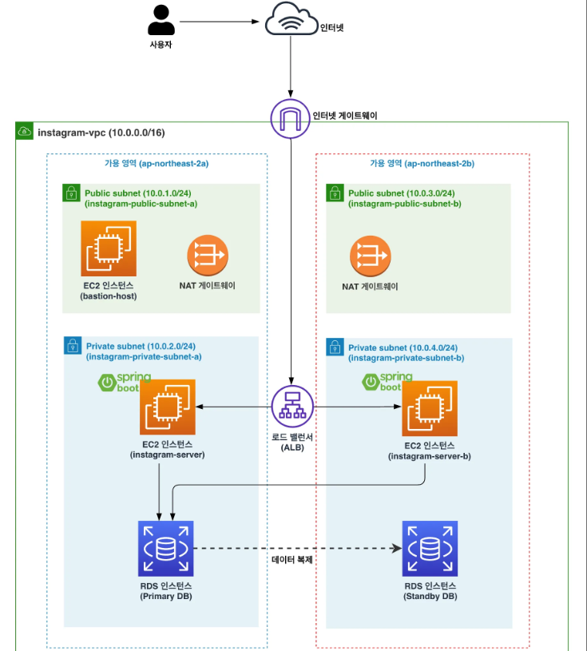

# RDS의 다중 AZ 배포란?

### ✅RDS의 다중 AZ(Multi AZ) 배포란?

**다중 AZ(Multi AZ) 배포**란 **다른 가용 영역에 RDS 인스턴스의 복제본을 생성해두는 걸 의미**한다.  
  
두 데이터베이스를 구분하기 위해 원본 DB를 **Primary DB** 또는 **Master DB**라고 부르고, 복제본 DB를 Standby DB(예비 데이터베이스)라고 부른다.  

  
- Primary DB에 데이터가 추가됨에 따라 Standby DB에도 똑같이 데이터가 추가된다. 즉, Primary DB의 데이터를 Standby DB에 동기화시킨다.
- 만약 Primary DB에 장애가 발생할 경우, Standby DB로 자동으로 교체해서 사용한다. 즉, ap-northeast-2a의 가용 영역에 장애가 발생할 경우, 자동으로 Standby DB로 교체해서 사용한다.
  
##  RDS에 다중 AZ 배포 설정으로 장애 대비하기

### 1.데이터베이스 인스턴스 수정 페이지 들어가기
  
  
### 2.다중 AZ 배포 설정하기  
  

### 마무리

RDS에 다중 AZ를 적용시켜보면 복제된 DB를 직접 눈으로 확인할 수 있지는 않다. RDS가 내부적으로 아래와 같이 구성한다. 다중 AZ를 적용시킬 때 아래와 같은 원리로 적용된다는 걸 이해할 수 있어야 한다.

  

### 비용 절감을 위해 다중 AZ 설정 끄기

다중 AZ를 사용하면 기존 RDS를 복제해서 2개의 DB 인스턴스를 활용해야 하기 때문에, 기존 RDS 인스턴스 하나만 썼을 때 나오는 비용의 2배가 발생한다. 따라서 실습 진행 시 비용 절감을 위해 다중 AZ 설정은 꺼두자.  
