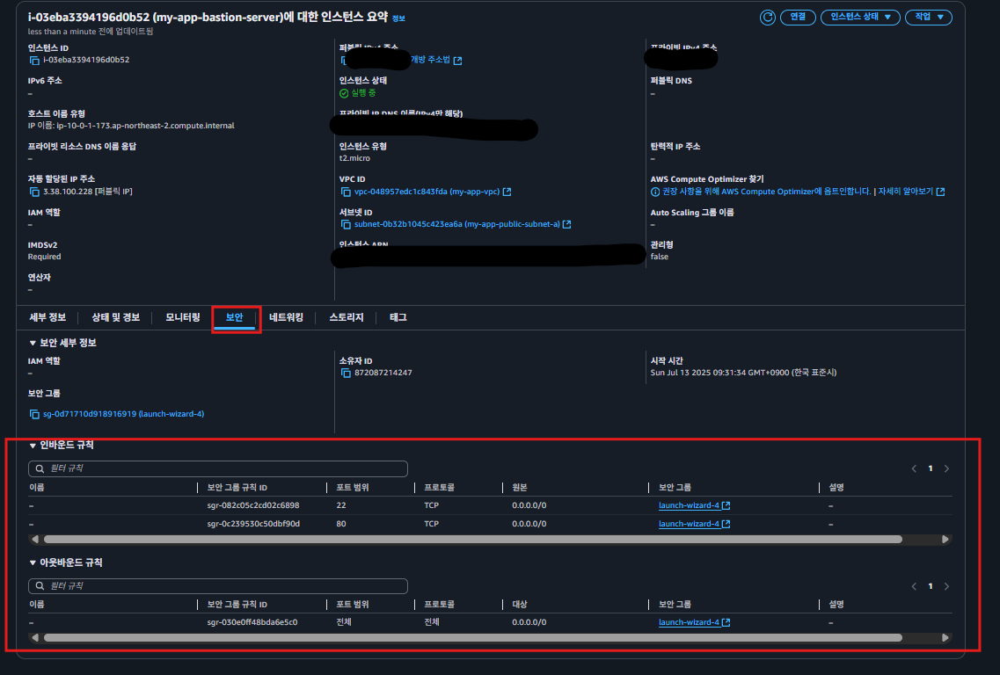

# 최소 권한의 원칙(PoLP)이란?

### ✅최소 권한의 원칙이란?

보안에서 ‘**최소 권한의 원칙(PoLP, Principle of least privilege)**’이라는 중요한 법칙이 있다. AWS, GCP 등 다양한 클라우드 플랫폼에서도 필수적인 보안 정책으로 활용되고 있다.

**최소 권한의 원칙**이란, **무언가에 액세스할 때 필요한 최소한의 권한만 가지도록 제한하는 보안 원칙**이다. 이 원칙에 따라 불필요한 권한을 제거하면 보안 사고를 어느 정도 예방할 수 있다.

### 최소 권한의 원칙을 어긴 예시
  

지금까지 구성한 인프라 중에서 Bastion Host의 보안 그룹을 살펴보자. 보안 그룹에 따르면 모든 IPv4에 대해 22번 포트와 80번 포트로 접속할 수 있게 허용해둔 상태이다.  
  
이 뜻을 다른 말로 바꾸면 어디서든 Bastion Host에 SSH로 접속할 수 있게 권한을 열어둔 상태이고, 누구든 80번 포트로 요청을 보낼 수 있게 권한을 열어둔 상태이다. 즉, 최소 권한의 원칙을 지키지 않고 셋팅을 했다. 