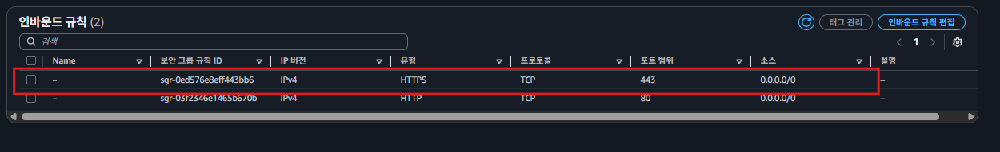
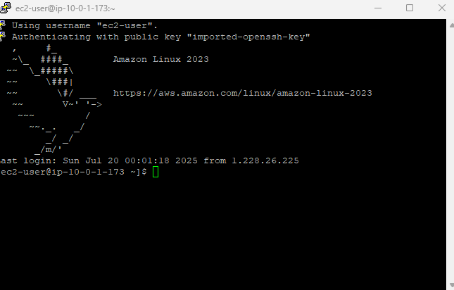

### 보안 그룹(Security Group)이란?

`보안 그룹(Security Group)`이란 **AWS 클라우드에서의 네트워크 보안**을 의미한다.  

AWS 리소스(EC2 인스턴스)를 **집**이라고 생각한다면, **보안 그룹**은 **집 바깥 쪽에 쳐져있는 울타리와 대문**이라고 생각하면 된다. 집에 접근할 때 울타리의 대문에서 접근해도 되는 요청인지 보안 요원이 검사를 하는 것과 비슷하다.

EC2 인스턴스 주위에 방화벽 역할을 할 보안 그룹(Security Group)을 만들고 보안 그룹에 규칙을 지정한다. 이 보안 규칙에는 인바운드 트래픽(즉, 보안 그룹의 외부에서 내부로 보내는 트래픽)에서 어떤 트래픽만 허용할 지 설정할 수 있고, 아웃바운드 트래픽(즉, 보안 그룹의 내부에서 외부로 나가는 트래픽)에서 어떤 트래픽만 허용할 지 설정할 수 있다.

보안 그룹을 설정할 때는 허용할 **IP 범위**와 포트(port)를 설정할 수 있다.  
  
### 보안 그룹의 특징
- 하나의 보안 그룹에 여러 개의 AWS 리소스를 포함시킬 수 있다.
- 특정 서브넷에 종속되지 않고 여러 AWS 리소스를 하나의 보안 그룹으로 묶을 수 있다.
  
  
### 보안 그룹에 포함되지 않은 주체가 요청을 보내면 어떻게 작동할까?
  
### 1. **로드 밸런서의 보안 그룹 규칙 수정하기**

인바운드 규칙을 아예 제거해보자. 즉, 외부로부터 들어오는 트래픽을 허용하지 않겠다는 의미이다.  

  
### 2. 로드 밸런서로 요청 보내보기
로드 밸런서로 요청을 보내보면 400 또는 500 대의 응답이 날라오면서 에러 메시지가 뜨는 것도 아니고, 요청 자체가 안 보내지는 것도 아니고, 응답을 기다리는 형태로 로딩이 계속 지속된다. 그러다 Timeout으로 로딩이 끝이 난다. 이게 바로 보안 그룹에 트래픽이 가로막혔을 때 발생하는 현상이다.  

**만약 AWS 리소스에 요청을 보냈는데 응답을 기다리는 형태로 로딩이 지속된다면 보안 그룹을 잘못 설정한 건 아닌 지 체크해보도록 하자.**  

---  

지금까지 구성한 아키텍처에서 보안그룹을 설정한 AWS 리소스에는 로드밸런서, bastion-host(EC2 인스턴스), instagram-server(EC2 인스턴스), RDS 인스턴스가 있다.  
  
## ALB 로드 밸런서 보안그룹 수정

### 아키텍처 그림 살펴보기

인프라 아키텍처 그림을 보면 보안 그룹을 어떻게 셋팅해야 할 지 파악하기 쉽다. 아키텍처 그림을 통해서 ALB에 어떤 트래픽이 들어오는 지 대략적으로 파악해보자.  
  
  
**용자는 ALB로 요청을 보낸다.**  
  
  
### ALB에 설정해야 할 보안 그룹 규칙
  
생성한 로드 밸런서를 보면 HTTP 프로토콜(80번 포트)에 대한 요청만 받게끔 설정을 했다. 따라서 **인바운드 규칙의 포트 범위는 HTTP/80번 포트로 설정**하면 된다. 또한 로드 밸런서로는 모든 사용자로부터 요청을 받을 수 있어야 하기 때문에 **모든 IPv4에 대해 트래픽을 허용**하게끔 설정해야 한다.

일반적으로는 로드 밸런서에 HTTP 프로토콜(80번 포트) 뿐만 아니라 HTTPS 프로토콜(443번 포트)도 같이 설정해두는 편이다. 하지만 현재 HTTP 프로토콜(80번 포트)만 활용하기 때문에 이에 맞춰서 보안 그룹을 설정해보자.  
  
###  ALB의 보안 그룹 수정하기  
  
### 1.ALB의 보안 그룹 설정 페이지로 들어가기  
  
  
### 2.로드 밸런서 인바운드 규칙 수정하기  
  
  
로드 밸런서의 리스너 규칙에서 HTTP 요청(80번 포트)의 트래픽만 받을 수 있게 설정되어 있기 때문에, 보안 그룹에서도 HTTP 요청(80번 포트)만 받을 수 있도록 수정하자.  
  
### 3. **로드밸런서 아웃바운드 규칙 체크하기**

아웃바운드 규칙은 내부에서 외부로 보내는 트래픽에 대한 규칙이다. 내부에서 요청을 보내는 것에 대한 제약이기 때문에 보안적으로 안전하다. 이 때문에 아웃바운드 규칙은 별도로 수정하지 않고 모든 트래픽에 허용하는 기본 설정을 그대로 두는 편이다.  
  

  
### 4.잘 작동하는 지 확인하기

  
### 보안 그룹 설정 완료
  
  

---
  
## EC2(Bastion Host)의 보안 그룹 수정
  
Bastion Host에는 관리자(개발자)만 접속한다. 

### EC2(Bastion Host)에 설정해야 할 보안 그룹 규칙

Bastion Host에는 인프라를 관리하는 개발자만 접속해야 한다. 그래서 **인프라를 관리하는 담당자의 IP 주소**만 보안 그룹에 등록한다.   
  
그리고 Bastion Host에는 SSH로 접속하는 용도로만 트래픽을 보내기 때문에 SSH 프로토콜(22번 포트)에 대해서만 트래픽을 허용하면 된다.  
  
  
### EC2(Bastion Host)의 보안 그룹 수정  
  
### 1. EC2 인스턴스의 보안 그룹 설정 페이지로 들어가기
  

보안 그룹 이름이 가독성 안 좋게 설정되어 있다.  
  
보안 그룹은 한 번 생성하면 이름을 바꿀 수 없기 때문에, 가독성 좋은 이름으로 보안 그룹을 새로 만들자. 그러면서 인바운드 규칙도 새로 설정하자. 
  
### 2. 보안 그룹 생성하기  
  
  

Bastion Host로 SSH 프로토콜(22번 포트)로 접속하는 건 ‘내 IP’에서만 가능하도록 설정, 만약 다른 개발자 및 회사에서 접근이 필요할시 해당 대역이나 개발자의 IP를 추가하면 된다.  
  
### 3.Bastion Host의 보안 그룹 변경하기
  
  
  
  

  
### 4.정상 접속확인
  
  

  

### 보안 그룹 설정 완료  

  
  

---
  
## EC2(백엔드 서버)의 보안 그룹 수정  
  
- Bastion Host가 EC2 인스턴스(백엔드 서버)에 접근한다.
- 사용자로부터 ALB가 전달받은 트래픽을 EC2 인스턴스(백엔드 서버)로 전달한다.  

### EC2(백엔드 서버)에 설정해야 할 보안 그룹 규칙

- EC2 인스턴스(백엔드 서버)는 **Bastion Host**가 SSH(22번 포트)로 접속할 수 있게 허용해야 한다.
- EC2(백엔드 서버)는 사용자로부터 직접적으로 요청을 전달받지 않는다. 오로지 ALB를 통해서 요청을 전달받는다. 따라서 EC2 인스턴스(백엔드 서버)는 **ALB**가 EC2(백엔드 서버)의 HTTP(80번 포트)로 요청을 보낼 수 있게 허용해야 한다.
  
##  EC2(백엔드 서버)의 보안 그룹 생성하기
  
### 1.보안 그룹 생성하기  
  
  
  

인바운드 규칙에 소스 항목을 **IP**가 아닌 **보안 그룹**으로 설정했다. 이 규칙을 어떻게 해석해야 하는 지 알아보자.

- 유형 : SSH / 포트 범위 : 22번 / 소스 : instagram-bastion-host-security-group

  → **instagram-bastion-host-security-group이라는 보안 그룹에 속한 AWS 리소스는 SSH 프로토콜(22번 포트)로 접속하는 걸 허용한다.**

- 유형 : HTTP / 포트 범위 : 80 / 소스 : instagram-elb-security-group

  → **instagram-elb-security-group이라는 보안 그룹에 속한 AWS 리소스는 HTTP 프로토콜(80번 포트)로 접속하는 걸 허용한다.**
  
### 2. 보안그룹 변경하기
EC2 에 접속해서 보안그룹을 변경한다.  
  
  
  
### 3.정상 동작확인하기
Bastion Host로 접속해서 백엔드 서버에 요청을 보내보자.  
  
  
  
  
  
보안 그룹에서 제거 후 다시 시도해보기  
  
