## 리소스 정리
  
### 1. ELB 삭제
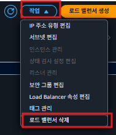  
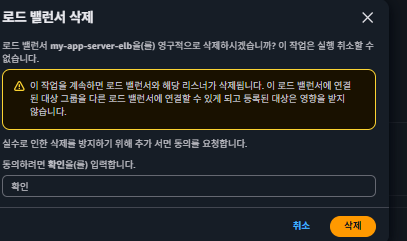  
  
### 2. 대상 그룹 삭제
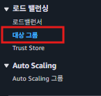  
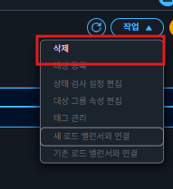  
  
  
### 3. EC2 삭제
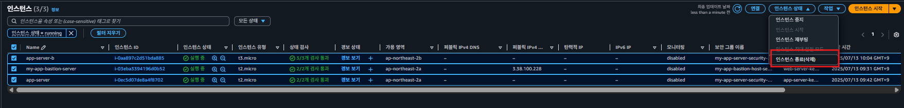  
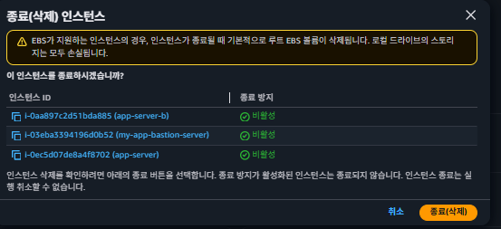  
  
### 4. RDS 삭제
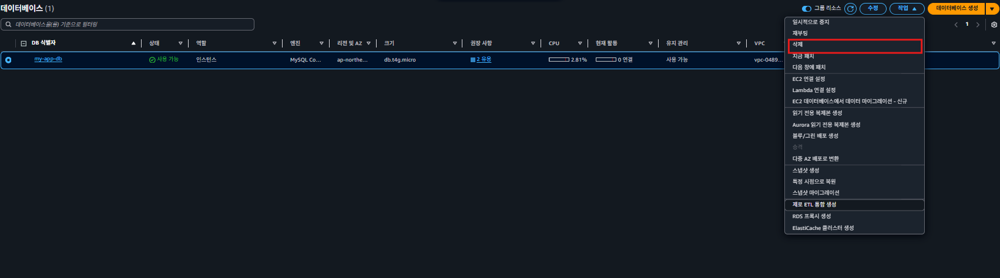  
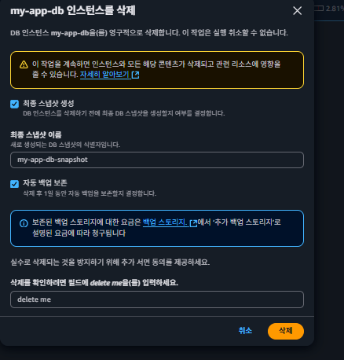  
최종 스냅샵, 자동백업 체크표시 해지  
  
만약 체크하고 삭제 했다면 스냅샷 대시보드에서 해당 스냅샷 삭제  
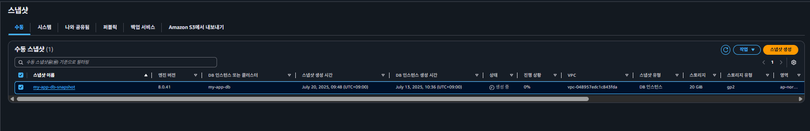  
  
### 5. RDS-서브넷 그룹 삭제
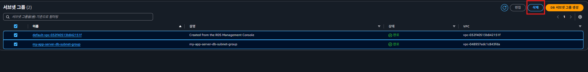  
  
### 6. EC2 키페어 삭제  
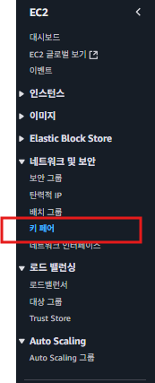  
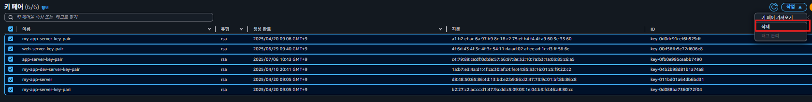  
  
### 7.NAT GateWay 삭제
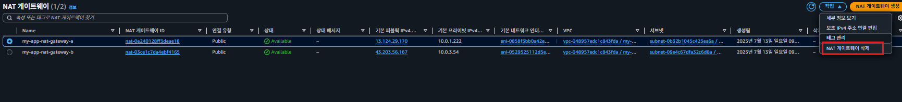  
  
### 8. VPC 삭제
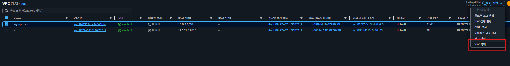  
  
### 9.EC2- 보안그룹 삭제
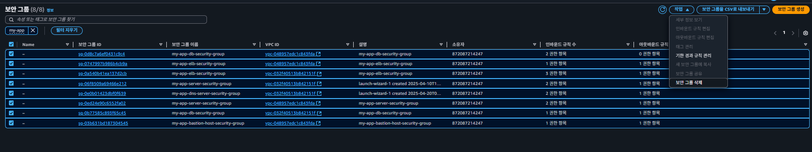  
  
### 10 EC2-탄력적 IP 삭제
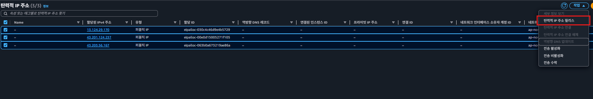