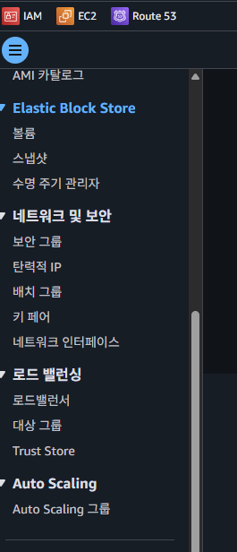
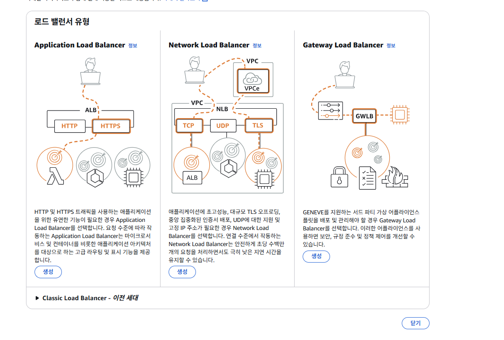
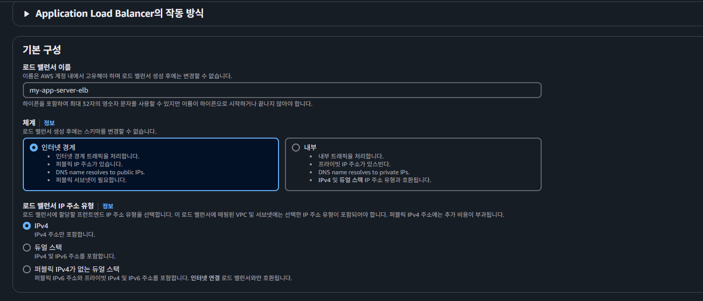
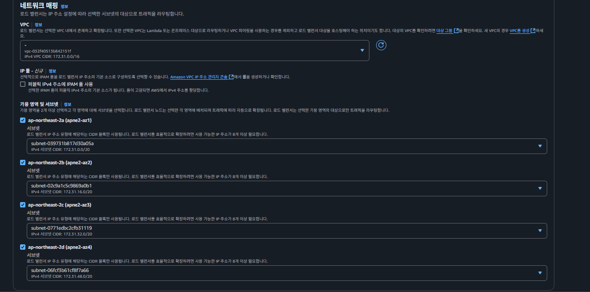

## ELB(Https 적용하기)
`Elastic Load Balancer`는 트랙픽(부하)을 적절하게 분배하주는 장치이다.  
  
출처 : https://cloudacademy.com  
  
> **로드밸런서(Load Balancer)**   
> 는 클라이언트의 요청을 여러 대의 서버(또는 인스턴스)에 분산(dispatch)하여 처리 부하를 고르게 분배하고, 서비스의 가용성·확장성·신뢰성을 높이는 네트워크 장치 또는 소프트웨어 컴포넌트입니다.

 AWS ELB는 로드밸런서의 기능 뿐만 아니라 Https 적용할 수 있는 부가 옵션 또한 존재한다.  
   
### SSL/TSL 이란?
SSL/TSL 은 간단하게 표현하자면 HTTP를 HTTPS로 바꿔주는 `인증서`이다. 이 기능을 ELB에서 제공하고 있다. 따라서 SSL/TSL 인증서를 활용해서 HTTP가 아닌 HTTPS로 통신할 수 있게 만들어 준다.
  
  
### HTTPS 적용?
1. 보안적 이유
   - 데이터를 서버와 주고 받을때 암호화를 시켜서 통신을한다. 이 암호화를 하지 않으면 다른 누군가가 데이터를 중간에 가로채서 조작할 수 있다.
2. 사용자 이탈
   - 사이트 접속시 브라우저에서 `"보안 연결이 사용되지 않았습니다."`와 같은 문구가 노출되어 사용자에게 신뢰하지 못하는 사이트라 인식할 수 있다.

  
### ELB를 활용한 아키텍처
  
ELB를 사용하기 전에는 사용자들이 직접 EC2에 요청을 보낸 구조 였다면 ELB를 적용한 후에는 ELB를 향해 요청을 보내도록 구성되어 있는 것을 볼 수 있다.  
그래서 앞서 EC2에 도메인을 적용했던 것을 ELB에 적용하고, HTTPS도 ELB의 도메인에 적용할 수 있게된다.
  
### ELB 설정
EC2 기능 탭목록 하단쪽에 `로드 밸런싱 > 로드 밸런서`를 찾을 수 있다.  
  
로드 밸런서를 클렉해서 생성하기 앞서 `region이 서울`인 한번더 확인해 보자  
  
### 1. Application Load Balancer (ALB)
- **OSI 레이어**: 7 (애플리케이션)
- **지원 프로토콜**: HTTP, HTTPS, HTTP/2, WebSocket
- **주요 기능**:
    - URL 경로/호스트 기반 라우팅
    - 리다이렉션, 고급 헤더 검사
    - AWS WAF 연동, 세션 스틱키니스

### 2. Network Load Balancer (NLB)
- **OSI 레이어**: 4 (전송)
- **지원 프로토콜**: TCP, TLS, UDP, TCP_UDP
- **주요 기능**:
    - 초저지연·고성능 처리
    - 고정 IP(Elastic IP) 지원
    - TLS 종료 또는 패스스루 모드
    - 대량의 연결 처리에 최적화

### 3. Gateway Load Balancer (GWLB)
- **OSI 레이어**: 3 (네트워크) — GENEVE 터널링
- **지원 프로토콜**: GENEVE 기반 캡슐화된 L3 트래픽
- **주요 기능**:
    - 네트워크 виртуал 어플라이언스(방화벽, IDS/IPS) 투명 체이닝
    - 흐름(flow) 단위 트래픽 포워딩
    - 자동 확장 가능한 가상 어플라이언스 서비스

---

## ELB 유형별 주요 차이 비교표

| 특성                      | ALB                                  | NLB                                             | GWLB                                                         |
| :----------------------- | :----------------------------------- | :---------------------------------------------- | :----------------------------------------------------------- |
| **OSI 레이어**            | 7 (애플리케이션)                     | 4 (전송)                                        | 3 (네트워크, GENEVE 터널)                                     |
| **지원 프로토콜**         | HTTP, HTTPS, HTTP/2, WebSocket       | TCP, TLS, UDP, TCP_UDP                          | GENEVE 터널링(네트워크 트래픽)                                |
| **주요 사용 사례**        | 웹 애플리케이션, API, WebSocket      | IoT, 게임 서버, gRPC, 대규모 TCP/UDP 워크로드    | 방화벽·IDS/IPS 등 네트워크 보안 어플라이언스 체이닝           |
| **고정 IP 지원**          | ❌ (DNS 이름)                         | ✅ (Elastic IP)                                  | ✅ (Elastic IP)                                               |
| **TLS 종료**              | ✅ (HTTPS 리스너)                     | ✅ (TLS 리스너)                                 | ❌ (패스스루만 지원)                                          |
| **라우팅/포워딩 기능**     | 호스트/경로 기반, 리다이렉션, 가중치  | 기본 라운드로빈                                 | 흐름 단위 투명 포워딩                                         |
| **헬스체크 방식**         | HTTP/HTTPS                           | TCP (옵션: HTTP)                                | 흐름(flow) 상태 체크                                           |
| **자동 확장**             | ✅                                   | ✅                                              | ✅                                                           |
| **장점**                  | 세밀한 HTTP 레벨 제어, WAF 통합      | 초저지연·고성능, 고정 IP, 대용량 연결 처리      | 보안 어플라이언스 손쉬운 체이닝, L3 트래픽 분산               |
| **단점**                  | TCP/UDP 트래픽 비효율                | HTTP 레벨 고급 라우팅 불가                      | HTTP/HTTPS 직접 라우팅 불가, 설정 복잡도                       |

---
  
여기서는 Https 만 적용할 것이기 때문에 `application load balancer`를 선택한다.  

---

### 기본구성
  
- **인터넷 경계**와 **내부**라는 옵션이 있다. **내부** 옵션은 Private IP를 활용할 때 사용한다. VPC, Private IP에 대한 개념을 활용하지 않을 예정이라 **인터넷 경계** 옵션을 선택하면 된다.
- **IPv4**와 **듀얼 스택**이라는 옵션이 있다. IPv6을 사용하는 EC2 인스턴스가 없다면 **IPv4**를 선택하면 된다. 우리가 만든 EC2 인스턴스는 전부 IPv4로 이루어져 있다.
  
**참고) IPv4와 IPv6의 차이**  

IPv4 주소는 `121.13.0.5`와 같은 IP 주소를 의미한다. 그런데 IPv4 주소가 고갈될 것으로 예측하고 IPv6을 추가로 만들어낸다. IPv6은 IPv4보다 훨씬 더 많은 주소값을 만들어낼 수 있게 구성했다. IPv6의 형태는 `2dfc:0:0:0:0217:cbff:fe8c:0`와 같다.
  
### 네트워크 매핑
로드 밸런서가 어떤 **가용 영역**으로만 트래픽을 보낼 건지 제한하는 기능이다. 아직 가용 영역에 대한 개념을 배우지 않았다. AWS 입문자한테는 별로 중요한 개념이 아니다.

가용 영역에 제한을 두지 않고 모든 영역에 트래픽을 보내게 설정하자. 즉, **모든 가용 영역에 다 체크하자.**
  
> AWS에서 가용 영역(Availability Zone, AZ)은 같은 지역(Region) 내에 위치하지만 물리적으로 분리된 독립적인 데이터 센터입니다. 
>   
> **물리적 분리**: 각 가용 영역은 다른 가용 영역과 물리적으로 분리되어 있으며, 자연재해나 정전과 같은 장애로부터 격리됩니다.  
> **낮은 지연 시간 연결**: 같은 리전 내 가용 영역들은 고속, 저지연 네트워크로 연결되어 있습니다.  
> **코드 표기**: AWS 콘솔에서는 보통 us-east-1a, us-east-1b와 같이 리전 코드 뒤에 알파벳을 붙여 표시합니다.
  

### ELB와 가용 영역의 관계
ELB(Elastic Load Balancer)를 설정할 때 가용 영역을 선택하는 것은 다음과 같은 이유로 중요합니다:

고가용성 확보: 여러 가용 영역에 ELB를 배포하면 하나의 가용 영역에 장애가 발생해도 서비스가 계속 운영됩니다.  
트래픽 분산: ELB는 선택된 가용 영역 내의 인스턴스들에만 트래픽을 분산시킵니다.  
지연 시간 최적화: 사용자와 가까운 가용 영역을 선택하여 지연 시간을 줄일 수 있습니다.  
   

---
  
