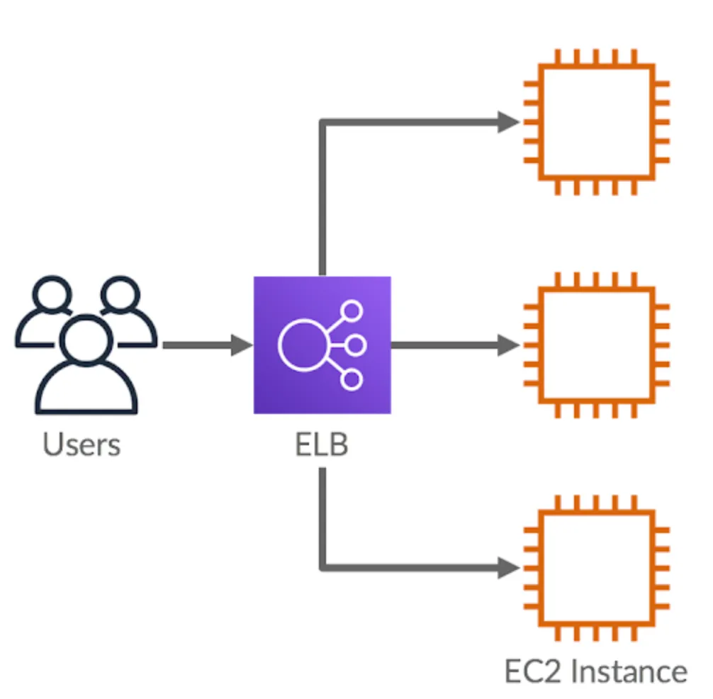
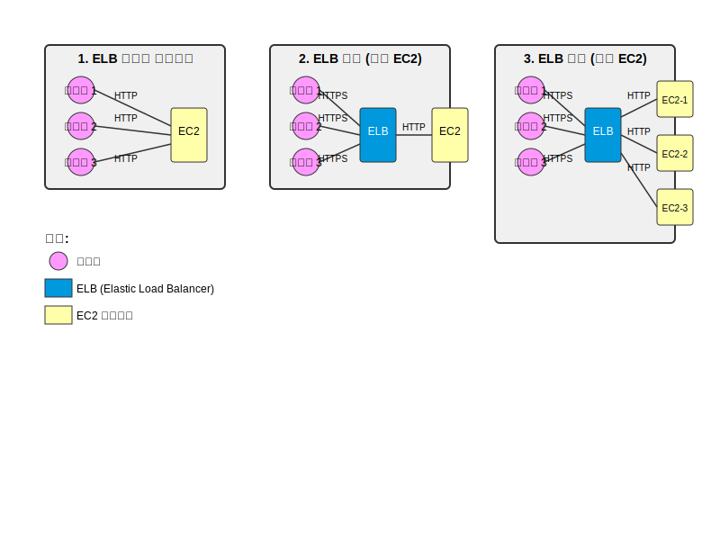

## ELB(Https 적용하기)
`Elastic Load Balancer`는 트랙픽(부하)을 적절하게 분배하주는 장치이다.  
  
출처 : https://cloudacademy.com  
  
> **로드밸런서(Load Balancer)**   
> 는 클라이언트의 요청을 여러 대의 서버(또는 인스턴스)에 분산(dispatch)하여 처리 부하를 고르게 분배하고, 서비스의 가용성·확장성·신뢰성을 높이는 네트워크 장치 또는 소프트웨어 컴포넌트입니다.

 AWS ELB는 로드밸런서의 기능 뿐만 아니라 Https 적용할 수 있는 부가 옵션 또한 존재한다.  
   
### SSL/TSL 이란?
SSL/TSL 은 간단하게 표현하자면 HTTP를 HTTPS로 바꿔주는 `인증서`이다. 이 기능을 ELB에서 제공하고 있다. 따라서 SSL/TSL 인증서를 활용해서 HTTP가 아닌 HTTPS로 통신할 수 있게 만들어 준다.
  
  
### HTTPS 적용?
1. 보안적 이유
   - 데이터를 서버와 주고 받을때 암호화를 시켜서 통신을한다. 이 암호화를 하지 않으면 다른 누군가가 데이터를 중간에 가로채서 조작할 수 있다.
2. 사용자 이탈
   - 사이트 접속시 브라우저에서 `"보안 연결이 사용되지 않았습니다."`와 같은 문구가 노출되어 사용자에게 신뢰하지 못하는 사이트라 인식할 수 있다.

  
### ELB를 활용한 아키텍처
  
ELB를 사용하기 전에는 사용자들이 직접 EC2에 요청을 보낸 구조 였다면 ELB를 적용한 후에는 ELB를 향해 요청을 보내도록 구성되어 있는 것을 볼 수 있다.  
그래서 앞서 EC2에 도메인을 적용했던 것을 ELB에 적용하고, HTTPS도 ELB의 도메인에 적용할 수 있게된다.