# RDS (Relational Database Service)

## RDS란?

AWS에서 제공하는 관계형 데이터베이스 서비스입니다. MySQL, PostgreSQL, MariaDB, Oracle, SQL Server 등의 데이터베이스 엔진을 클라우드 환경에서 관리형 서비스로 제공합니다.

## RDS를 사용하는 이유

### 1. 배포 환경의 DB 접근성 문제 해결

로컬 개발 환경에서는 개발자의 PC에 설치된 MySQL 등을 사용할 수 있습니다. 하지만 애플리케이션을 실제 서버에 배포하면, 해당 서버가 개발자 PC의 로컬 DB에 접근할 수 없습니다. 따라서 외부에서 접근 가능한 별도의 데이터베이스 서버가 필요합니다.

### 2. 관리형 서비스의 장점

AWS RDS는 다음과 같은 관리형 서비스 기능을 제공합니다:

- **자동 백업**: 정기적인 백업과 포인트-인-타임 복구 기능
- **자동 패치**: 보안 패치와 소프트웨어 업데이트 자동 적용
- **모니터링**: CloudWatch를 통한 성능 모니터링과 알림
- **Multi-AZ 배포**: 고가용성을 위한 다중 가용 영역 배포
- **읽기 전용 복제본**: 읽기 성능 향상을 위한 Read Replica 지원
- **자동 확장**: CPU, 메모리, 스토리지의 자동 스케일링

### 3. 운영 부담 감소

데이터베이스 서버의 설치, 설정, 유지보수, 모니터링 등의 운영 업무를 AWS에서 대신 처리해주므로 개발팀은 애플리케이션 개발에 집중할 수 있습니다.

## EC2에 직접 DB 설치 vs RDS 사용

### EC2 직접 설치 방식의 특징

**장점:**

- RDS 비용 절약 가능
- 완전한 제어권 (root 권한)
- 커스터마이징 자유도 높음

**단점:**

- EC2 장애 시 DB도 함께 영향받음 (단일 장애점)
- 백업, 모니터링, 보안 패치 등 모든 운영 업무를 직접 처리해야 함
- 고가용성 구성의 복잡성
- 확장성 제한

### RDS 사용 방식의 특징

**장점:**

- EC2와 DB 분리로 장애 격리 효과
- 관리형 서비스의 다양한 기능 활용 가능
- 고가용성과 확장성 쉽게 구현
- 운영 부담 대폭 감소

**단점:**

- 추가 비용 발생
- 일부 고급 설정에 제약

## 실무에서의 권장사항

**프로덕션 환경**: EC2와 RDS를 분리하여 구성하는 것이 일반적입니다. 안정성, 확장성, 운영 효율성 측면에서 유리하기 때문입니다.

**개발/테스트 환경**: 비용 절약이 중요하다면 EC2에 DB를 직접 설치하여 사용할 수 있습니다. 특히 개인 프로젝트나 학습 목적의 경우 이 방식을 많이 활용합니다.

**스타트업/소규모 프로젝트**: 초기에는 비용 절약을 위해 EC2에 DB를 직접 설치하고, 서비스가 성장하면서 점진적으로 RDS로 마이그레이션하는 전략도 고려할 수 있습니다.

## 결론

RDS는 데이터베이스 운영의 복잡성을 크게 줄여주는 관리형 서비스입니다. 비용 대비 얻을 수 있는 운영상의 이점이 크므로, 실제 서비스 운영에서는 RDS 사용을 권장합니다. 다만, 예산이 제한적인 개인 프로젝트나 학습 목적에서는 EC2에 직접 DB를 설치하는 것도 충분히 유효한 선택입니다.
  
### RDS 생성하기
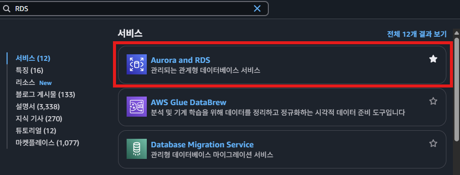  
  
### 1. 데이터 베이스 종류 선택하기
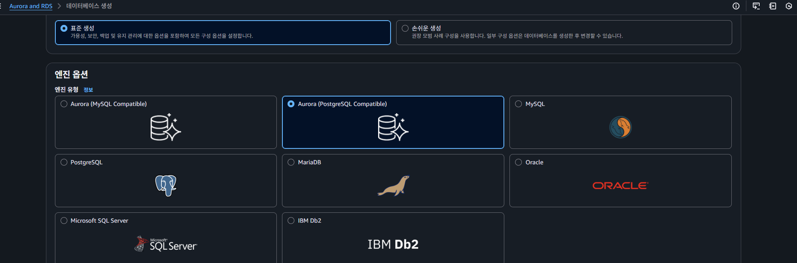  
  
### 2.템플릿 선택
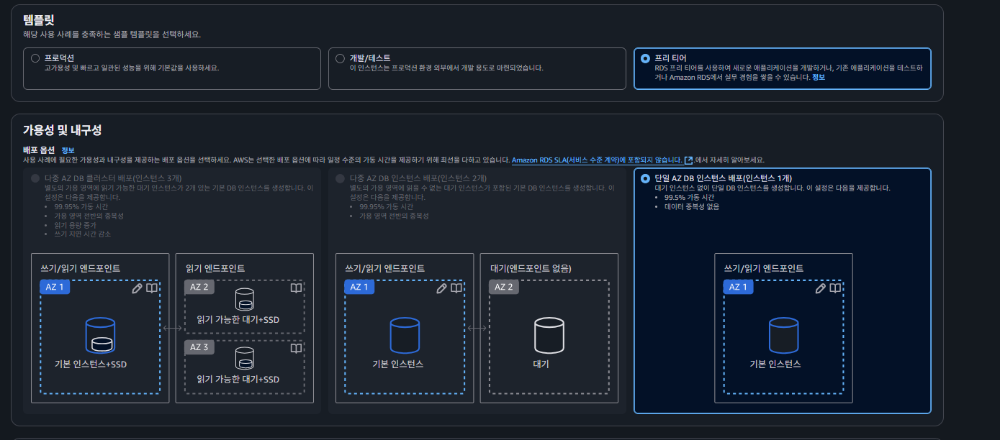

여기서 많이들 오해하는 게 프리 티어는 학습할 때나 테스트할 때만 쓰는 안 좋은 사양의 컴퓨터라고 생각한다. 하지만 실제 서비스에서 활용해도 될 정도로 나름 괜찮은 사양이다. 하루 방문자 수가 2,000명 정도였던 서비스를 운영했었는데 문제 없이 잘 돌아갔다. 성능에 문제가 직접적으로 생기기 전까지는 너무 걱정하지 말자.

### 3. 설정
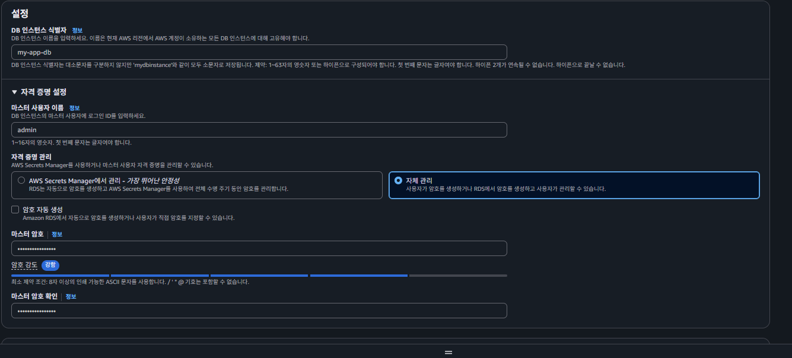  

- **마스터 사용자 이름**과 **마스터 암호**는 데이터베이스에 접근하기 위한 아이디와 비밀번호와 같은 값이다. 따라서 `마스터 사용자 이름`과 `마스터 암호`는 따로 적어두자.
### 4. 인스턴스 구성(기본 값) - 성능 선택  
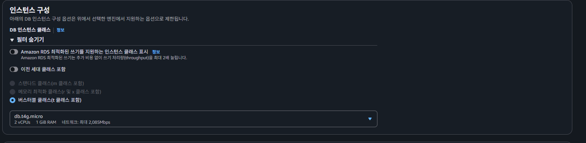  
  
### 5. 스토리지 구성(하드)  
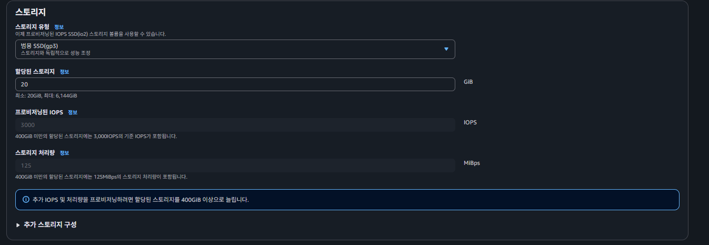  

### 6. 연결

퍼블릭 액세스를 **예**로 체크하자. 여러 환경(로컬 환경, 개발 환경 등)에서 편하게 DB에 접근할 수 있게 된다.  
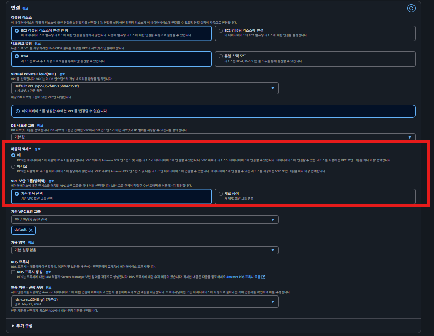  

나중에 보안에 조금 더 신경써서 구성하고 싶을 때는 퍼블릭 액세스를 **아니오**로 체크하고 RDS를 만들 때도 있다. 하지만 입문할 때는 불편하기 때문에 퍼블릭 액세스를 **예**로 두고 많이 사용한다.

이렇게 설정하면 보안적으로 치명적인 위험이 있지 않을까 걱정하는 분들이 있다. 생각보다 그렇진 않다. 그러니 안심하고 퍼블릭 액세스를 **예**로 체크하고 RDS를 만들어서 연습하자.  

### 7. 데이터베이스 인증, 모니터링-(일단 기본 값 설정  
  
### 8. 생성
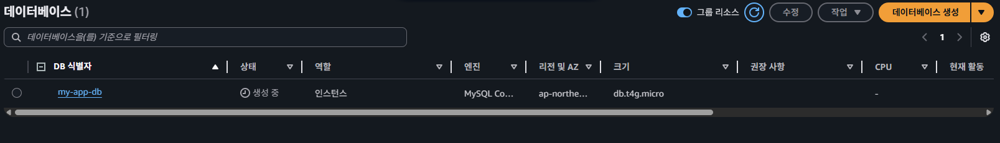  
  
### 9. 보안 그룹 설정하기
이 RDS 서비스 또한 특정 컴퓨터 위에서 RDS 서비스를 실행시키기 때문에 보안 그룹을 설정해야 한다.  
  
### 9.1.AWS EC2 - 보안 그룹 메뉴 선택  
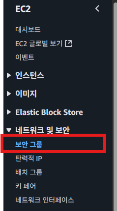  
  
### 9.2 인바운드 규칙, 아웃바운드 규칙 설정하기  
별도의 설정을 하지 않았다면 RDS의 MySQL은 3306번 포트에서 실행된다. DB에 접근하기 위해 3306번 포트를 인바운드 규칙에 추가해주자. 아웃바운드 규칙에는 모든 트래픽을 허용하는 규칙을 추가해주자.  

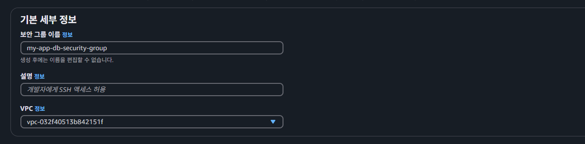  
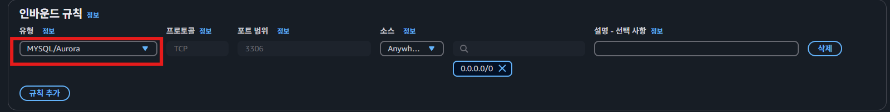  
  
### 9.3 보안그룹 적용하기  
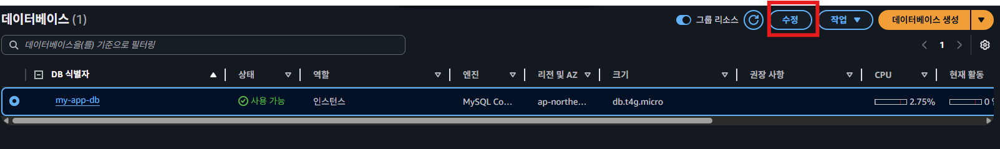
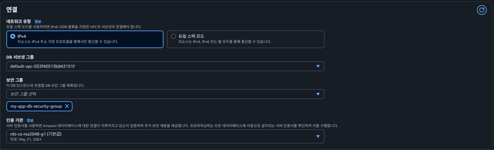  
  
연결 설정부분에서 보안 그룹에 우리가 아까 생성했던 데이터베이스 보안그룹을 설정한다.  
  
### 10. 파라미터 그룹 설정하기
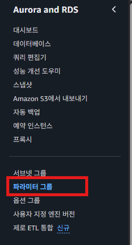  
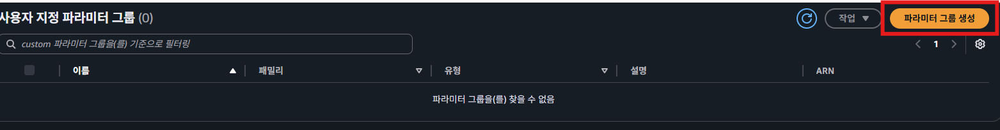  
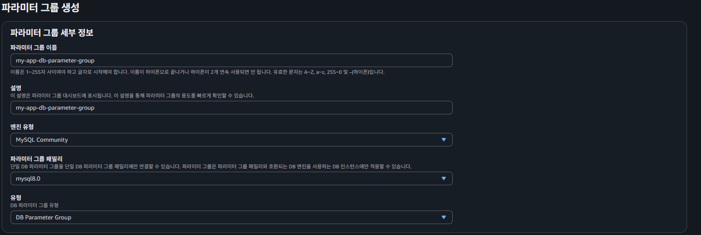  
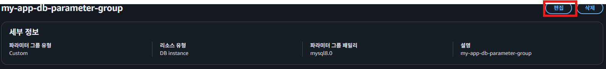  
  

**아래 속성 전부 `utf8mb4`로 설정하기**

- `character_set_client`
- `character_set_connection`
- `character_set_database`
- `characater_set_filesystem`
- `characater_set_results`
- `character_set_server`

**참고)** `utf8` 대신에 `utf8mb4`를 사용하는 이유는 ‘한글’ 뿐만 아니라 ‘이모티콘’도 지원이 가능하도록 하기 위해서이다.

**2. 아래 속성 전부 `utf8mb4_unicode_ci`로 설정하기**

- `collation_connection`
- `collation_server`

**참고)** `utf8mb4_unicode_ci`은 정렬, 비교 방식을 나타낸다.
**참고)** `collation`는 세부적인 정렬에 대한 옵션을 설정한다.

**3. `time_zone`을 `Asia/Seoul`로 설정하기**  
  
### 11.RDS의 파라미터 그룹 변경하기
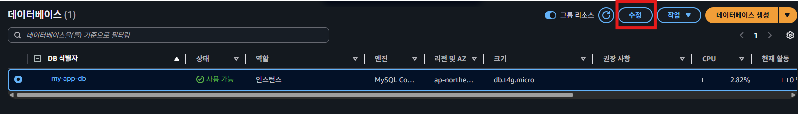  
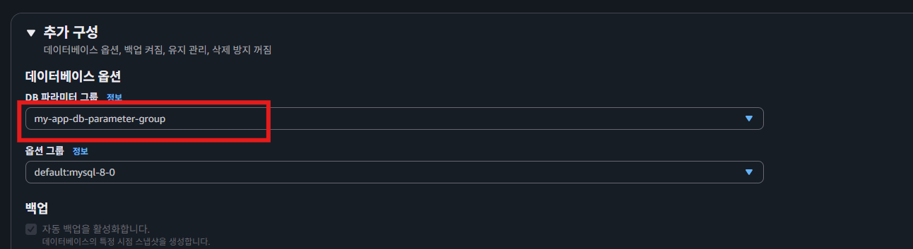  
**주의) DB 파라미터 그룹을 변경한 뒤에는 RDS의 DB를 재부팅해야만 정상적으로 적용된다.**  
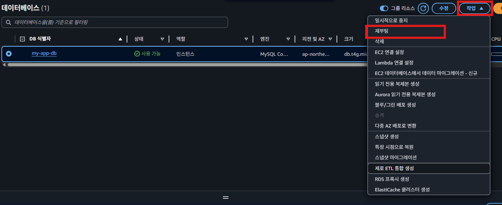