# S3 (Simple Storage Service)

## S3란?

AWS에서 제공하는 객체 스토리지 서비스입니다. 파일, 이미지, 동영상, 문서 등 다양한 형태의 데이터를 안전하고 확장 가능한 클라우드 스토리지에 저장할 수 있습니다.   
  
웹 인터페이스나 API를 통해 언제 어디서나 데이터에 접근할 수 있습니다. 우린 사진이나 동영상을 구글 드라이브나 iCloud에 저장한다. 이와 유사한 서비스라고 생각하면 된다.  
  
> 파일 저장 서비스
  
  

## S3를 사용하는 이유

### 1. 로컬 파일 시스템의 한계 해결

로컬 개발 환경에서는 서버의 하드디스크에 파일을 저장할 수 있습니다. 하지만 실제 서비스에서는 여러 문제가 발생합니다:

- **서버 장애 시 파일 유실**: 서버가 다운되면 저장된 파일들도 함께 사라짐
- **확장성 부족**: 서버 용량 한계로 인한 저장 공간 부족
- **다중 서버 환경**: 여러 서버에서 동일한 파일에 접근하기 어려움

### 2. 관리형 스토리지 서비스의 장점

AWS S3는 다음과 같은 관리형 서비스 기능을 제공합니다:

- **무제한 저장 공간**: 필요한 만큼 자동으로 확장되는 스토리지
- **높은 내구성**: 99.999999999%(11 9's)의 데이터 내구성 보장
- **자동 백업**: 여러 데이터센터에 자동으로 복제되어 저장
- **CDN 연동**: CloudFront와 연동하여 전 세계 빠른 파일 전송
- **세밀한 권한 관리**: IAM을 통한 파일별, 폴더별 접근 권한 설정
- **버전 관리**: 파일의 이전 버전들을 자동으로 보관

### 3. 비용 효율성

사용한 만큼만 비용을 지불하는 구조로, 초기 인프라 투자 비용을 크게 절약할 수 있습니다. 또한 자주 접근하지 않는 파일은 더 저렴한 스토리지 클래스로 자동 이동시켜 비용을 최적화할 수 있습니다.

## 서버 로컬 스토리지 vs S3 사용

### 서버 로컬 스토리지 방식의 특징

**장점:**

- 초기 설정이 간단함
- 네트워크 비용 없음
- 빠른 로컬 접근 속도

**단점:**

- 서버 장애 시 파일 유실 위험
- 저장 공간의 물리적 한계
- 백업 및 복구 작업의 복잡성
- 다중 서버 환경에서 파일 동기화 어려움
- 확장 시 서버 용량 증설 필요

### S3 사용 방식의 특징

**장점:**

- 서버와 스토리지 분리로 안정성 향상
- 무제한 확장 가능한 저장 공간
- 자동 백업 및 복제
- 전 세계 어디서나 빠른 접근 (CDN 연동)
- 다양한 스토리지 클래스로 비용 최적화

**단점:**

- 네트워크 비용 발생
- 인터넷 연결에 의존적
- 초기 설정 및 학습 비용

## 실무에서의 권장사항

**프로덕션 환경**: S3 사용을 강력히 권장합니다. 특히 사용자가 업로드하는 이미지, 동영상, 문서 등은 반드시 S3에 저장하는 것이 안전합니다.

**개발/테스트 환경**: 개발 단계에서도 S3를 사용하여 프로덕션 환경과 동일한 구조로 개발하는 것을 권장합니다.

**정적 웹사이트 호스팅**: React, Vue 등으로 만든 SPA(Single Page Application)를 S3에서 직접 호스팅할 수 있어 매우 경제적입니다.

## S3 생성

### S3에서만 사용하는 용어 정리

S3에서는 버킷(Bucket)과 객체(Object)라는 용어를 사용한다. 이 용어에 대해 알아보자.

**버킷(Bucket)이란?**  
⇒ 깃헙(Github)을 보면 여러 개의 Repository를 만들 수 있다. S3에서도 여러 개의 저장소를 만들 수 있다. 여기서 **하나의 저장소**를 버킷(Bucket)이라고 부른다.

**객체(Object)이란?**  
⇒ S3에 업로드한 파일을 보고, S3에서는 파일(File)이라 부르지 않고 객체(Object)라고 부른다. 즉, 객체(Object)란 **S3 버킷에 업로드된 파일**을 의미한다.  
  
## 1. 버킷생성
1.
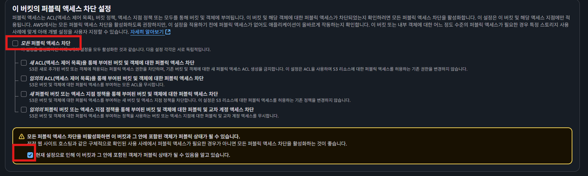
  
2.
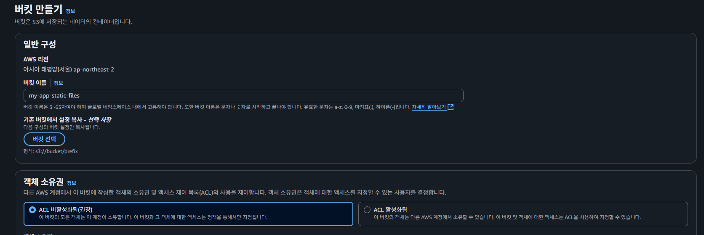
  
3.
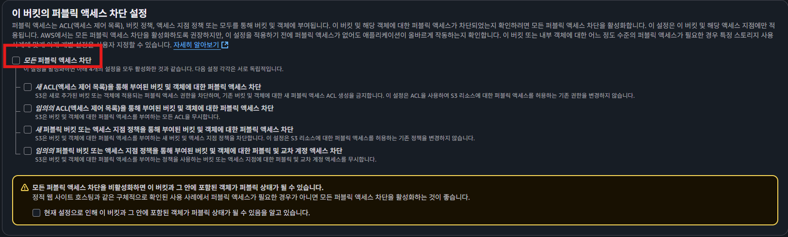  
외부에서 공개적으로 접근할 수 있는지 여부 확인  
  
4.
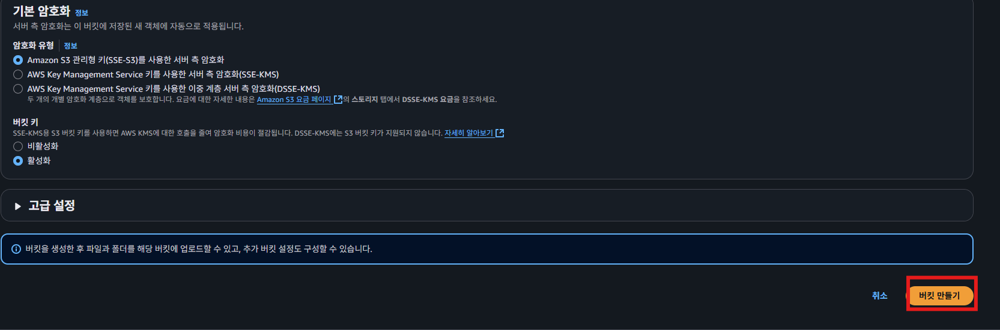  
나머지 설절등은 Default로 두고 생성한다.  

## 2. 버킷에 정책 추가하기

💡 **정책(Policy)이란 ?  
⇒ 권한(Permission)을 정의하는 JSON 문서**를 의미한다.   
AWS는 기본적으로 대부분의 권한이 주어져있지 않다. AWS의 특정 소스에 접근하려면 권한을 허용해주어야 한다. 권한을 허용할 때 작성해야 하는 게 정책(Policy)이다.

> 특정 서비스에서 상품 이미지를 모든 사용자한테 보여주고 싶다고 가정해보자. 그러면 버킷에서 상품 이미지를 다운로드해서 사용할 수 있어야 한다. 버킷에서 이미지 파일을 조회할 수 있게 정책을 추가해보겠다.
>
  
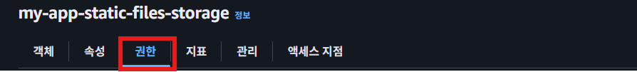  
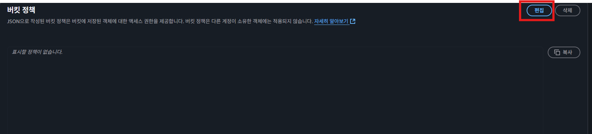  
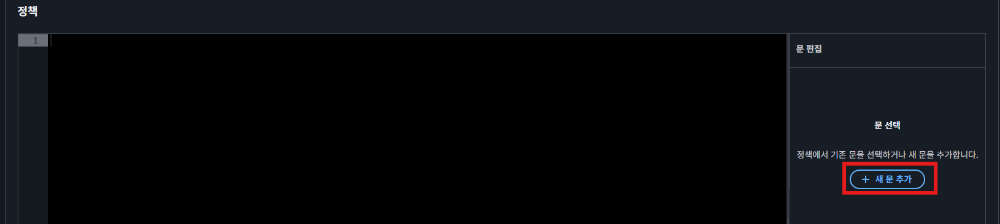  
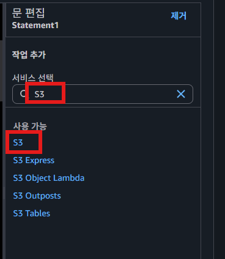  
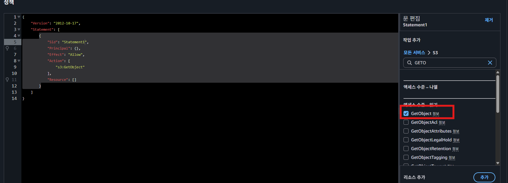  
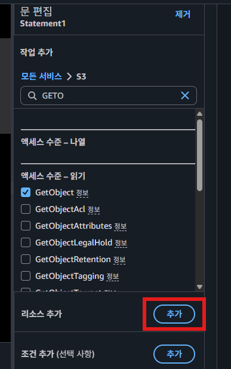
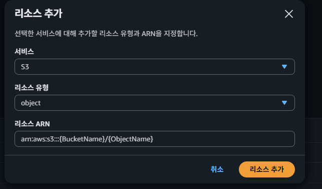  
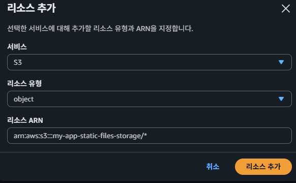
- 리소스 ARN : `arn:aws:s3:::{내가 만든 버킷명}/*`의 형식으로 입력하기  
> 💡 **ARN이란?**  
> ⇒ Amazon Resource Number의 약자이다. **AWS에 존재하는 리소스를 표현하는 문법**이다.  
> 
  
- **Principal** : 어느 사람한테 위의 정책을 허용할 것 인지에 대한 설정  
  
## 3.IAM 액세스키 발급
기본적으로 AWS의 리소스에 아무나 접근을 못하게 막아놨기 때문에 S3에 접근해서 파일을 업로드할 수가 없다.   
  
하지만 백엔드 서버가 S3에 접근해서 파일을 업로드할 수 있어야 한다. S3에 접근할 수 있는 권한을 받기 위해 IAM이라는 곳에서 권한을 부여받아야 한다.  
  
### 3.1 IAM에서 ‘사용자’ 메뉴로 들어가기
1.
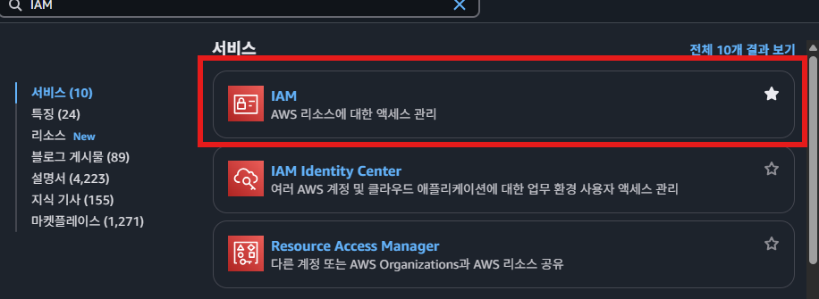  
2.
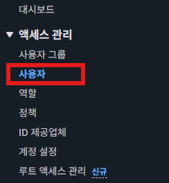  
### 3.2사용자 추가하기  

1 
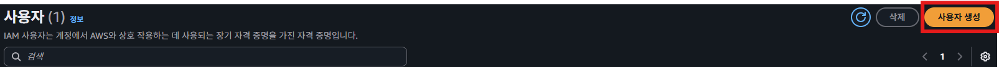  
2
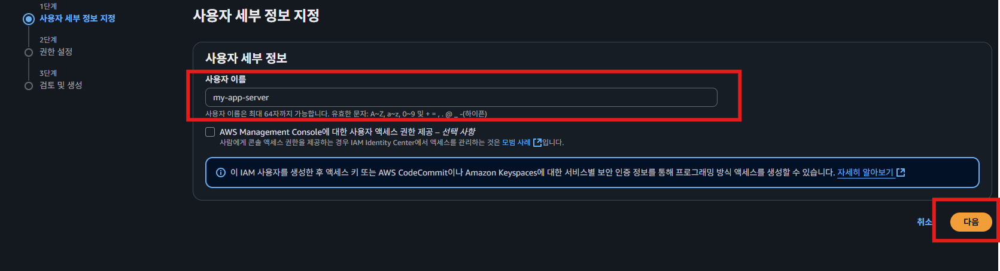  
3.
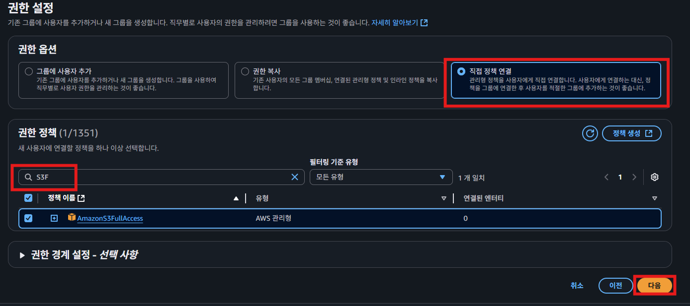  
4.
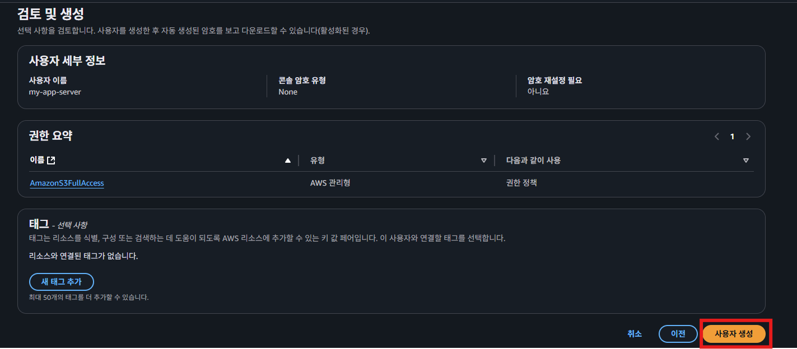  
  
## 4.엑세스키 생성  

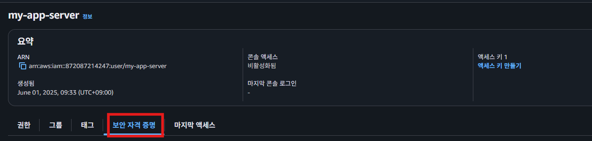  
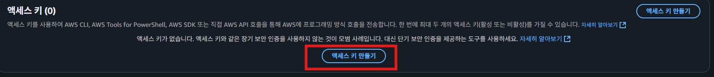  
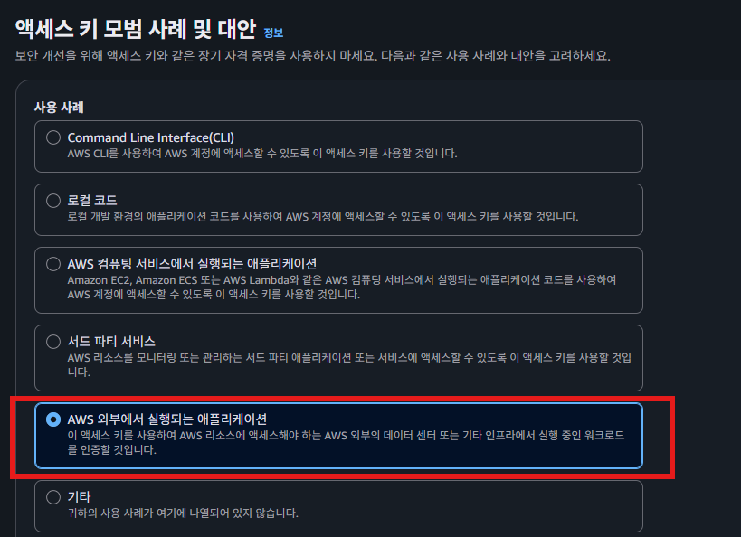  
- 스프링 부트나, Express 서버와 같이 실행해야하기 떄문에 해당키 선택한다.  
  
엑세스 키를 만들고 해당 엑세스키는 별도로 저장해둔다.