## 배포
  
### 배포할때 사용하는 S3, CloudFront

### S3는 ‘파일 저장 서비스’이지 않나?

S3는 파일 저장 서비스라고 표현했다. 사실 S3는 파일 저장 이외에도 부가적인 기능을 가지고 있다.   
  
그 중 하나가 ‘**정적 웹 사이트 호스팅**’ 기능이다. 쉽게 표현하자면 **웹 서비스를 다른 사용자들도 쓸 수 있게 인터넷에 배포**하는 걸 뜻한다.

### CloudFront란?

<aside>
한 줄 요약 : 컨텐츠(파일, 동영상 등)를 빠르게 전송하게 해주는 서비스이다.
</aside>

  
  

컨텐츠(파일, 동영상)는 S3라는 곳에 저장될 것이다. 하지만 그 S3 저장소가 한국에 있다고 가정하자. 그러면 한국 사용자는 S3와 거리가 가까우므로 데이터를 빠르게 전송받을 수 있다. 하지만 미국에 있는 사용자가 S3로부터 데이터를 전송받으려면 거리가 멀어 시간이 오래 걸리게 된다.

이런 문제를 해결하기 위해 전세계 곳곳에 **컨텐츠(파일, 동영상)의 복사본을 저장해놓을 수 있는 임시 저장소를 구축**한다. 그러면 미국에 있는 사용자가 컨텐츠를 전송받고 싶을 때, 가장 가까운 임시 저장소에서 컨텐츠를 가져오면 훨씬 속도가 빨라진다.

이런 형태의 서비스를 보고 `CDN(Content Delivery Network)`이라고 부른다. 그래서 CloudFront를 CDN 서비스라고도 표현한다.  

### CDN(Content Delivery Network) 특징

- 웹 페이지, 이미지, 동영상 등의 컨텐츠를 본래 서버에서 받아와 캐싱
- 해당 컨텐츠에 대한 요청이 들어오면 캐싱해 둔 컨텐츠를 제공
- 컨텐츠를 제공하는 서버와 실제 요청 지점 간의 지리적 거리가 매우 먼 경우 or 통신 환경이 안좋은 경우→ 요청지점의 CDN을 통해 빠르게 컨텐츠 제공 가능
- 서버의 요청이 필요 없기 때문에 서버의 부하를 낮추는 효과

## 엣지 로케이션

- 컨텐츠가 캐싱되고 유저에게 제공되는 지점
- AWS가 CDN 을 제공하기 위해서 만든 서비스인 CloudFront의 캐시 서버 (데이터 센터의 전 세계 네트워크)
- cloudFront 서비스는 엣지 로케이션을 통해 콘텐츠를 제공 
- CloudFront를 통해 서비스하는 콘텐츠를 사용자가 요청하면 지연 시간이 가장 낮은 엣지 로케이션으로 라우팅되므로 콘텐츠 전송 성능이 뛰어나다.
- 콘텐츠가 이미 지연 시간이 가장 낮은 엣지 로케이션에 있는 경우 CloudFront가 콘텐츠를 즉시 제공
  
### 사용 이유?
S3만을 이용해도 웹서비스를 배포할 수 있다. 하지만 `CloudFront`를 **사용하면 컨텐츠 전송 받는 성능을 향상**시키기 위해 사용한다.  
그리고 **HTTPS를 적용**하려면 `CloudFront`를 사용해야한다. 또한 **보안을 한층 강화**할 수 있다는 장점도 있다. 
  
### 아키텍처
  
  
## 1. S3

### 1.1버킷 생성
[S3 버킷 생성하기](../5.s3/0.S3.md)  
  
  
### 1.2 html 업로드
간단하게 확인할 수 있는 HTML 파일을 업로드한다.  
```html
<title>
    Title
</title>
```
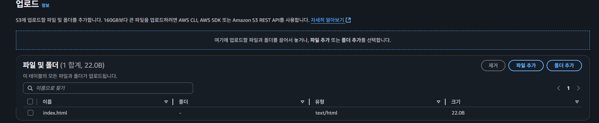
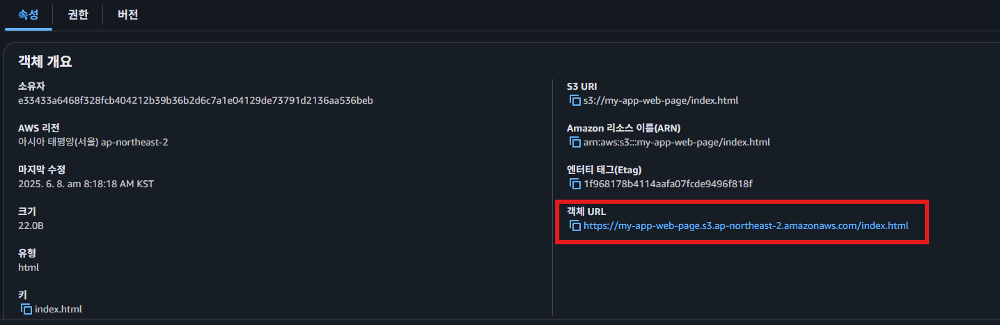
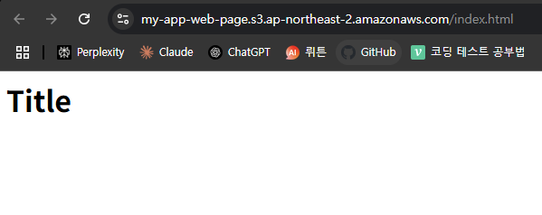  
  
### 1.3 정적 웹사이트 호스팅 설정
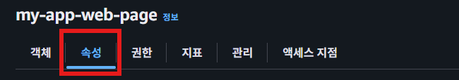  
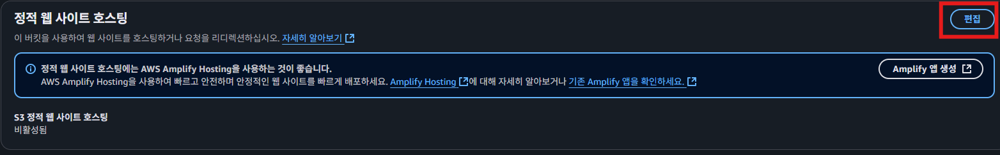  
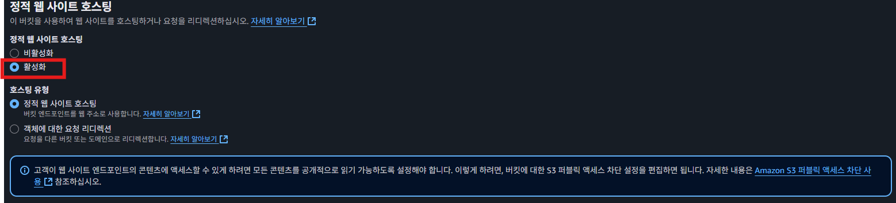  
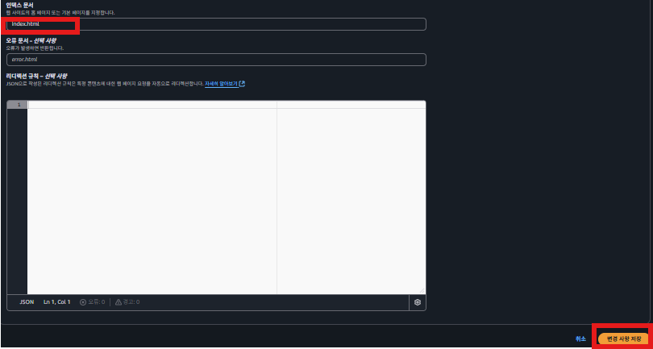  
  
설정을 완료한 후 다시 정적 호스팅메뉴를 확인해보면 배포가 되어 있는 것을 확인할 수 있다.
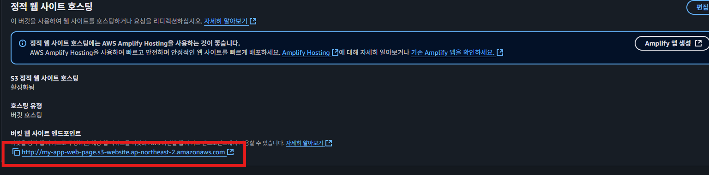  
  
### 1.3 React 배포 
[1.리엑트 S3 배포](https://velog.io/@jwo0o0/AWS-S3%EB%A1%9C-React-%EC%95%A0%ED%94%8C%EB%A6%AC%EC%BC%80%EC%9D%B4%EC%85%98-%EB%B0%B0%ED%8F%AC%ED%95%98%EA%B8%B0)  
[2.리엑트 S3 배포](https://velog.io/@kimkevin90/React-CRA-%EB%B0%B0%ED%8F%ACAWS-S3-CloudFront)  
  
## 2. Cloud Front  
### 2.1 접속
  
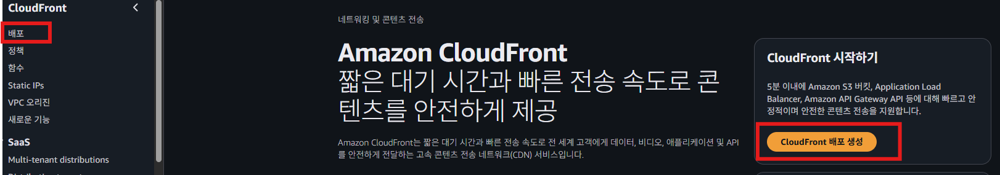  

### 2.2 원본 도메인 입력하기
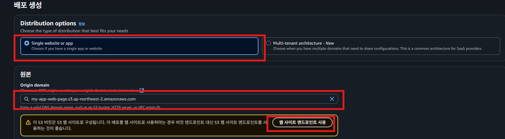  
원본 도메인에 S3 버킷 엔드포인트(static-practice.s3.ap-northeast-2.amazonaws.com)를 사용하지 말고 S3 정적 호스팅 웹 사이트의 엔드포인트(static-practice.s3-website.ap-northeast-2.amazonaws.com)를 사용.  
  
### 2.3. HTTP, HTTPS에 대한 정책 선택
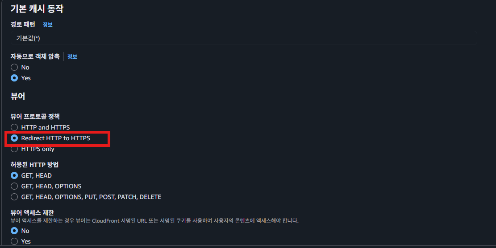  
  
  
### 2.4 WAF 설정 
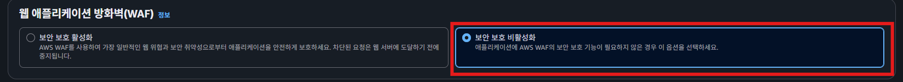  
  
### 2.5 CDN 설정  
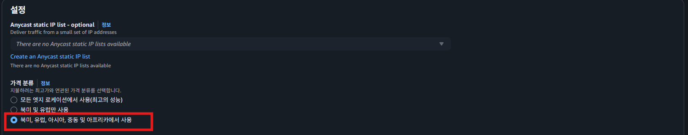  
### 2.6 기본 루트 설정
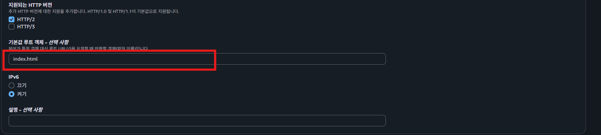  
  
### 2.7 확인  
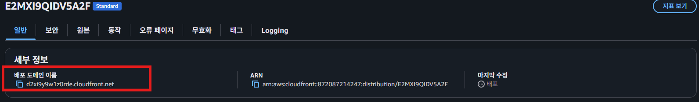  
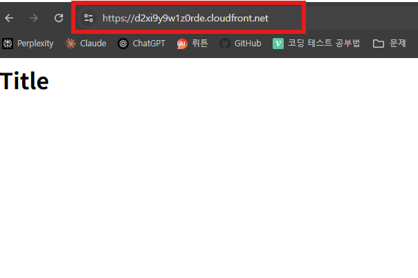  
  
## 3. 도메인 연결 및 HTTPS 적용  
  
### 3.1 인증서 발급
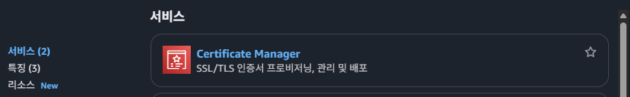  

> Cloudfront는 HTTPS를 적용하려면 인증서를 **미국 동부(버지니아 북부)에서 발급**받아야 한다.
> 
  
### 3.2 인증서 발급  
[인증서 발급](../2.route53/0.Route53.md)  
  
### 3.3 인증서 연결
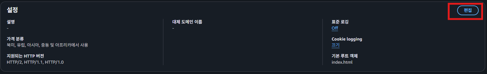  
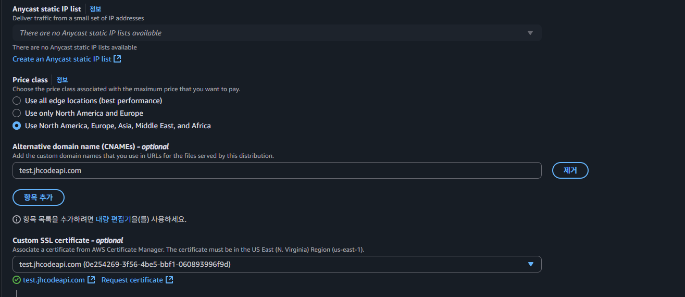
  
### 3.4 Rout 53 도메인 연결
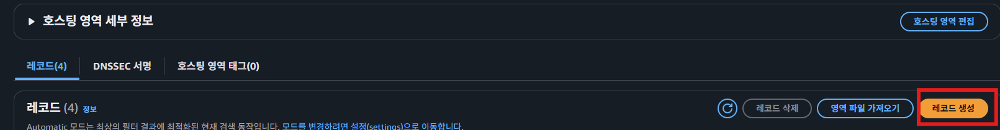  
  
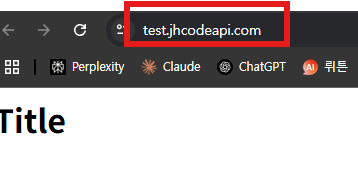