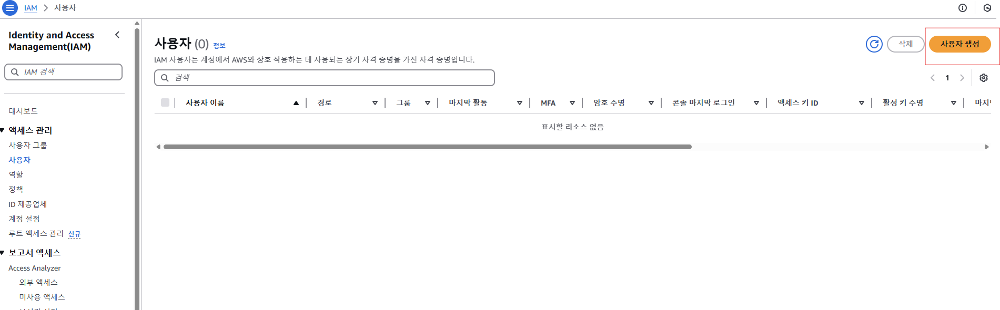
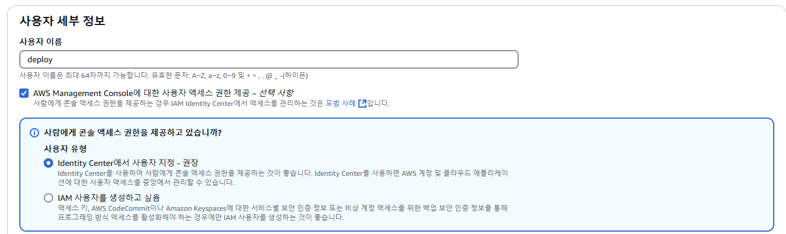
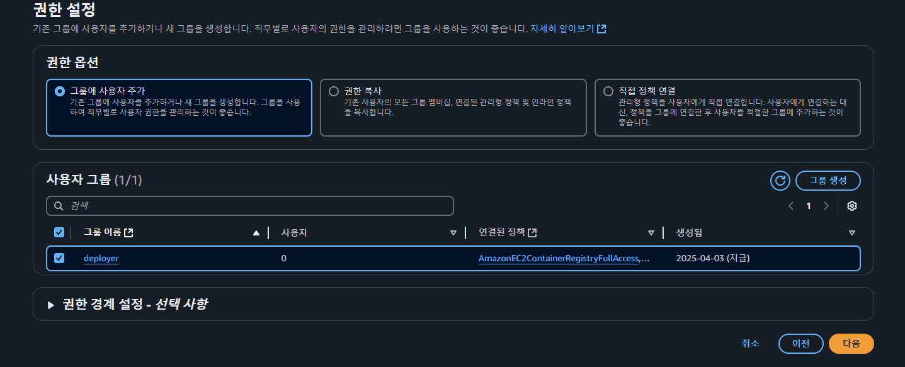
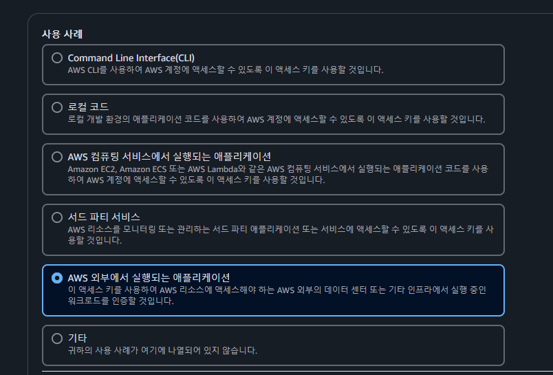

# AWS IAM 설정 방법

AWS IAM은 AWS 리소스에 대한 접근 제어를 위한 서비스입니다. IAM을 사용하면 사용자, 그룹, 역할, 정책을 통해 누가 어떤 리소스에 접근할 수 있는지 세밀하게 관리할 수 있습니다.

---

## 1. IAM 기본 개념

- **사용자(User)**: AWS 리소스에 접근할 수 있는 개별 계정입니다.
- **그룹(Group)**: 여러 사용자를 묶어 공통의 권한을 부여할 수 있습니다.
- **역할(Role)**: AWS 서비스나 애플리케이션에 임시 권한을 부여할 때 사용합니다.
- **정책(Policy)**: JSON 형식으로 작성된 권한 문서로, 사용자/그룹/역할에 어떤 작업을 허용할지 정의합니다.

---

## 2. IAM 설정 단계

### 2.1 AWS Management Console 로그인

- [AWS Management Console](https://aws.amazon.com/console/)에 로그인합니다.

### 2.2 IAM 콘솔로 이동

- 상단 서비스 검색창에 **IAM**을 입력하여 IAM 콘솔로 이동합니다.

### 2.3 사용자(User) 생성

1. **Users** 메뉴를 클릭한 후, **Add user** 버튼을 누릅니다.  
  
2. 사용자 이름을 입력합니다.
   - 
3. 권한 선택 (CI/CD 구축 예제를 위해):
   - **AmazonEC2ContainerRegistryFullAccess** – ECR(Elastic Container Registry)에 Docker 이미지를 푸시/풀 권한 (이미지 레지스트리 사용).
   - **AmazonEKSFullAccess** – EKS 클러스터를 생성하고 관리할 수 있는 권한 (EKS 사용 시). *(생략 가능: 클러스터 생성/관리를 수동으로 할 경우 필요 없음)*
   - **AmazonEC2ReadOnlyAccess** – (옵션) EC2 인스턴스 정보를 조회하는 권한 (예: 배포 대상 EC2의 IP 확인 등 필요한 경우).
4. 다음 단계에서 그룹에 추가하거나 개별 정책을 첨부해 권한을 부여합니다

### 2.4 그룹(Group) 생성 및 권한 부여

1. **Groups** 메뉴에서 **Create New Group**을 클릭합니다.
2. 그룹 이름을 지정합니다.
3. 그룹에 부여할 관리형 정책(예: AmazonS3ReadOnlyAccess, AmazonEC2FullAccess 등)을 선택합니다.
4. 그룹 생성 후, 사용자를 해당 그룹에 추가합니다.

### 2.5 역할(Role) 생성

1. **Roles** 메뉴에서 **Create role** 버튼을 클릭합니다.
2. 역할을 사용할 AWS 서비스(예: EC2, Lambda 등)를 선택합니다.
3. 필요한 정책을 선택하여 역할에 부여합니다.
4. 역할 생성 후, 해당 역할을 AWS 리소스(예: EC2 인스턴스)에 연결합니다.

### 2.6 정책(Policy) 직접 작성

- **정책 생성**:
    1. **Policies** 메뉴에서 **Create policy**를 선택합니다.
    2. **JSON** 탭에서 권한 문서를 직접 작성합니다.
    3. 예시 정책(JSON):

        ```json
        {
          "Version": "2012-10-17",
          "Statement": [
            {
              "Effect": "Allow",
              "Action": "s3:*",
              "Resource": "*"
            }
          ]
        }
        
        ```

- 작성한 정책은 사용자, 그룹, 역할에 첨부할 수 있습니다.

---

## 3. 보안 모범 사례

- **최소 권한 원칙**: 각 사용자나 역할에 필요한 최소한의 권한만 부여합니다.
- **MFA(다단계 인증) 활성화**: 관리자 및 중요한 계정에 MFA를 설정하여 보안을 강화합니다.
- **정기적인 액세스 키 회전**: 액세스 키를 정기적으로 교체하여 보안을 유지합니다.
- **IAM 역할 사용 권장**: EC2, Lambda 등에서는 액세스 키 대신 역할을 사용합니다.

---

## 4. CLI 및 코드 기반 설정

### AWS CLI를 활용한 IAM 설정 예시

```bash
bash
복사
# IAM 사용자 생성
aws iam create-user --user-name MyUser

# IAM 그룹 생성
aws iam create-group --group-name MyGroup

# 사용자 그룹에 추가
aws iam add-user-to-group --user-name MyUser --group-name MyGroup

# IAM 역할 생성 (예: EC2용 역할)
aws iam create-role --role-name MyEC2Role --assume-role-policy-document file://trust-policy.json

# 역할에 정책 첨부 (예: AmazonS3ReadOnlyAccess)
aws iam attach-role-policy --role-name MyEC2Role --policy-arn arn:aws:iam::aws:policy/AmazonS3ReadOnlyAccess

```

> 참고: trust-policy.json은 역할을 맡을 엔터티(예: EC2 서비스)를 명시하는 JSON 파일입니다.
>

### IaC 도구를 활용한 설정

- **Terraform**이나 **CloudFormation**을 사용하면 인프라 코드(IaC)를 통해 IAM 구성을 관리할 수 있습니다.

---

## 최종 정리

- **IAM의 주요 구성 요소**: 사용자, 그룹, 역할, 정책으로 구성되며, 이를 통해 AWS 리소스 접근 제어를 세밀하게 관리할 수 있습니다.
- **설정 단계**:
    1. AWS 콘솔에 로그인 후 IAM 콘솔로 이동.
    2. 사용자 생성 및 그룹/역할에 필요한 권한 부여.
    3. 필요에 따라 직접 정책을 작성하여 적용.
- **보안 모범 사례**: 최소 권한 원칙, MFA 활성화, 액세스 키 회전, 역할 사용 등을 준수합니다.
- **CLI/IaC 활용**: AWS CLI, Terraform, CloudFormation 등을 통해 IAM 설정을 자동화하고 관리할 수 있습니다.
  
---

### 액세스 키 발급
  

## 1. Command Line Interface(CLI)

- **설명**: AWS CLI를 사용하여 AWS 계정을 제어할 경우, 이 액세스 키를 사용하겠다는 의미
- **예시**: 로컬 PC나 서버에서 `aws configure`를 통해 CLI를 설정, S3에 파일 업로드, EC2 인스턴스 관리 등

## 2. 코드(Code)

- **설명**: 애플리케이션 소스 코드 내에서 AWS SDK를 사용하여 AWS 리소스에 접근할 때, 이 액세스 키를 사용하겠다는 의미
- **예시**: Python, Node.js, Java 등에서 SDK로 S3/EC2 등을 호출할 때, `Access Key ID`와 `Secret Access Key`를 코드에서 사용

## 3. AWS 컴퓨팅 서비스에서 실행되는 애플리케이션

- **설명**: EC2, ECS, Lambda 등 **AWS 내부**에서 실행되는 애플리케이션에 이 액세스 키를 적용하겠다는 의미
- **주의**: 일반적으로 AWS 내부 서비스(EC2, Lambda 등)에서는 IAM 역할을 사용하는 것이 더 권장됨 (액세스 키 하드코딩 지양)

## 4. 3자 파트너 서비스

- **설명**: Datadog, Splunk, CircleCI 같은 외부 SaaS(3rd party) 서비스를 연결할 때, 해당 서비스에서 AWS API를 호출하도록 액세스 키를 제공
- **예시**: CircleCI에서 AWS 배포를 진행하기 위해 키를 설정하는 경우

## 5. AWS 외부에서 실행되는 애플리케이션

- **설명**: 온프레미스(사내 서버), 다른 클라우드, 개인 PC 등 **AWS 외부**에서 동작하는 애플리케이션이 AWS API를 호출할 때 이 액세스 키를 사용
- **예시**: Jenkins, GitLab, GitHub Actions, 자체 호스팅된 서버 등이 AWS 리소스에 접근할 때

## 6. 기타

- **설명**: 위 범주에 정확히 들어맞지 않는 경우를 선택
- **예시**: 테스트 용도, 특정 개발 환경 등 위 시나리오에 해당되지 않는 사용
  
---
Jenkins나 Git처럼 온프레미스 또는 외부 환경에서 동작하는 CI/CD 도구를 통해 AWS 리소스에 접근하는 경우 는 "AWS 외부에서 실행되는 애플리케이션"의 키를 생성한다.  

