# Amazon EC2(Elastic Compute Cloud) 개요

Amazon EC2는 **아마존 웹 서비스(AWS)** 에서 제공하는 클라우드 기반의 컴퓨팅 서비스입니다. 사용자는 EC2를 통해 손쉽게 서버를 구성하고 관리할 수 있으며, 필요에 따라 리소스를 확장하거나 축소할 수 있습니다.

즉 **컴퓨터를 빌려서 원격으로 접속해 사용하는 서비스 하나의 컴퓨터 이다.**

---

### EC2 왜 쓰는데??

서버를 배포하기 위해서는 컴퓨터가 필요한데, 만약 내가 가진 컴퓨터로 서버를 배포해 다른 사용자가 인터넷을 통해 접근하게 만들 수도 있다. 하지만 이런 경우 내 컴퓨터를 24시간 동안 컴퓨터를 켜놔야한다. 그리고 다른 사용자가 내 컴퓨터에 접근할 수 있게 만들다 보니 보안적으로 위험할 수 있다.

또한 EC2를 사용하게 되면 여러 부가기능(로깅, 오토스케일링, 로드벨런싱 등)을 많이 가지고 있다.

- 프론트 웹페이지 배포

  EC2를 이용해서 배포를 할수도 있지만 AWS EC2 보다는 vercel, netify 또는 AWS S3를 사용해서 주로 배포한다.


---

## EC2의 핵심 개념 및 용어

### 1. **인스턴스(Instance)**

- EC2에서 생성하는 가상 서버로, 애플리케이션 실행을 위한 기본 환경을 제공합니다.
- 사용자는 다양한 유형의 인스턴스 중에서 원하는 리소스 사양(CPU, RAM, 네트워크 등)을 선택할 수 있습니다.

### 2. **AMI(Amazon Machine Image)**

- EC2 인스턴스를 생성할 때 사용하는 템플릿으로 OS, 애플리케이션, 환경설정을 포함합니다.
- 사용자가 AMI를 직접 생성하여 원하는 구성의 인스턴스를 반복적으로 생성할 수 있습니다.

### 3. **인스턴스 유형(Instance Types)**

- 다양한 컴퓨팅 요구 사항을 위해 인스턴스 유형을 제공합니다.

| 카테고리 | 용도 및 특징 | 예시 유형 |
| --- | --- | --- |
| 범용 | 균형 잡힌 성능 제공 | t4g, t3a, m7i 등 |
| 컴퓨팅 최적화 | 높은 CPU 성능 제공 | c7i, c6a, c6gn 등 |
| 메모리 최적화 | 메모리 집약적인 작업에 적합 | r7i, r6a, x2iezn 등 |
| 스토리지 최적화 | 높은 디스크 I/O 성능을 제공 | i4i, d3, d3en 등 |
| 가속 컴퓨팅 | GPU를 활용한 연산 작업에 최적화됨 | p4d, g5, g6 등 |

> 최신 세대 인스턴스는 Nitro 시스템 기반으로 성능과 보안이 향상되었습니다.
>

### 4. **EBS(Elastic Block Store)**

- EC2 인스턴스에 연결하여 사용할 수 있는 지속적이고 안정적인 블록 스토리지입니다.
- 인스턴스 종료 후에도 데이터를 유지할 수 있으며, 스냅샷을 생성하여 백업 가능합니다.

### 5. **보안 그룹(Security Groups)**

- 인스턴스의 방화벽 역할을 수행하는 가상 네트워크 보안 기능입니다.
- 인바운드 및 아웃바운드 트래픽을 세부적으로 설정하여 보안 정책을 적용할 수 있습니다.

### 6. **키 페어(Key Pair)**

- 인스턴스 접속 시 사용하는 공개 키 및 개인 키의 쌍입니다.
- SSH 접속 시 필수적으로 요구됩니다.

---
  
### 리전(Region)
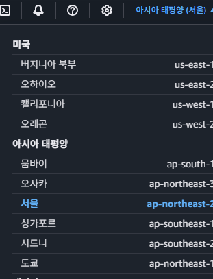
리전(Region)이란 인프라를 지리적으로 나누어 배포한 각각의 데이터 센터를 의미한다. 

말이 어렵다. 조금 더 쉽게 풀어서 EC2에 대입해서 생각해보자. 우린 EC2가 **컴퓨터를 빌려서 원격으로 접속해 사용하는 서비스**라는 걸 알고 있다. 여기서 EC2를 통해 빌려서 쓸 수 있는 컴퓨터들이 전 세계적으로 다양하게 분포해있다. 이렇게 컴퓨터들이 위치한 위치를 보고 AWS에서는 리전(Region)이라고 한다.
  
### 특징
- AWS는 전 세계적으로 다양한 Region을 보유하고 있다
    - 세계 곳곳에 데이터 센터를 보유하고 있다.
- 이 Region은 고유한 이름을 가지고 있다.
  - 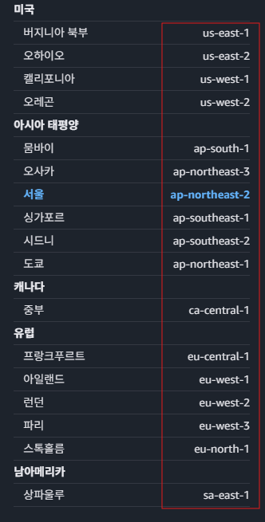
  
### 리전은 어떤 기준으로 선택할까??
사용자들은 에플리케이션을 사용할때 네트워크를 통해 통신을 하게 된다. 이때 사용자의 위치와 에플리케이션을 실행시키는 컴퓨터와 위치가 멀면 멀수록 속도가 느려진다. 따라서 **사용자들의 위치와 지리적으로 가까운 리전을 선택**하는 것이 유리하다.  

---  
  
### EC2 구성하기

  


### 구성해보기
  
### 1. 이름 및 테그
  
우리는 나중에 여러 컴퓨터를 빌리게 되었을때, 기능별, 환경별 등 여러 용도와 목적에 맞게 다양한 서버를 빌려서 사용하게 될때 이를 구분할 수 있게 해주는 역할을 한다.

EC2의 이름을 설정하는 곳이다. 이름을 지을 때는 이 컴퓨터가 어떤 역할을 하는 지 알아볼 수 있게 작성한다.

ex) `instagram-server`
  
  
### 2. 애플리케이션 및 OS 이미지(Amazon Machine Image) 
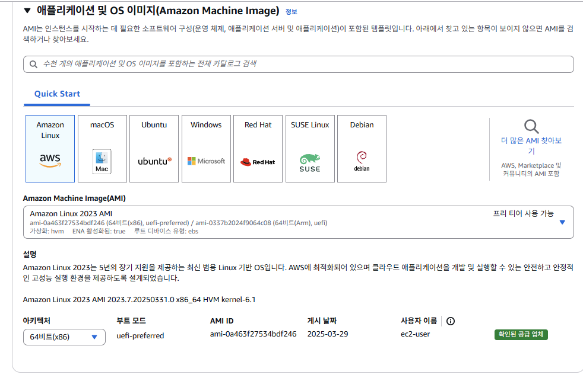  
OS를 선택하는 단계이다. 해당 단계에서 여러 OS 및 버전을 선택할 수 있다.  
  
### 3. 인스턴스 유형
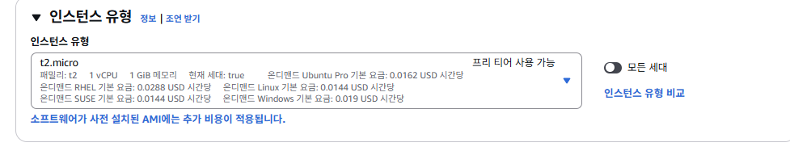  

**인스턴스**란, **AWS EC2에서 빌리는 컴퓨터 1대를 의미**한다.

그럼 **인스턴스 유형**은 무슨 뜻일까? **컴퓨터 사양을 의미**한다. 컴퓨터 사양이 좋으면 좋을수록 많은 수의 요청을 처리할 수 있고, 무거운 서버나 프로그램을 돌릴 수 있다.

프리 티어에 해당하는 **t2.micro**를 사용할 것이다.

여기서 많이들 오해하는 게 **t2.micro**는 학습할 때나 테스트할 때만 쓰는 안 좋은 사양의 컴퓨터라고 생각한다. 하지만 실제 서비스에서 활용해도 될 정도로 나름 괜찮은 사양이다. 하루 방문자 수가 2,000명 정도였던 서비스를 운영했었는데 문제 없이 잘 돌아갔다. 성능에 문제가 직접적으로 생기기 전까지는 너무 걱정하지 말자.
  
  
### 4. 키 페어  
키 페어(Key Pair)는 무슨 뜻일까? EC2 컴퓨터에 접근할 때 사용하는 비밀번호라고 생각하면 된다. 말 그대로 열쇠(Key, 키)의 역할을 한다.  

  

- **키 페어 이름**은 어떤 EC2에 접근하기 위한 키 페어였는 지 알아볼 수 있게 지정하면 좋다.
- `RSA`와 `.pem`을 선택한 후에 키 페어를 생성하면 된다. `ED25519`가 뭔지, `.ppk`가 뭔지는 몰라도 된다. 중요하지 않다.
- 키 페어를 생성하면 파일이 하나 다운받아질텐데, 그 파일은 잃어버리면 안 되니 잘 보관해놔야 한다.
- **참고)** 실습에서는 `키 페어`를 활용해서 EC2에 접근하지 않고, 더 편한 방법으로 접근할 예정이다.  
  
### 5. 네트워크 설정
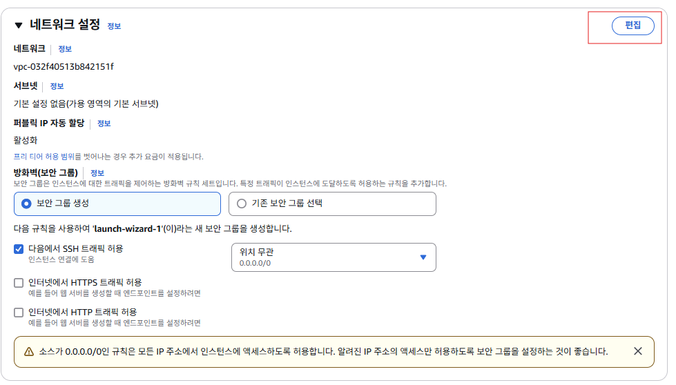
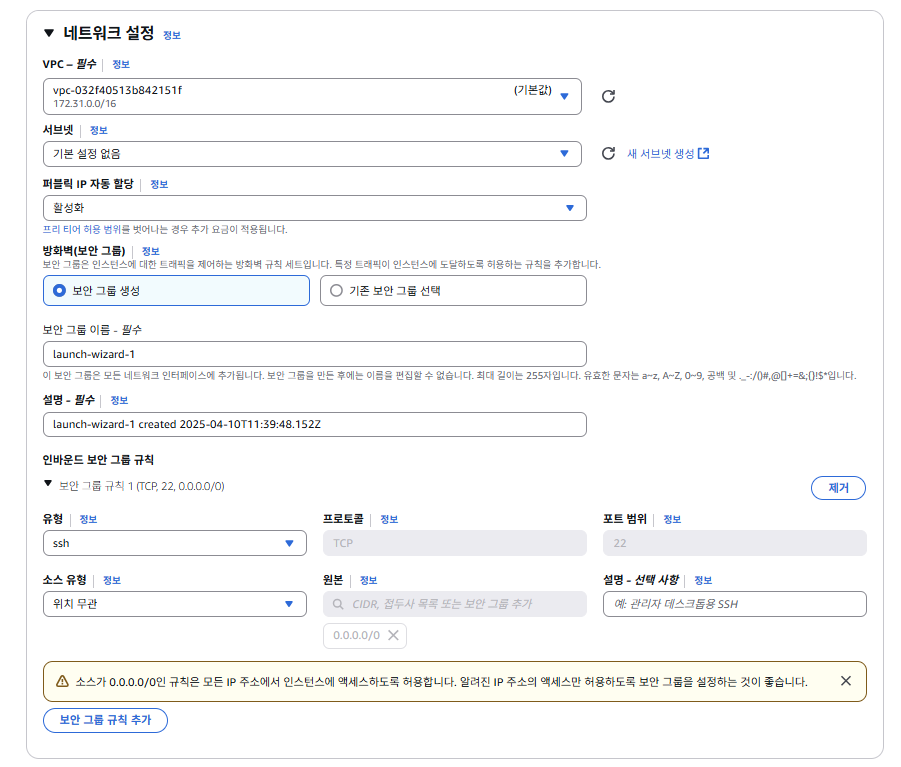  

네트워크 설정 칸을 보면 **VPC**와 **Security Groups(보안 그룹)**가 보인다. 여기서 VPC라는 개념은 AWS를 입문하는 입장에서는 크게 중요하지 않으니 넘어가자. 나중에 AWS에 어느 정도 익숙해졌을 때 VPC를 학습하도록 하자. VPC를 몰라도 서버를 배포하는 데 아무 문제가 없다.  
[EC2-네트워크설정에 대해서](1.EC2-%EB%84%A4%ED%8A%B8%EC%9B%8C%ED%81%AC%EC%84%A4%EC%A0%95.md)
  
### 5.보안그룹(Security Group) 이란??
보안 그룹(Security Group)이란 AWS 클라우드에서의 네트워크 보안을 의미한다. 
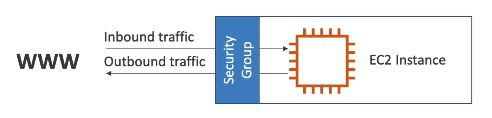  
**EC2 인스턴스**를 **집**이라고 생각한다면, **보안 그룹**은 **집 바깥 쪽에 쳐져있는 울타리와 대문**이라고 생각하면 된다. 집에 접근할 때 울타리의 대문에서 접근해도 되는 요청인지 보안 요원이 검사를 하는 것과 비슷하다.

인터넷에서 일부 사용자가 EC2 인스턴스에 접근(액세스)하려고 한다고 가정해보자. 위 그림과 같이 EC2 인스턴스 주위에 방화벽 역할을 할 보안 그룹(Security Group)을 만들고 보안 그룹에 규칙을 지정한다. 이 보안 규칙에는 **인바운드 트래픽**(즉, 외부에서 EC2 인스턴스로 보내는 트래픽)에서 어떤 트래픽만 허용할 지 설정할 수 있고, **아웃바운드 트래픽**(즉, EC2 인스턴스에서 외부로 나가는 트래픽)에서 어떤 트래픽만 허용할 지 설정할 수 있다.

보안 그룹을 설정할 때는 허용할 **IP 범위**와 **포트**(port)를 설정할 수 있다.

> **그러면 EC2 인스턴스를 생성할 때 어떻게 보안 그룹(Security Group)을 설정해야 하는 지 알아보자.**
>
  
  
### 6. 보안그룹 설정
외부에서 EC2로 접근할 포트는 22번 포트와 80번 포트라고 생각해서 이 2가지에 대해 인바운드 보안 그룹 규칙을 추가했다. 왜냐하면 22번 포트는 우리가 EC2에 원격 접속할 때 사용하는 포트이고, 80번 포트에는 백엔드 서버를 띄울 예정이기 때문이다. 그리고 어떤 IP에서든 전부 접근할 수 있게 만들기 위해 소스 유형은 위치 무관으로 설정했다.
  
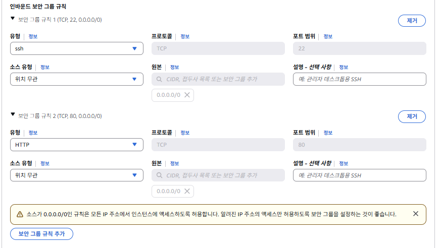  
  
> SSH?  
> SSH는 네트워크 상에서 안전하게 원격 접속을 하기 위한 암호화 프로토콜입니다.
  
### 7. 스토리지 구성
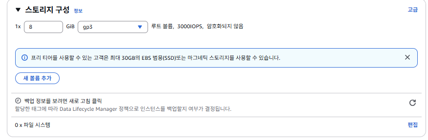  

우리가 쓰고 있는 노트북이나 데스크톱 컴퓨터는 전부 하드디스크를 가지고 있다. 하드디스크는 컴퓨터에서 파일을 저장하는 공간이다. EC2도 하나의 컴퓨터이다보니 여러 파일들을 저장할 저장 공간이 필요하다. 이 저장 공간을 보고 EBS(Elastic Block Storage)라고 부른다. 즉, EBS란 EC2 안에 부착되어 있는 일종의 하드디스크라고 생각하면 된다. EBS와 같은 저장 공간을 조금 더 포괄적인 용어로 스토리지(Storage), 볼륨(Volume)이라고 부른다. 
  
프리어어는 30GB 까지는 무료로 사용가능 하다
  
  
### 8. EC2 접속
  

세부 정보에서 눈여겨 봐야 할 부분은 2가지 밖에 없다. **퍼블릭 IPv4 주소**와 **인스턴스 상태**이다.

- **퍼블릭 IPv4 주소**는 EC2 인스턴스가 생성되면서 부여받은 IP 주소이다. EC2 인스턴스에 접근하려면 이 IP 주소로 접근하면 된다.
- **인스턴스 상태**는 말그대로 EC2 인스턴스가 **실행 중**이라는 뜻은 컴퓨터가 켜져있다는 뜻이다.  

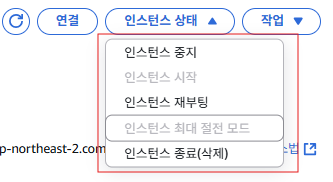  

EC2 인스턴스를 중지, 재부팅, 종료도 할 수 있다. 우리가 쓰는 컴퓨터와 아주 유사하다.  
재부팅은 말그대로 컴퓨터를 재시작시키는 걸 의미하고, 중지는 컴퓨터를 잠시 꺼놓는 걸 의미한다. 종료는 컴퓨터를 아예 삭제시킨다는 걸 의미한다. EC2 인스턴스를 한 번 종료하면 도중에 취소할 수 없으니 조심해야 한다.

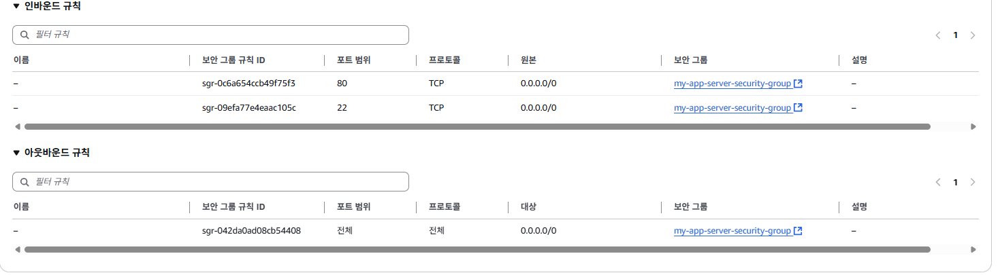
  
우리가 처음에 EC2를 생성할때 설정한 보안그룹을확인할 수 있다.  
여기에 IP가 지금 0.0.0.0/0 이렇게 설정되어 있는데 이는 모든 IP에 대해서 접근을 허용하겠다는 의미이다.   

  
실제 접속은 위에 연결 버튼을 눌러서 우리가 빌려온 가상 컴퓨터에 접속할 수 있다.  
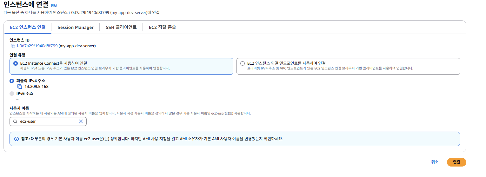  
이렇게 직접 AWS 접속해서 연결할 수도 있고 실제 우리가 처음 EC2에 생성할때 만든 키를 가지고 SSH를 통해 직접 접근할 수도 있다.  
  
만약 IAM 을 생성해서 접근하는 경우  
```
Failed to connect to your instance
Access denied by EC2 Instance Connect. Either your AWS credentials are not valid or you do not have access to the EC2 instance.
```
해당 오류가 발생 했다면 인라인 권한을 새롭게 추가해야 한다.  
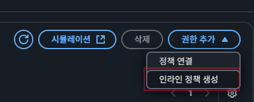  
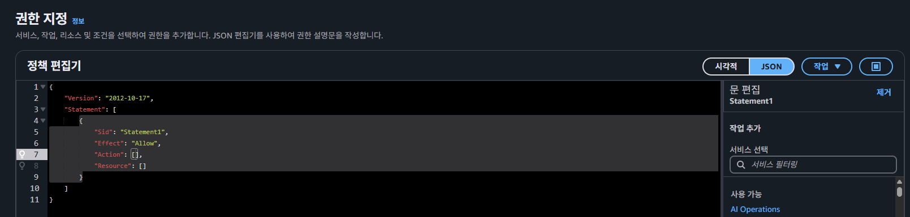  
  
여기서 해당 권한을 추가해서 새롭게 생성하면 정상 접속하는 것을 확인할 수 있다.  
``` json
{
  "Version": "2012-10-17",
  "Statement": [
    {
      "Sid": "EC2InstanceConnectSendPublicKey",
      "Effect": "Allow",
      "Action": "ec2-instance-connect:SendSSHPublicKey",
      "Resource": "*"
    }
  ]
}

```
   
### ssh 접속  
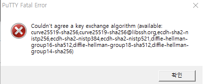  
ssh 접속시에 해당 오류가 발생한다면 putty 버전을 최신버전으로 다운로드받고 재접속 해보면 정상 접속확인할 수 있다.  
  

---

### 탄력적 IP(Elastic IP)

EC2 인스턴스를 생성하면 IP를 할당받는다. 이렇게 할당 받은 IP는 임시적인 IP이다. EC2 인스턴스를 잠깐 중지시켰다가 다시 실행시켜보면 IP가 바뀌어 있다.

EC2 인스턴스를 중지 시켰다 다시 실행시킬 때마다 IP가 바뀌면 굉장히 불편하다. 따라서 다시 실행시켜도 바뀌지 않는 고정 IP를 할당 받아야 한다.

> **이 고정된 IP를 바로 타력적 IP 이다.**
  
  
  
중지 후 다시 인스턴스를 확인해 보면

  
이렇게 IP 주소가 비어 있는걸 확인할 수 있다.


중지 후 재 기동하게 되면 IP 주소가 변경된 것을 확인할 수 있다.
  
  
  
### 탄력적 IP 설정
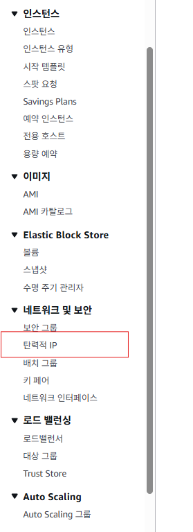
해당 텝에 들어가서 탄력적 IP 할당을 클릭한다.  

  
  
기본 Default 설정 그대로 사용한다.  
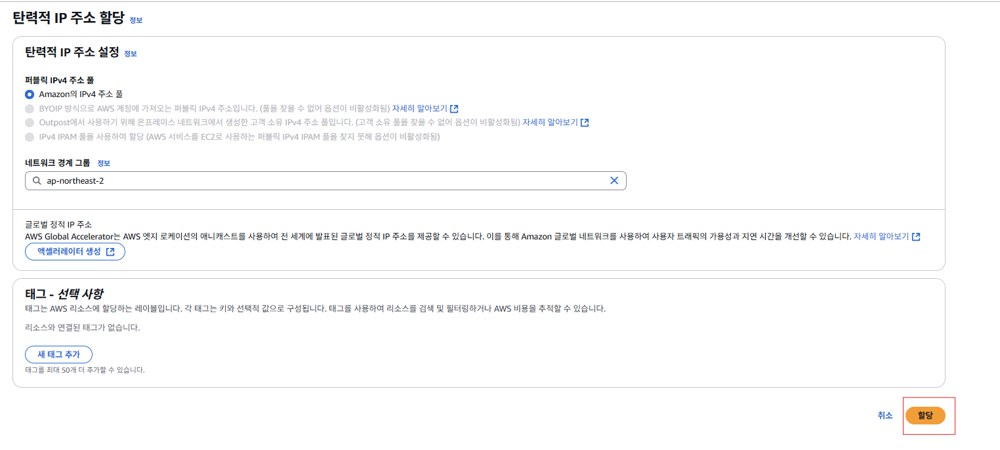  
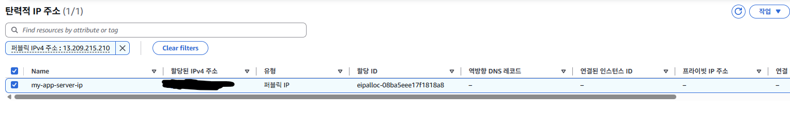  
  
이렇게 할당 받은 특정 IP를 연결하는 방법은 위에 상단에 작업 버튼을 클릭하면 **탄력적 IP주소 연결** 이라는 메뉴를 클릭하면 된다.  
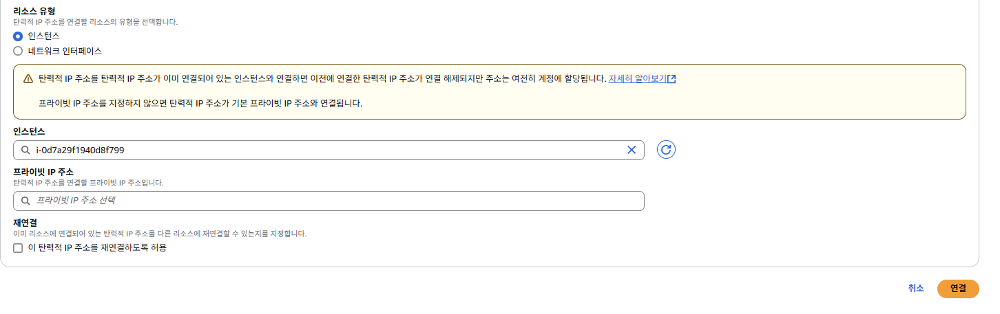  
이렇게 탄력적 IP를 연결한 EC2 인스턴스를 선택한 후 연결을 한 후 EC2 인스턴스에의 IP 주소를 확인해보면 할당받은 탄력적 IP로 변겨오디어 있는 것을 확인할 수 있다.  
  
이렇게 탄력적 IP를 지정하면 EC2 인스턴스를 중지하고 다시 실행시켜도 IP주소가 변경되지 않는다.